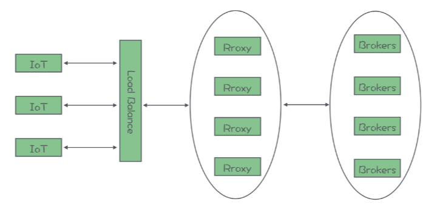

## MQTT协议

物联网设备，它要实现互相通信，也必须有一套标准的通信协议，MQTT 就是专门为物联网设备设计的一套标准的消息队列通信协议。使用 MQTT 协议的 IoT 设备，可以连接到任何支持 MQTT 协议的消息队列上，进行通信。

从宏观上来说，MQTT 和其他消息队列采用的传输协议是差不多的。它采用的也是“发布 - 订阅”的消息模型。网络结构上，也是 C/S 架构，IoT 设备是客户端，Broker 是服务端，客户端与 Broker 通信进行收发消息。

MQTT 的使用场景有什么样的特点？

IoT 设备它有什么特点？最大的特点就是便宜，一个水杯才卖几十块钱，它上面的智能模块的成本十块钱最多了，再贵就卖不出去了。十块钱的智能设备内存都是按照 KB 来计算的，可能都没有 CPU，也不一定有操作系统，整个设备就一个 SoC。这样的设备就需要通信协议不能太复杂，功能不能太多。另外，IoT 设备一般都采用无线连接，很多设备都是经常移动的，这就导致，IoT 设备的网络连接不稳定，并且这种不稳定的网络是一个常态。

MQTT 协议在设计上，充分考虑了上面的这些特点。在协议的报文设计上极其的精简，可以说是惜字如金。协议的功能也非常简单，基本上就只有发布订阅主题和收发消息这两个最核心的功能。另外，为了应对网络连接不稳定的问题，MQTT 增加了心跳和会话的机制。加入心跳机制可以让客户端和服务端双方都能随时掌握当前连接状态，一旦发现连接中断，可以尽快地重连。MQTT 还加入了会话的机制，在服务端来保存会话状态，客户端重连之后就可以恢复之前的会话，继续来收发消息。这样，把复杂度转移到了服务端，客户端的实现就会更简单。

RocketMQ 它的元数据是保存在 NameServer 的内存中，Kafka 是保存在 ZooKeeper 中，**这些存储都不擅长保存大量数据，所以也支撑不了太多的客户端和主题。**

如果说客户端的规模超过十万的量级，需要支撑这么大规模的客户端数量，服务端只有单个节点肯定是不够的，必须用一个集群来支持，并且这个集群是要能支持水平扩容的，这些都是最基本的要求。这个时候就几乎没什么可供选择的开源产品了。这种情况建议选择一些云平台厂商提供的 MQTT 云服务，价格相对比较低，当然你可以选择价格更高的商业版 MQTT Server。

一般来说，一个 MQTT 集群它的架构应该是这样的：

这个图从左向右看，首先接入的地址最好是一个域名，这样域名的后面可以配置多个 IP 地址做负载均衡，当然这个域名不是必需的。也可以直接连接负载均衡器。负载均衡可以选择像 F5 这种专用的负载均衡硬件，也可以使用 Nginx 这样的软件，只要是四层或者支持 MQTT 协议的七层负载均衡设备，都可以选择。

负载均衡器的后面，需要部署一个 Proxy 集群，这个 Proxy 集群承担了三个重要的作用：第一个作用是来承接海量 IoT 设备的连接，第二个作用是来维护与客户端的会话，第三个作用是作为代理，在客户端和 Broker 之间进行消息转发。

在 Proxy 集群的后面是 Broker 集群，负责保存和收发消息。