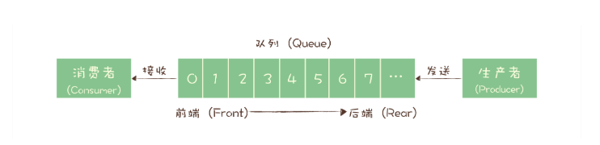
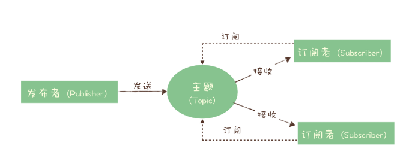
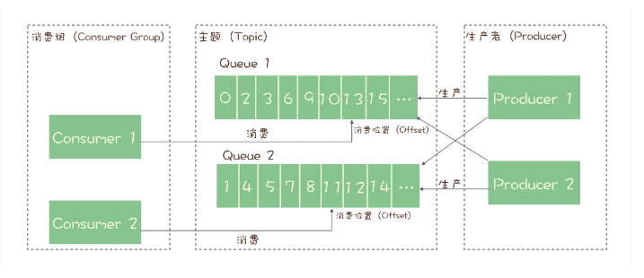

## 消息模型

每种消息队列都有自己的一套消息模型，像队列（Queue）、主题（Topic）或是分区（Partition）这些名词概念，在每个消息队列模型中都会涉及一些，含义还不太一样。

消息队列早期的模型是**队列模型**

如果有多个生产者往同一个队列里面发送消息，这个队列中可以消费到的消息，就是这些生产者生产的所有消息的合集。消息的顺序就是这些生产者发送消息的自然顺序。如果有多个消费者接收同一个队列的消息，这些消费者之间实际上是竞争的关系，每个消费者只能收到队列中的一部分消息，也就是说任何一条消息只能被其中的一个消费者收到。

后期演化出了，**发布 - 订阅模型（Publish-Subscribe Pattern）**

在发布 - 订阅模型中，消息的发送方称为发布者（Publisher），消息的接收方称为订阅者（Subscriber），服务端存放消息的容器称为主题（Topic）。发布者将消息发送到主题中，订阅者在接收消息之前需要先“订阅主题”。“订阅”在这里既是一个动作，同时还可以认为是主题在消费时的一个逻辑副本，每份订阅中，订阅者都可以接收到主题的所有消息。

### RabbitMQ消息模型

它是少数依然坚持使用队列模型的产品之一。那它是怎么解决多个消费者的问题呢？你还记得我在上节课中讲到 RabbitMQ 的一个特色 Exchange 模块吗？在 RabbitMQ 中，Exchange 位于生产者和队列之间，生产者并不关心将消息发送给哪个队列，而是将消息发送给 Exchange，由 Exchange 上配置的策略来决定将消息投递到哪些队列中。

同一份消息如果需要被多个消费者来消费，需要配置 Exchange 将消息发送到多个队列，每个队列中都存放一份完整的消息数据，可以为一个消费者提供消费服务。这也可以变相地实现新发布 - 订阅模型中，“一份消息数据可以被多个订阅者来多次消费”这样的功能。

### RocketMQ消息模型

RocketMQ 使用的消息模型是标准的发布 - 订阅模型，在 RocketMQ 的术语表中，生产者、消费者和主题与我在上面讲的发布 - 订阅模型中的概念是完全一样的。

几乎所有的消息队列产品都使用一种非常朴素的“请求 - 确认”机制，确保消息不会在传递过程中由于网络或服务器故障丢失。具体的做法也非常简单。在生产端，生产者先将消息发送给服务端，也就是 Broker，服务端在收到消息并将消息写入主题或者队列中后，会给生产者发送确认的响应。

如果生产者没有收到服务端的确认或者收到失败的响应，则会重新发送消息；在消费端，消费者在收到消息并完成自己的消费业务逻辑（比如，将数据保存到数据库中）后，也会给服务端发送消费成功的确认，服务端只有收到消费确认后，才认为一条消息被成功消费，否则它会给消费者重新发送这条消息，直到收到对应的消费成功确认。

这个确认机制很好地保证了消息传递过程中的可靠性，但是，引入这个机制在消费端带来了一个不小的问题。什么问题呢？为了确保消息的有序性，在某一条消息被成功消费之前，下一条消息是不能被消费的，否则就会出现消息空洞，违背了有序性这个原则。

也就是说，每个主题在任意时刻，至多只能有一个消费者实例在进行消费，那就没法通过水平扩展消费者的数量来提升消费端总体的消费性能。**为了解决这个问题，RocketMQ 在主题下面增加了队列的概念**。

**每个主题包含多个队列，通过多个队列来实现多实例并行生产和消费。**需要注意的是，RocketMQ 只在队列上保证消息的有序性，主题层面是无法保证消息的严格顺序的。

消费组中包含多个消费者，同一个组内的消费者是竞争消费的关系，每个消费者负责消费组内的一部分消息。如果一条消息被消费者 Consumer1 消费了，那同组的其他消费者就不会再收到这条消息。

在 Topic 的消费过程中，由于消息需要被不同的组进行多次消费，所以消费完的消息并不会立即被删除，这就需要 RocketMQ 为每个消费组在每个队列上维护一个消费位置（Consumer Offset），这个位置之前的消息都被消费过，之后的消息都没有被消费过，每成功消费一条消息，消费位置就加一。这个消费位置是非常重要的概念，我们在使用消息队列的时候，丢消息的原因大多是由于消费位置处理不当导致的。

### Kafka消息模型

Kafka 的消息模型和 RocketMQ 是完全一样的，我刚刚讲的所有 RocketMQ 中对应的概念，和生产消费过程中的确认机制，都完全适用于 Kafka。唯一的区别是，在 Kafka 中，队列这个概念的名称不一样，Kafka 中对应的名称是“分区（Partition）”，含义和功能是没有任何区别的。