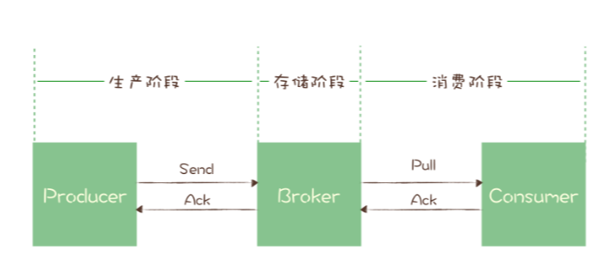

## 消息队列可靠性

### 消息丢失

现在主流的消息队列产品都提供了非常完善的消息可靠性保证机制，完全可以做到在消息传递过程中，即使发生网络中断或者硬件故障，也能确保消息的可靠传递，不丢消息。

绝大部分丢消息的原因都是由于开发者不熟悉消息队列，没有正确使用和配置消息队列导致的。虽然不同的消息队列提供的 API 不一样，相关的配置项也不同，但是在保证消息可靠传递这块儿，它们的实现原理是一样的。

#### 检测消息丢失

用消息队列最尴尬的情况不是丢消息，而是消息丢了还不知道。

 IT 基础设施比较完善的公司，一般都有分布式链路追踪系统，使用类似的追踪系统可以很方便地追踪每一条消息。如果没有这样的追踪系统，**我们可以利用消息队列的有序性来验证是否有消息丢失。**

原理非常简单，在 Producer 端，我们给每个发出的消息附加一个连续递增的序号，然后在 Consumer 端来检查这个序号的连续性。

如果没有消息丢失，Consumer 收到消息的序号必然是连续递增的，或者说收到的消息，其中的序号必然是上一条消息的序号 +1。如果检测到序号不连续，那就是丢消息了。还可以通过缺失的序号来确定丢失的是哪条消息，方便进一步排查原因。

大多数消息队列的客户端都支持拦截器机制，你可以利用这个拦截器机制，在 Producer 发送消息之前的拦截器中将序号注入到消息中，在 Consumer 收到消息的拦截器中检测序号的连续性，这样实现的好处是消息检测的代码不会侵入到你的业务代码中，待你的系统稳定后，也方便将这部分检测的逻辑关闭或者删除。

如果是在一个分布式系统中实现这个检测方法，有几个问题需要你注意。

首先，像 Kafka 和 RocketMQ 这样的消息队列，**它是不保证在 Topic 上的严格顺序的，只能保证分区上的消息是有序的，所以我们在发消息的时候必须要指定分区，并且，在每个分区单独检测消息序号的连续性**。

**Consumer 实例的数量最好和分区数量一致，做到 Consumer 和分区一一对应，这样会比较方便地在 Consumer 内检测消息序号的连续性。**

#### 可靠投递

讲完了检测消息丢失的方法，接下来我们一起来看一下，整个消息从生产到消费的过程中，哪些地方可能会导致丢消息，以及应该如何避免消息丢失。

- **生产阶段**: 在这个阶段，从消息在 Producer 创建出来，经过网络传输发送到 Broker 端。
- **存储阶段**: 在这个阶段，消息在 Broker 端存储，如果是集群，消息会在这个阶段被复制到其他的副本上。
- **消费阶段**: 在这个阶段，Consumer 从 Broker 上拉取消息，经过网络传输发送到 Consumer 上。

##### 生产阶段

在生产阶段，消息队列通过最常用的请求确认机制，来保证消息的可靠传递：当你的代码调用发消息方法时，消息队列的客户端会把消息发送到 Broker，Broker 收到消息后，会给客户端返回一个确认响应，表明消息已经收到了。客户端收到响应后，完成了一次正常消息的发送。

只要 Producer 收到了 Broker 的确认响应，就可以保证消息在生产阶段不会丢失。有些消息队列在长时间没收到发送确认响应后，会自动重试，如果重试再失败，就会以返回值或者异常的方式告知用户。

**你在编写发送消息代码时，需要注意，正确处理返回值或者捕获异常，就可以保证这个阶段的消息不会丢失。**

##### 存储阶段

在存储阶段正常情况下，只要 Broker 在正常运行，就不会出现丢失消息的问题，但是如果 Broker 出现了故障，比如进程死掉了或者服务器宕机了，还是可能会丢失消息的。

**如果对消息的可靠性要求非常高，可以通过配置 Broker 参数来避免因为宕机丢消息。**

对于单个节点的 Broker，需要配置 Broker 参数，在收到消息后，将消息写入磁盘后再给 Producer 返回确认响应，这样即使发生宕机，由于消息已经被写入磁盘，就不会丢失消息，恢复后还可以继续消费。例如，在 RocketMQ 中，需要将刷盘方式 flushDiskType 配置为 SYNC_FLUSH 同步刷盘。

如果是 Broker 是由多个节点组成的集群，需要将 Broker 集群配置成：至少将消息发送到 2 个以上的节点，再给客户端回复发送确认响应。这样当某个 Broker 宕机时，其他的 Broker 可以替代宕机的 Broker，也不会发生消息丢失。

##### 消费阶段

消费阶段采用和生产阶段类似的确认机制来保证消息的可靠传递，客户端从 Broker 拉取消息后，执行用户的消费业务逻辑，成功后，才会给 Broker 发送消费确认响应。如果 Broker 没有收到消费确认响应，下次拉消息的时候还会返回同一条消息，确保消息不会在网络传输过程中丢失，也不会因为客户端在执行消费逻辑中出错导致丢失。

你在编写消费代码时需要注意的是，**不要在收到消息后就立即发送消费确认，而是应该在执行完所有消费业务逻辑之后，再发送消费确认。**

### 重复消息

如果消息队列本身能保证消息不重复，那应用程序的实现不就简单了？那有没有消息队列能保证消息不重复呢？

然而消息队列重复的情况必然存在，既然消息队列无法保证消息不重复，就需要我们的消费代码能够接受“消息是可能会重复的”这一现状，然后，通过一些方法来消除重复消息对业务的影响。

#### 幂等性解决重复消息问题

一般解决重复消息的办法是，在消费端，让我们消费消息的操作具备幂等性。

**幂等（Idempotence）** 本来是一个数学上的概念，它是这样定义的：

> 如果一个函数 f(x) 满足：f(f(x)) = f(x)，则函数 f(x) 满足幂等性。

一个幂等操作的特点是，**其任意多次执行所产生的影响均与一次执行的影响相同。**

一个幂等的方法，使用同样的参数，对它进行多次调用和一次调用，对系统产生的影响是一样的。所以，对于幂等的方法，不用担心重复执行会对系统造成任何改变。

我们举个例子来说明一下。在不考虑并发的情况下，“将账户 X 的余额设置为 100 元”，执行一次后对系统的影响是，账户 X 的余额变成了 100 元。只要提供的参数 100 元不变，那即使再执行多少次，账户 X 的余额始终都是 100 元，不会变化，这个操作就是一个幂等的操作。

如果我们系统消费消息的业务逻辑具备幂等性，那就不用担心消息重复的问题了，因为同一条消息，消费一次和消费多次对系统的影响是完全一样的。也就可以认为，消费多次等于消费一次。

从对系统的影响结果来说：**At least once + 幂等消费 = Exactly once。**

那么如何实现幂等操作呢？最好的方式就是，**从业务逻辑设计上入手，将消费的业务逻辑设计成具备幂等性的操作。**但是，不是所有的业务都能设计成天然幂等的，这里就需要一些方法和技巧来实现幂等。

### 消息积压

在使用消息队列遇到的问题中，消息积压这个问题，应该是最常遇到的问题了，并且，这个问题还不太好解决。

消息积压的直接原因，一定是系统中的某个部分出现了性能问题，来不及处理上游发送的消息，才会导致消息积压。

对于绝大多数使用消息队列的业务来说，消息队列本身的处理能力要远大于业务系统的处理能力。主流消息队列的单个节点，消息收发的性能可以达到每秒钟处理几万至几十万条消息的水平，还可以通过水平扩展 Broker 的实例数成倍地提升处理能力。

而一般的业务系统需要处理的业务逻辑远比消息队列要复杂，单个节点每秒钟可以处理几百到几千次请求，已经可以算是性能非常好的了。所以，对于消息队列的性能优化，我们更关注的是，**在消息的收发两端，我们的业务代码怎么和消息队列配合，达到一个最佳的性能。**

#### 发送端性能优化

发送端业务代码的处理性能，实际上和消息队列的关系不大，因为一般发送端都是先执行自己的业务逻辑，最后再发送消息。**如果说，你的代码发送消息的性能上不去，你需要优先检查一下，是不是发消息之前的业务逻辑耗时太多导致的。**

对于发送消息的业务逻辑，只需要注意设置合适的并发和批量大小，就可以达到很好的发送性能。为什么这么说呢？

我们之前的课程中讲过 Producer 发送消息的过程，Producer 发消息给 Broker，Broker 收到消息后返回确认响应，这是一次完整的交互。假设这一次交互的平均时延是 1ms，我们把这 1ms 的时间分解开，它包括了下面这些步骤的耗时：

- 发送端准备数据、序列化消息、构造请求等逻辑的时间，也就是发送端在发送网络请求之前的耗时；
- 发送消息和返回响应在网络传输中的耗时；
- Broker 处理消息的时延。

如果是单线程发送，每次只发送 1 条消息，那么每秒只能发送 1000ms / 1ms * 1 条 /ms = 1000 条 消息，这种情况下并不能发挥出消息队列的全部实力。

无论是增加每次发送消息的批量大小，还是增加并发，都能成倍地提升发送性能。至于到底是选择批量发送还是增加并发，主要取决于发送端程序的业务性质。简单来说，只要能够满足你的性能要求，怎么实现方便就怎么实现。

#### 消费端性能优化

使用消息队列的时候，大部分的性能问题都出现在消费端，如果消费的速度跟不上发送端生产消息的速度，就会造成消息积压。如果这种性能倒挂的问题只是暂时的，那问题不大，只要消费端的性能恢复之后，超过发送端的性能，那积压的消息是可以逐渐被消化掉的。

要是消费速度一直比生产速度慢，时间长了，整个系统就会出现问题，要么，消息队列的存储被填满无法提供服务，要么消息丢失，这对于整个系统来说都是严重故障。

所以，我们在设计系统的时候，**一定要保证消费端的消费性能要高于生产端的发送性能，这样的系统才能健康的持续运行(重)。**

消费端的性能优化除了优化消费业务逻辑以外，也可以通过水平扩容，增加消费端的并发数来提升总体的消费性能。特别需要注意的一点是，**在扩容 Consumer 的实例数量的同时，必须同步扩容主题中的分区（也叫队列）数量，确保 Consumer 的实例数和分区数量是相等的。**如果 Consumer 的实例数量超过分区数量，这样的扩容实际上是没有效果的。原因我们之前讲过，因为对于消费者来说，在每个分区上实际上只能支持单线程消费。

#### 积压处理

大部分消息队列都内置了监控的功能，只要通过监控数据，很容易确定是哪种原因。如果是单位时间发送的消息增多，比如说是赶上大促或者抢购，短时间内不太可能优化消费端的代码来提升消费性能，唯一的方法是通过扩容消费端的实例数来提升总体的消费能力。

如果短时间内没有足够的服务器资源进行扩容，没办法的办法是，**将系统降级**，通过关闭一些不重要的业务，减少发送方发送的数据量，最低限度让系统还能正常运转，服务一些重要业务。

优化消息收发性能，预防消息积压的方法有两种，增加批量或者是增加并发，在发送端这两种方法都可以使用，在消费端需要注意的是，增加并发需要同步扩容分区数量，否则是起不到效果的。

对于系统发生消息积压的情况，需要先解决积压，再分析原因，毕竟保证系统的可用性是首先要解决的问题。快速解决积压的方法就是通过水平扩容增加 Consumer 的实例数量。