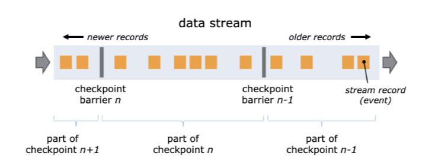

## 消息队列和流计算

消息队列和流计算往往是相互配合，一起来使用的。而流计算也是后端程序员技术栈中非常重要的一项技术。

**对实时产生的数据进行实时统计分析，这类场景都适合使用流计算来实现。**

需要特别注意的是，这里面有两个“实时”，一个是说，数据是“实时”产生的，另一个是说，统计分析这个过程是“实时”进行的，统计结果也是第一时间就计算出来了。对于这样的场景，你都可以考虑使用流计算框架。

因为流计算框架可以自动地帮我们实现实时的并行计算，性能非常好，并且内置了很多常用的统计分析的算子，比如 TimeWindow、GroupBy、Sum 和 Count，所以非常适合用来做实时的统计和分析。举几个例子：

- 每分钟按照 IP 统计 Web 请求次数；
- 电商在大促时，实时统计当前下单量；
- 实时统计 App 中的埋点数据，分析营销推广效果。

以上这些场景，以及和这些场景类似的场景，都是比较适合用流计算框架来实现的。特别是基于时间维度的统计分析，使用流计算框架来实现是非常方便的。

### 配合

对流计算来说，有一个问题，就是在集群中流动的数据并没有被持久化，所以它们就有可能由于节点故障而丢失，怎么解决这个问题呢？办法也比较简单粗暴，就是直接重启整个计算任务，并且从数据源头向前回溯一些数据。计算任务重启之后，会重新分配计算节点，顺便就完成了故障迁移。

回溯数据源，可以保证数据不丢失，这和消息队列中，通过重发未成功的消息来保证数据不丢的方法是类似的。所以，它们面临同样的问题：可能会出现重复的消息。消息队列可以通过在消费端做幂等来克服这个问题，但是对于流计算任务来说，这个问题就很棘手了。

对于接收计算结果的下游系统，它可能会收到重复的计算结果，这还不是最糟糕的。像一些统计类的计算任务，就会有比较大的影响，比如上节课中统计访问次数的例子，本来这个 IP 地址在统计周期内被访问了 5 次，产生了 5 条访问日志，正确的结果应该是 5 次。如果日志被重复统计，那结果就会多于 5 次，重复的数据导致统计结果出现了错误。怎么解决这个问题呢？

我们之前提到过，Kafka 支持 Exactly Once 语义，它的这个特性就是为了解决这个问题而生的。这节课，我们就来通过一个例子学习一下，如何使用 Kafka 配合 Flink，解决数据重复的问题，实现端到端的 Exactly Once 语义。

### Flink 是如何保证 Exactly Once 语义的？

我们所说的端到端 Exactly Once，这里面的“端到端”指的是，数据从 Kafka 的 A 主题消费，发送给 Flink 的计算集群进行计算，计算结果再发给 Kafka 的 B 主题。在这整个过程中，无论是 Kafka 集群的节点还是 Flink 集群的节点发生故障，都不会影响计算结果，每条消息只会被计算一次，不能多也不能少。

在理解端到端 Exactly Once 的实现原理之前，我们需要先了解一下，Flink 集群本身是如何保证 Exactly Once 语义的。为什么 Flink 也需要保证 Exactly Once 呢？Flink 集群本身也是一个分布式系统，它首先需要保证数据在 Flink 集群内部只被计算一次，只有在这个基础上，才谈得到端到端的 Exactly Once。

Flink 通过 CheckPoint 机制来定期保存计算任务的快照，这个快照中主要包含两个重要的数据：

1. 整个计算任务的状态。这个状态主要是计算任务中，每个子任务在计算过程中需要保存的临时状态数据。比如，上节课例子中汇总了一半的数据。
2. 数据源的位置信息。这个信息记录了在数据源的这个流中已经计算了哪些数据。如果数据源是 Kafka 的主题，这个位置信息就是 Kafka 主题中的消费位置。

有了 CheckPoint，当计算任务失败重启的时候，可以从最近的一个 CheckPoint 恢复计算任务。具体的做法是，每个子任务先从 CheckPoint 中读取并恢复自己的状态，然后整个计算任务从 CheckPoint 中记录的数据源位置开始消费数据，只要这个恢复位置和 CheckPoint 中每个子任务的状态是完全对应的，或者说，每个子任务的状态恰好是：“刚刚处理完恢复位置之前的那条数据，还没有开始处理恢复位置对应的这条数据”，这个时刻保存的状态，就可以做到严丝合缝地恢复计算任务，每一条数据既不会丢失也不会重复。

因为每个子任务分布在不同的节点上，并且数据是一直在子任务中流动的，所以确保 CheckPoint 中记录的恢复位置和每个子任务的状态完全对应并不是一件容易的事儿，Flink 是怎么实现的呢？

Flink 通过在数据流中插入一个 Barrier（屏障）来确保 CheckPoint 中的位置和状态完全对应。下面这张图来自[Flink 官网的说明文档](https://ci.apache.org/projects/flink/flink-docs-stable/internals/stream_checkpointing.html)。

你可以把 Barrier 理解为一条特殊的数据。Barrier 由 Flink 生成，并在数据进入计算集群时被插入到数据流中。这样，无限的数据流就被很多的 Barrier 分隔成很多段。Barrier 在流经每个计算节点的时候，就会触发这个节点在 CheckPoint 中保存本节点的状态，如果这个节点是数据源节点，还会保存数据源的位置。

当一个 Barrier 流过所有计算节点，流出计算集群后，一个 CheckPoint 也就保存完成了。由于每个节点都是在 Barrier 流过的时候保存的状态，这时的状态恰好就是 Barrier 所在位置（也就是 CheckPoint 数据源位置）对应的状态，这样就完美解决了状态与恢复位置对应的问题。

Flink 通过 CheckPoint 机制实现了集群内计算任务的 Exactly Once 语义，但是仍然实现不了在输入和输出两端数据不丢不重。比如，Flink 在把一条计算结果发给 Kafka 并收到来自 Kafka 的“发送成功”响应之后，才会继续处理下一条数据。如果这个时候重启计算任务，Flink 集群内的数据都可以完美地恢复到上一个 CheckPoint，但是已经发给 Kafka 的消息却没办法撤回，还是会出现数据重复的问题。

所以，我们需要配合 Kafka 的 Exactly Once 机制，才能实现端到端的 Exactly Once。

### Kafka 如何配合 Flink 实现端到端 Exactly Once？

简单地说就是，每个 Flink 的 CheckPoint 对应一个 Kafka 事务。Flink 在创建一个 CheckPoint 的时候，同时开启一个 Kafka 的事务，完成 CheckPoint 同时提交 Kafka 的事务。当计算任务重启的时候，在 Flink 中计算任务会恢复到上一个 CheckPoint，这个 CheckPoint 正好对应 Kafka 上一个成功提交的事务。未完成的 CheckPoint 和未提交的事务中的消息都会被丢弃，这样就实现了端到端的 Exactly Once。

但是，怎么才能保证“完成 CheckPoint 同时提交 Kafka 的事务”呢？或者说，如何来保证“完成 CheckPoint”和“提交 Kafka 事务”这两个操作，要么都成功，要么都失败呢？这不就是一个典型的分布式事务问题嘛！

所以，**Flink 基于两阶段提交这个常用的分布式事务算法，实现了一分布式事务的控制器来解决这个问题**。

