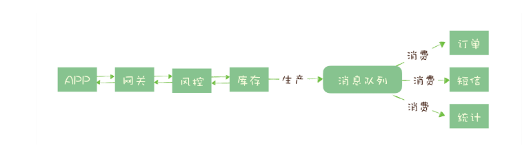

## 消息队列基础

消息队列主要解决了以下这些问题：

### 异步处理

秒杀系统需要解决的核心问题是，如何利用有限的服务器资源，尽可能多地处理短时间内的海量请求。我们知道，处理一个秒杀请求包含了很多步骤，例如：

- 风险控制；
- 库存锁定；
- 生成订单；
- 短信通知；
- 更新统计数据。

如果没有任何优化，正常的处理流程是：App 将请求发送给网关，依次调用上述 5 个流程，然后将结果返回给 APP。

对于对于这 5 个步骤来说，能否决定秒杀成功，实际上只有风险控制和库存锁定这 2 个步骤。只要用户的秒杀请求通过风险控制，并在服务端完成库存锁定，就可以给用户返回秒杀结果了，对于后续的生成订单、短信通知和更新统计数据等步骤，并不一定要在秒杀请求中处理完成。

所以当服务端完成前面 2 个步骤，确定本次请求的秒杀结果后，就可以马上给用户返回响应，然后把请求的数据放入消息队列中，由消息队列异步地进行后续的操作。

**在这个场景中，消息队列被用于实现服务的异步处理。**这样做的好处是：

- 可以更快地返回结果；
- 减少等待，自然实现了步骤之间的并发，提升系统总体的性能。

### 流量控制

我们需要设计一套足够健壮的架构来将后端的服务保护起来。**我们的设计思路是，使用消息队列隔离网关和后端服务，以达到流量控制和保护后端服务的目的。**

加入消息队列后，整个秒杀流程变为：

1. 网关在收到请求后，将请求放入请求消息队列；
2. 后端服务从请求消息队列中获取 APP 请求，完成后续秒杀处理过程，然后返回结果。

秒杀开始后，当短时间内大量的秒杀请求到达网关时，不会直接冲击到后端的秒杀服务，而是先堆积在消息队列中，后端服务按照自己的最大处理能力，从消息队列中消费请求进行处理。

对于超时的请求可以直接丢弃，APP 将超时无响应的请求处理为秒杀失败即可。运维人员还可以随时增加秒杀服务的实例数量进行水平扩容，而不用对系统的其他部分做任何更改。

这种设计的优点是：能根据下游的处理能力自动调节流量，达到**“削峰填谷”**的作用(**zwlj: 消息队列的重要作用，削峰填谷**)。但这样做同样是有代价的：

- 增加了系统调用链环节，导致总体的响应时延变长。
- 上下游系统都要将同步调用改为异步消息，增加了系统的复杂度。

### 服务解耦

消息队列的另外一个作用，就是实现系统应用之间的解耦。再举一个电商的例子来说明解耦的作用和必要性。

我们知道订单是电商系统中比较核心的数据，当一个新订单创建时：

1. 支付系统需要发起支付流程；
2. 风控系统需要审核订单的合法性；
3. 客服系统需要给用户发短信告知用户；
4. 经营分析系统需要更新统计数据；
5. ……

所有的电商都选择用消息队列来解决类似的系统耦合过于紧密的问题。引入消息队列后，订单服务在订单变化时发送一条消息到消息队列的一个主题 Order 中，所有下游系统都订阅主题 Order，这样每个下游系统都可以获得一份实时完整的订单数据。

无论增加、减少下游系统或是下游系统需求如何变化，订单服务都无需做任何更改，实现了订单服务与下游服务的解耦。

### 消息队列选型

介绍一些常见的消息队列选型

#### RabbitMQ

老牌儿消息队列 RabbitMQ，俗称兔子 MQ。RabbitMQ 是使用一种比较小众的编程语言：Erlang 语言编写的，它最早是为电信行业系统之间的可靠通信设计的，也是少数几个支持 AMQP 协议的消息队列之一。

RabbitMQ 就像它的名字中的兔子一样：轻量级、迅捷，它的 Slogan，也就是宣传口号，也很明确地表明了 RabbitMQ 的特点：Messaging that just works，“开箱即用的消息队列”。也就是说，RabbitMQ 是一个相当轻量级的消息队列，非常容易部署和使用。

RabbitMQ 一个比较有特色的功能是支持非常灵活的路由配置，和其他消息队列不同的是，它在生产者（Producer）和队列（Queue）之间增加了一个 Exchange 模块，你可以理解为交换机。

这个 Exchange 模块的作用和交换机也非常相似，根据配置的路由规则将生产者发出的消息分发到不同的队列中。路由的规则也非常灵活，甚至你可以自己来实现路由规则。基于这个 Exchange，可以产生很多的玩儿法，如果你正好需要这个功能，RabbitMQ 是个不错的选择。

接下来说下 RabbitMQ 的几个问题。

- RabbitMQ 对消息堆积的支持并不好，在它的设计理念里面，消息队列是一个管道，大量的消息积压是一种不正常的情况，应当尽量去避免。当大量消息积压的时候，会导致 RabbitMQ 的性能急剧下降。
- RabbitMQ 的性能是我们介绍的这几个消息队列中最差的，根据官方给出的测试数据综合我们日常使用的经验，依据硬件配置的不同，它大概每秒钟可以处理几万到十几万条消息。其实，这个性能也足够支撑绝大多数的应用场景了，不过，如果你的应用对消息队列的性能要求非常高，那不要选择 RabbitMQ。

#### RocketMQ

RocketMQ 是阿里巴巴在 2012 年开源的消息队列产品，后来捐赠给 Apache 软件基金会，2017 正式毕业，成为 Apache 的顶级项目。阿里内部也是使用 RocketMQ 作为支撑其业务的消息队列，经历过多次“双十一”考验，它的性能、稳定性和可靠性都是值得信赖的。作为优秀的国产消息队列，近年来越来越多的被国内众多大厂使用。

我在总结 RocketMQ 的特点时，发现很难找出 RocketMQ 有什么特别让我印象深刻的特点，也很难找到它有什么缺点。

RocketMQ 有非常活跃的中文社区，大多数问题你都可以找到中文的答案，也许会成为你选择它的一个原因。另外，RocketMQ 使用 Java 语言开发，它的贡献者大多数都是中国人，源代码相对也比较容易读懂，你很容易对 RocketMQ 进行扩展或者二次开发。

RocketMQ 对在线业务的响应时延做了很多的优化，大多数情况下可以做到毫秒级的响应，**如果你的应用场景很在意响应时延，那应该选择使用 RocketMQ。**

RocketMQ 的性能比 RabbitMQ 要高一个数量级，每秒钟大概能处理几十万条消息。

RocketMQ 的一个劣势是，作为国产的消息队列，相比国外的比较流行的同类产品，在国际上还没有那么流行，与周边生态系统的集成和兼容程度要略逊一筹。

#### Kafka

Kafka 最早是由 LinkedIn 开发，目前也是 Apache 的顶级项目。Kafka 最初的设计目的是用于处理海量的日志。

在早期的版本中，为了获得极致的性能，在设计方面做了很多的牺牲，比如不保证消息的可靠性，可能会丢失消息，也不支持集群，功能上也比较简陋，这些牺牲对于处理海量日志这个特定的场景都是可以接受的。这个时期的 Kafka 甚至不能称之为一个合格的消息队列。

但是，请注意，重点一般都在后面。随后的几年 Kafka 逐步补齐了这些短板，你在网上搜到的很多消息队列的对比文章还在说 Kafka 不可靠，其实这种说法早已经过时了。当下的 Kafka 已经发展为一个非常成熟的消息队列产品，无论在数据可靠性、稳定性和功能特性等方面都可以满足绝大多数场景的需求。

**Kafka 与周边生态系统的兼容性是最好的没有之一，尤其在大数据和流计算领域，几乎所有的相关开源软件系统都会优先支持 Kafka。**

Kafka 使用 Scala 和 Java 语言开发，设计上大量使用了批量和异步的思想，这种设计使得 Kafka 能做到超高的性能。Kafka 的性能，尤其是异步收发的性能，是三者中最好的，但与 RocketMQ 并没有量级上的差异，大约每秒钟可以处理几十万条消息。

我曾经使用配置比较好的服务器对 Kafka 进行过压测，在有足够的客户端并发进行异步批量发送，并且开启压缩的情况下，Kafka 的极限处理能力可以超过每秒 2000 万条消息。

但是 Kafka 这种异步批量的设计带来的问题是，它的同步收发消息的响应时延比较高，因为当客户端发送一条消息的时候，Kafka 并不会立即发送出去，而是要等一会儿攒一批再发送，在它的 Broker 中，很多地方都会使用这种“先攒一波再一起处理”的设计。当你的业务场景中，每秒钟消息数量没有那么多的时候，Kafka 的时延反而会比较高。所以，**Kafka 不太适合在线业务场景。**

