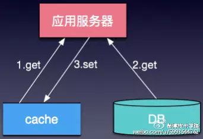
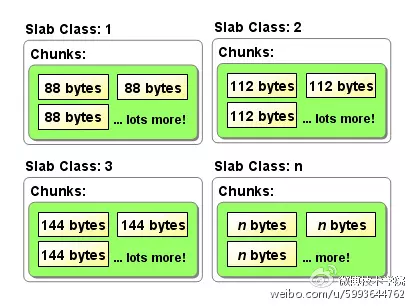
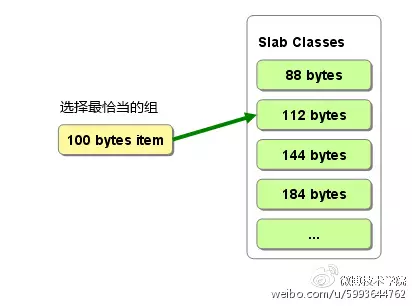
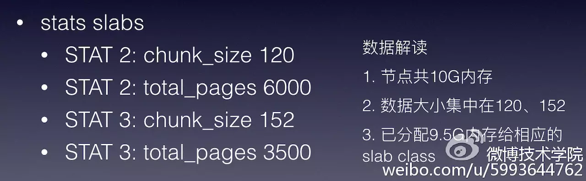
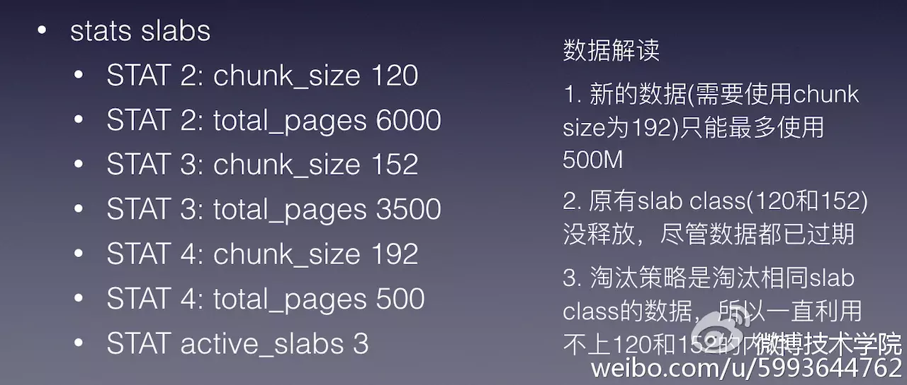

## 缓存技术基础
对于构建高性能、高可用的大型互联网系统，缓存是不可或缺的组成部分

传统的后端业务场景中，访问量以及对响应时间的要求均不高，通常只使用DB即可满足要求。这种架构简单，便于快速部署，很多网站发展初期均考虑使用这种架构。但是随着访问量的上升，以及对响应时间的要求提升，单DB无法再满足要求。这时候通常会考虑DB拆分(sharding)、读写分离、甚至硬件升级(SSD)等以满足新的业务需求。

但上述也有缺点：

 - 性能提升有限，很难达到数量级上的提升，尤其在互联网业务场景下，随着网站的发展，访问量经常会面临十倍、百倍的上涨。
 - 成本高昂，为了承载N倍的访问量，通常需要N倍的机器，这个代价难以接受。

同时我们也注意到，内容访问复合二八原则：

大部分的业务场景下，80%的访问量都集中在20%的热数据上(适用二八原则)。因此，通过引入缓存组件，将高频访问的数据，放入缓存中，可以大大提高系统整体的承载能力，原有单层DB的数据存储结构，也变为Cache+DB的结构

下面介绍一下常用的缓存组件：

### Memcached
Memcached是开源的，高性能的，可分布式部署，用于网站提速，减轻数据库负载的缓存组件

有如下特点：

 - 高性能Key-Value存储
 - 协议简单：简单文本协议、二进制协议
 - 支持数据过期
 - LRU剔除算法
 - 多线程
 - slab内存管理
 - 客户端实现分布式       

#### 内存管理

Memcached使用Slab Allocator的机制来实现分配、管理内存，按照预先规定的大小，将分配的内存分割成特定长度的块，以此来解决内存碎片问题，如图：

**​slab是特定大小的chunk的组**，并根据增长因子(factor)，划分成不同slab class。如上图就分为4个class，每个class的组，chunk大小也都不一样。

每次分配一个page(默认1MB)给某个slab(可以理解为一个slab会被分配一个page大小的内存)，并根据slab的大小，切分成多个chunk，数据存储在chunk中。**Memcached根据收到的数据的大小，选择最适合数据大小的slab**

 Memcached的Slab Allocator内存分配方式会存在内存浪费的问题，主要有以下几种情况：

  - chunk浪费: 缓存数据没有填充满chunk
  - page浪费: 一个page的容量不能被slab的大小整除。
  - slab浪费: 某个slab的内存没有完全被利用，只存储了少量数据，却占用一个page。

#### 剔除算法
Memcached采用**LRU淘汰算法--最久未使用算法**，在容量满的时候进行数据剔除。不过该淘汰算法 **只在Slab内部进行**，也就是说，某个Slab容量已满时，只会在该Slab内部进行数据剔除，而不会影响其它Slab。这种局部剔除的策略也带来了一个问题：**Slab钙化**。

#### Slab钙化
某个Memcached实例的Slab状态如下：

上图意味，有两个slab，第一个slab chunk单位是120m，第二个slab chunk单位是152m。且第一个slab被分配了6000个page也就是6g，slab2则是3.5g。

​如果此时，业务数据大小出现变更，比如超过152字节。就会出现以下问题

 新的数据(需要使用chunk size为192)，只能最多使用500M，而原有slab class(120和152)没释放，尽管数据都已过期，因为淘汰策略是淘汰相同slab class的数据，所以一直利用不上120和152的内存，这种情况会导致缓存命中率急剧下降。

如果发生这种情况，有以下几种解决方案：

 - 重启Memcached实例，简单粗暴，需要避免单点问题，避免出现雪崩

 - 随机过期，过期淘汰策略也支持淘汰其他slab class的数据，twitter和facebook等均作了类似支持

 - 通过slab_reassign、slab_authmove，官方1.4.11版开始支持此功能

### redis
Redis是开源的，高性能的，支持分布式，支持多数据结构的缓存组件(详细笔记将记到数据库目录下)。特点如下

 - 高性能Key-Value存储
 - 丰富的数据结构：string、list、hash、set、zset、hypeloglog
 - 支持数据过期：主动过期+惰性过期
 - 支持多种LRU策略：volatile-lru、volatile-ttl 等
 - 内存管理：tcmaloc、jemalloc
 - 内存存储+磁盘持久化: rdb、aof
 - 支持主从复制
 - 单线程

### 分布式缓存基础
构建大型互联网系统会面临很多的挑战，主要有：

 - 百万级QPS的资源调用 (高并发)
 - 99.99%的可用性 (高可用)
 - 毫秒级的核心请求响应时间 (高性能)

 设计这样的互联网系统，**不可避免的要考虑使用分布式缓存，并从可用性、并发性、性能多个方面进行综合考量**。

下面介绍一下分布式缓存的实现方式：

#### 数据分片
数据分片就是把数据均匀分散到多个实例中。

数据分片(也可以理解为根据key值找机器)可以采用以下几种规则：区间分片、hash分片、 slot分片。对于hash分片，主要的哈希算法有静态哈希和一致性哈希，静态哈希和一致性哈希对比如下：

 - 静态哈希(取模求余) 优点：算法简单，缺点：加减节点时震荡厉害, 命中率下降厉害
 - 一致性哈希，优点：加减节点时震荡较小, 保持较高命中率。 缺点：自动rehash场景下会数据不一致的问题(同一份数据的请求在不同节点漂移)

#### 可用性
线上使用过程中，如果出现某些缓存实例不可用，大量请求穿透会给DB带来巨大的压力，极端情况会导致雪崩场景，这需要有更好的方式保证缓存的高可用。于是我们采用用主从(Master/Slave)的架构，如图6。也就是在原有单层缓存的结构下，增加一层Slave，来保证即使某个Master节点宕机，整个缓存层依然是可用的，不会出现大量请求穿透DB的情况。

### 参考
[分布式缓存架构基础](https://juejin.im/entry/57e39e320e3dd90058021bff)
