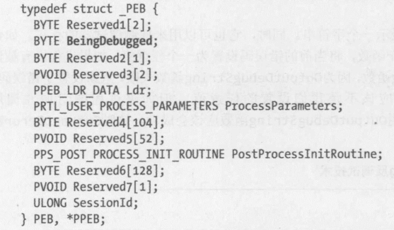

## 反调试技术详解
取自
<A>http://blog.csdn.net/liujiayu2/article/details/72956591</a>

反调试技术，恶意代码用它识别是否被调试，或者让调试器失效。恶意代码编写者意识到分析人员经常使用调试器来观察恶意代码的操作，因此他们使用反调试技术尽可能地延长恶意代码的分析时间。为了阻止调试器的分析，当恶意代码意识到自己被调试时，它们可能改变正常的执行路径或者修改自身程序让自己崩溃，从而增加调试时间和复杂度。很多种反调试技术可以达到反调试效果。这里介绍当前常用的几种反调试技术，同时也会介绍一些逃避反调试的技巧。

### 通过探测windows调试器
恶意代码会使用**多种技术**探测调试器调试它的痕迹，其中包括使用Windows API、手动检测调试器人工痕迹的内存结构，查询调试器遗留在系统中的痕迹等。调试器探测是恶意代码最常用的反调试技术。

#### 使用windows API
使用Windows API函数检测调试器是否存在是最简单的反调试技术。Windows操作系统中提供了这样一些API，应用程序可以通过调用这些API，来检测自己是否正在被调试。这些API中，其中很小部分函数没有在微软官方文档显示。通常，防止恶意代码使用API进行反调试的最简单的办法是在恶意代码运行期间修改恶意代码，使其不能调用探测调试器的API函数，或者修改这些API函数的返回值，确保恶意代码执行合适的路径。与这些方法相比，较复杂的做法是**挂钩这些函数，如使用rootkit技术**。

zwlj:也就是自己写封装一些windows官方的函数来判断自己是否被debug。

##### 1.1 IsDebuggerPresent
IsDebuggerPresent查询进程环境块(PEB)中的IsDebugged标志。如果进程没有运行在调试器环境中，函数返回0；如果调试附加了进程，函数返回一个非零值。

``` c++
BOOL CheckDebug()
{
    return IsDebuggerPresent();
}
```

##### 1.2 CheckRemoteDebuggerPresent
CheckRemoteDebuggerPresent同IsDebuggerPresent几乎一致。它不仅可以探测系统其他进程是否被调试，通过传递自身进程句柄还可以探测自身是否被调试。

``` c++
BOOL CheckDebug()
{
    BOOL ret;
    CheckRemoteDebuggerPresent(GetCurrentProcess(), &ret);
    return ret;
}
```


#### 1.3NtQueryInformationProcess
这个函数是Ntdll.dll中一个原生态API，它用来提取一个给定进程的信息。它的第一个参数是进程句柄，第二个参数告诉我们它需要提取进程信息的类型。为第二个参数指定特定值并调用该函数，相关信息就会设置到第三个参数。第二个参数是一个枚举类型，其中与反调试有关的成员有ProcessDebugPort(0x7)、ProcessDebugObjectHandle(0x1E)和ProcessDebugFlags(0x1F)。例如将该参数置为ProcessDebugPort，如果进程正在被调试，则返回调试端口，否则返回0。

#### 1.4GetLastError
编写应用程序时，经常需要涉及到错误处理问题。许多函数调用只用TRUE和FALSE来表明函数的运行结果。一旦出现错误，MSDN中往往会指出请用GetLastError()函数来获得错误原因。**恶意代码可以使用异常来破坏或者探测调试器**。调试器捕获异常后，并不会立即将处理权返回被调试进程处理，大多数利用异常的反调试技术往往据此来检测调试器。


zwlj：具体方法可以看top来源链接，原理也是利用了debug会设置一些错误信息的方法来判断。

##### 1.5 ZwSetInformationThread
ZwSetInformationThread拥有两个参数，第一个参数用来接收当前线程的句柄，第二个参数表示线程信息类型，若其值设置为ThreadHideFromDebugger(0x11)，使用语句ZwSetInformationThread(GetCurrentThread(), ThreadHideFromDebugger, NULL, 0);调用该函数后，调试进程就会被分离出来。该函数不会对正常运行的程序产生任何影响，但若运行的是调试器程序，因为该函数隐藏了当前线程，调试器无法再收到该线程的调试事件，最终停止调试。还有一个函数DebugActiveProcessStop用来分离调试器和被调试进程，从而停止调试。两个API容易混淆，需要牢记它们的区别。

#### 2 手动检测数据结构
虽然使用Windows API是探测调试器存在的最简单办法，但**手动检查数据结构是恶意代码编写者最常使用的办法**。这是因为很多时候通过Windows API实现的反调试技术无效，例如这些API函数被rootkit挂钩，并返回错误信息。因此，恶意代码编写者经常手动执行与这些API功能相同的操作。在手动检测中，**PEB结构中的一些标志暴露了调试器存在的信息**。这里，我们关注检测调试器存在常用的一些标志。

##### 2.1检测BeingDebugged属性
Windows操作系统维护着每个正在运行的进程的PEB结构，它包含与这个进程相关的所有用户态参数。这些参数包括进程环境数据，环境数据包括环境变量、加载的模块列表、内存地址，以及调试器状态。



``` c++
BOOL CheckDebug()
{
    int result = 0;
    __asm
    {
        mov eax, fs:[30h]
        mov al, BYTE PTR [eax + 2]
        mov result, al
    }
    return result != 0;
}
```

##### 2.2检测ProcessHeap属性
Reserved数组中一个未公开的位置叫作ProcessHeap，它被设置为加载器为进程分配的第一个堆的位置。ProcessHeap位于PEB结构的0x18处。第一个堆头部有一个属性字段，它告诉内核这个堆是否在调试器中创建。这些属性叫作ForceFlags和Flags。在Windows XP系统中，ForceFlags属性位于堆头部偏移量0x10处；在Windows 7系统中，对于32位的应用程序来说ForceFlags属性位于堆头部偏移量0x44处。

##### 2.3检测NTGlobalFlag
由于调试器中启动进程与正常模式下启动进程有些不同，所以它们创建内存堆的方式也不同。系统使用PEB结构偏移量0x68处的一个未公开位置，来决定如何创建堆结构。如果这个位置的值为0x70，我们就知道进程正运行在调试器中。

#### 3.系统痕迹检测
通常，我们使用调试工具来分析恶意代码，但这些工具会在系统中驻留一些痕迹。恶意代码通过搜索这种系统痕迹，来确定你是否试图分析它。

##### 3.1查找调试器引用的注册表项
下面是调试器在注册表中的一个常用位置。
SOFTWARE\\Microsoft\\Windows NT\\CurrentVersion\\AeDebug(32位系统)
SOFTWARE\\Wow6432Node\\Microsoft\\WindowsNT\\CurrentVersion\\AeDebug(64位系统)

该注册表项指定当应用程序发生错误时，触发哪一个调试器。默认情况下，它被设置为Dr.Watson。如果该这册表的键值被修改为OllyDbg，则恶意代码就可能确定它正在被调试。

##### 3.2查找窗体信息
FindWindow函数检索处理顶级窗口的类名和窗口名称匹配指定的字符串。

EnumWindows函数枚举所有屏幕上的顶层窗口，并将窗口句柄传送给应用程序定义的回调函数。

GetForegroundWindow获取一个前台窗口的句柄。

##### 3.3查找进程信息
用一下代码来枚举进程，然后对比。

``` c++
BOOL CheckDebug()
{
    DWORD ID;
    DWORD ret = 0;
    PROCESSENTRY32 pe32;
    pe32.dwSize = sizeof(pe32);
    HANDLE hProcessSnap = CreateToolhelp32Snapshot(TH32CS_SNAPPROCESS, 0);
    if(hProcessSnap == INVALID_HANDLE_VALUE)
    {
        return FALSE;
    }
    BOOL bMore = Process32First(hProcessSnap, &pe32);
    while(bMore)
    {
        if (stricmp(pe32.szExeFile, "OllyDBG.EXE")==0 || stricmp(pe32.szExeFile, "OllyICE.exe")==0 || stricmp(pe32.szExeFile, "x64_dbg.exe")==0 || stricmp(pe32.szExeFile, "windbg.exe")==0 || stricmp(pe32.szExeFile, "ImmunityDebugger.exe")==0)
        {
            return TRUE;
        }
        bMore = Process32Next(hProcessSnap, &pe32);
    }
    CloseHandle(hProcessSnap);
    return FALSE;
}
```

### 识别调试器行为
在逆向工程中，为了帮助恶意代码分析人员进行分析，可以使用调试器设置一个断点，或是单步执行一个进程。然而，在调试器中执行这些操作时，它们会修改进程中的代码。因此，恶意代码常使用几种反调试技术探测软件/硬件断点、完整性校验、时钟检测等几种类型的调试器行为。直接运行恶意代码与在调试器中运行恶意代码也会在一些细节上不同，如父进程信息、STARTUPINFO信息、SeDebugPrivilege权限等。

#### 1.软件断点检查
调试器设置断点的基本机制是**用软件中断指令INT 3**临时**替换运行程序中的一条指令**，然后当程序运行到这条指令时，调用调试异常处理例程。INT 3指令的机器码是0xCC，因此无论何时，使用调试器设置一个断点，它都会插入一个0xCC来修改代码。恶意代码常用的一种反调试技术是在它的代码中查找机器码0xCC，来扫描调试器对它代码的INT 3修改。repne scasb指令用于在一段数据缓冲区中搜索一个字节。EDI需指向缓冲区地址，AL则包含要找的字节，ECX设为缓冲区的长度。当ECX=0或找到该字节时，比较停止。

#### 2.硬件断点检查
在OllyDbg的寄存器窗口按下右键，点击View debug registers可以看到DR0、DR1、DR2、DR3、DR6和DR7这几个寄存器。DR0、Dr1、Dr2、Dr3用于设置硬件断点，由于只有4个硬件断点寄存器，所以同时最多只能设置4个硬件断点。DR4、DR5由系统保留。  DR6、DR7用于记录Dr0-Dr3中断点的相关属性。如果没有硬件断点，那么DR0、DR1、DR2、DR3这4个寄存器的值都为0。

#### 3.执行代码校验和检查
恶意代码可以计算代码段的校验并实现与扫描中断相同的目的。与扫描0xCC不同，这种检查仅执行恶意代码中机器码CRC或者MD5校验和检查。

#### 4.时钟检测
被调试时，进程的运行速度大大降低，例如，单步调试大幅降低恶意代码的运行速度，所以时钟检测是恶意代码探测调试器存在的最常用方式之一。有如下两种用时钟检测来探测调试器存在的方法。
记录一段操作前后的时间戳，然后比较这两个时间戳，如果存在滞后，则可以认为存在调试器。
记录触发一个异常前后的时间戳。如果不调试进程，可以很快处理完异常，因为调试器处理异常的速度非常慢。默认情况下，调试器处理异常时需要人为干预，这导致大量延迟。虽然很多调试器允许我们忽略异常，将异常直接返回程序，但这样操作仍然存在不小的延迟。

##### 4.1使用rdtsc指令
较常用的时钟检测方法是利用rdtsc指令(操作码0x0F31)，它返回至系统重新启动以来的时钟数，并且将其作为一个64位的值存入EDX:EAX中。恶意代码运行两次rdtsc指令，然后比较两次读取之间的差值。

##### 4.2使用QueryPerformanceCounter和GetTickCount
同rdtsc指令一样，这两个Windows API函数也被用来执行一个反调试的时钟检测。使用这种方法的前提是处理器有高分辨率能力的计数器-寄存器，它能存储处理器活跃的时钟数。为了获取比较的时间差，调用两次QueryPerformanceCounter函数查询这个计数器。若两次调用之间花费的时间过于长，则可以认为正在使用调试器。GetTickCount函数返回最近系统重启时间与当前时间的相差毫秒数(由于时钟计数器的大小原因，计数器每49.7天就被重置一次)。

``` c++
BOOL CheckDebug()
{
    DWORD time1 = GetTickCount();
    __asm
    {
        mov     ecx,10
        mov     edx,6
        mov     ecx,10
    }
    DWORD time2 = GetTickCount();
    if (time2-time1 > 0x1A)
    {
        return TRUE;
    }
    else
    {
        return FALSE;
    }
}
```

#### 5.判断父进程是否是explorer.exe
一般双击运行的进程的父进程都是explorer.exe，但是如果进程被调试父进程则是调试器进程。也就是说如果父进程不是explorer.exe则可以认为程序正在被调试。

#### 6.判断STARTUPINFO信息
explorer.exe创建进程的时候会把STARTUPINFO结构中的值设为0，而非explorer.exe创建进程的时候会忽略这个结构中的值，也就是结构中的值不为0。所以可以利用STARTUPINFO来判断程序是否在被调试。

#### 7.判断是否具有SeDebugPrivilege权限
默认情况下进程是没有SeDebugPrivilege权限的，但是当进程通过调试器启动时，由于调试器本身启动了SeDebugPrivilege权限，当调试进程被加载时SeDebugPrivilege也就被继承了。所以我们可以检测进程的SeDebugPrivilege权限来间接判断是否存在调试器，而对SeDebugPrivilege权限的判断可以用能否打开csrss.exe进程来判断。

### 三.干扰调试器的功能
恶意代码可以用一些技术来干扰调试器的正常运行。例如线程本地存储(TLS)回调、插入中断、异常等。这些技术当且仅当程序处于调试器控制之下时才试图扰乱程序的运行。

#### 1.使用TLS回调
Thread Local Storage(TLS)，即线程本地存储，是Windows为解决一个进程中多个线程同时访问全局变量而提供的机制。TLS可以简单地由操作系统代为完成整个互斥过程，也可以由用户自己编写控制信号量的函数。当进程中的线程访问预先制定的内存空间时，操作系统会调用系统默认的或用户自定义的信号量函数，保证数据的完整性与正确性。下面是一个简单的TLS回调的例子，TLS_CALLBACK1函数在main函数执行前调用IsDebuggerPresent函数检查它是否正在被调试。

#### 2.利用中断
因为调试器使用INT 3来设置软件断点，所以一种反调试技术就是在合法代码段中插入0xCC(INT 3)欺骗调试器，使其认为这些0xCC机器码是自己设置的断点。

#### 3.设置陷阱标志位
EFLAGS寄存器的第八个比特位是陷阱标志位。如果设置了，就会产生一个单步异常。

#### 4.使用异常
前面已经讨论了各种使用异常机制的反调试手段。

### 四.调试器漏洞
与所有软件一样，调试器也存在漏洞，有时恶意代码编写者为了防止被调试，会攻击这些漏洞。这里我们展示几种OllyDbg调试器处理PE格式文件时的常见漏洞。

#### 1.PE头漏洞
OllyDbg非常严格地遵循了微软对PE文件头部的规定。在PE文件的头部，通常存在一个叫作IMAGE_OPTIONAL_HEADER的结构。

#### 2.OutputDebugString漏洞
恶意代码常尝试利用OllyDbg1.1的格式化字符串漏洞，为OutputDebugString函数提供一个%s字符串的参数，让OllyDbg崩溃。因此，需要注意程序中可疑的OutputDebugString调用，例如OutputDebugString("%s%s%s%s%s%s%s%s%s")。如果执行了这个调用，OllyDbg将会崩溃。
