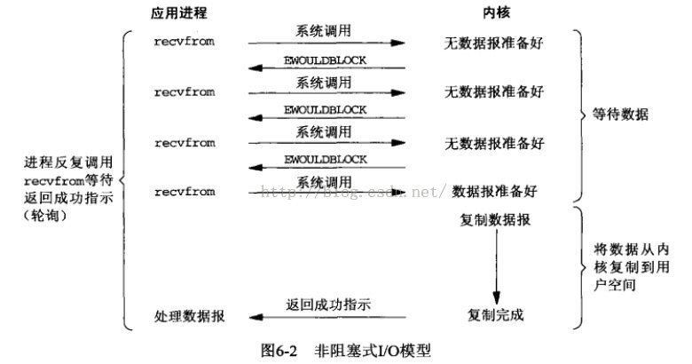
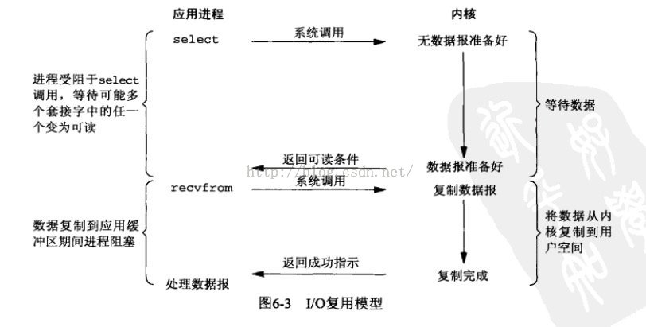
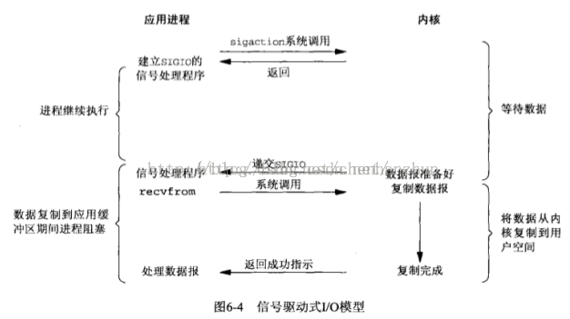

## 网络IO模型
在IO基础知识里，我们了解了操作系统是如何操作IO的。接下来阐述经典的5种IO模型。

有关Linux下网络编程相关知识，也可以去看操作系统下linux方面的笔记。

### 同步阻塞 IO（blocking IO）
同步阻塞 IO 模型是最常用的一个模型，也是最简单的模型。在linux中，默认情况下所有的socket都是blocking。它符合人们最常见的思考逻辑。阻塞就是进程 "被" 休息, CPU处理其它进程去了。

在这个IO模型中，用户空间的应用程序执行一个系统调用（recvform），这会导致应用程序阻塞，什么也不干，直到数据准备好，并且将数据从内核复制到用户进程，最后进程再处理数据，在等待数据到处理数据的两个阶段，整个进程都被阻塞。不能处理别的网络IO。**调用应用程序处于一种不再消费 CPU 而只是简单等待响应的状态**

如上图所示，应用进程会调用一个系统调用，然后就会立刻把CPU让出去。在等待数据准备好之前，进程是没有CPU使用权的。流程上，就是先等待数据被读到内核缓存区里(第一阶段)，然后再等数据从内核缓存区复制到用户缓存区(第二阶段)。

优点
 - 能够及时返回数据，无延迟；
 - 对内核开发者来说这是省事了；

缺点：
 - 对用户来说处于等待就要付出性能的代价了；

### 同步非阻塞 IO（nonblocking IO）
在上述的 阻塞式 IO中，可以看到，进程在发起了 recvform 系统调用的时候，就会阻塞，那么非阻塞式 IO 和 阻塞式 IO 的一个区别就在这里，它并不会阻塞，而是马上返回一个错误码，进程在得到错误码之后，可以干点别的事情，然后再重复上述的步骤，也就是又发起一个 recvform 系统调用。这个过程就成为轮询。（注意，这是针对第一步）

当用户进程发出read操作时，如果kernel中的数据还没有准备好，那么它并不会block用户进程，而是立刻返回一个error错误码。从用户进程角度讲，它发起一个read操作后，并不需要等待，而是马上就得到了一个结果。用户进程判断结果是一个error时，它就知道数据还没有准备好，因此也就可以去先干其他事情。最重要的一点是，由于错误码的返回，进程并没有被阻塞而是还把握着CPU的使用权。

优点：能够在等待任务完成的时间里干其他活了（包括提交其他任务，也就是 “后台” 可以有多个任务在同时执行）。

缺点：任务完成的响应延迟增大了，因为每过一段时间才去轮询一次read操作，而任务可能在两次轮询之间的任意时间完成。这会导致整体数据吞吐量的降低。

### IO 多路复用（ IO multiplexing）
由于同步非阻塞方式需要不断主动轮询，轮询占据了很大一部分过程，轮询会消耗大量的CPU时间。

而且，往往我们同时需要轮询很多个io，比如说，我需要同时读取好几个网络连接的数据。这时如果按照之前上述的方法，我们大概就会循环轮询。比如，先询问socket1数据准备好没->返回错误码->询问socket2数据->返回错误码->....，不停循环轮询多个网络io直到有数据准备好。这是以往的做法。

那么这种做法的不好之处在于：**这个轮询是由用户区发起的**。

**如果能把这种轮询多个socket的操作移到内核区，那么效率将会大大提高**。

IO多路复用模型正是如此。IO multiplexing就是我们说的select，poll，epoll，有些地方也称这种IO方式为event driven IO。select 系统调用是内核级别的。

如上图，大致流程便是，应用程序想要读数据的时候，先发一个select的系统调用，发起这个select之后，**应用进程便被阻塞了**。阻塞于进行这个select的调用。

接着select这个调用，会对一组文件描述符进行轮询。也就是说，应用进程想要读取多个网络io数据，那么这个select系统调用，就帮它轮询这些socket，直到某一个socket的数据准备好，这个时候就可以交应用进程开始读数据了。

select/epoll的好处就在于单个process就可以同时处理多个网络连接的IO。它的基本原理就是select，poll，epoll这个function会不断的轮询所负责的所有socket，当某个socket有数据到达了，就通知用户进程。

所以单纯跟上面的非阻塞io相比，非阻塞io只是轮询一个socket(在用户态)，而通过select，应用进程可以轮询多个socket(把这个任务交给内核态)。

上面的图和blocking IO的图其实并没有太大的不同，事实上，还更差一些。因为这里需要使用两个system call (select 和 recvfrom)，而blocking IO只调用了一个system call (recvfrom)。但是，**用select的优势在于它可以同时处理多个connection**。

所以，如果处理的连接数不是很高的话，使用select/epoll的web server不一定比使用multi-threading + blocking IO的web server性能更好，可能延迟还更大。（select/epoll的优势并不是对于单个连接能处理得更快，**而是在于能处理更多的连接**。）

**从整个IO过程来看，他们都是顺序执行的，因此可以归为同步模型(synchronous)。都是进程主动等待且向内核检查状态。【此句很重要！！！】**

在I/O编程过程中，当需要同时处理多个客户端接入请求时，可以利用多线程或者I/O多路复用技术进行处理。I/O多路复用技术通过把多个I/O的阻塞复用到同一个select的阻塞上，从而使得系统在单线程的情况下可以同时处理多个客户端请求。与传统的多线程/多进程模型比，I/O多路复用的最大优势是系统开销小，系统不需要创建新的额外进程或者线程，也不需要维护这些进程和线程的运行，降底了系统的维护工作量，节省了系统资源，I/O多路复用的主要应用场景如下：
 - 服务器需要同时处理多个处于监听状态或者多个连接状态的套接字。
 - 服务器需要同时处理多种网络协议的套接字。

#### 小总结
前面三种IO模式，在用户进程进行系统调用的时候，他们在等待数据到来的时候，处理的方式不一样，直接等待，轮询，select或poll轮询，两个阶段过程：

 - 第一个阶段有的阻塞，有的不阻塞，有的可以阻塞又可以不阻塞。
 - 第二个阶段都是阻塞的。

同步是需要主动等待消息通知(遇到阻塞主动挂起)，而异步则是被动接收消息通知，通过回调、通知、状态等方式来被动获取消息(类似js，发起一个任务以后继续处理接下来的事物)。IO多路复用在阻塞到select阶段时，用户进程是主动等待并调用select函数获取数据就绪状态消息，并且其进程状态为阻塞。所以，**把IO多路复用归为同步阻塞模式**。

###  信号驱动式IO（signal-driven IO）
信号驱动式I/O：首先我们允许Socket进行信号驱动IO,并安装一个信号处理函数，进程继续运行并不阻塞。当数据准备好时，进程会收到一个SIGIO信号，可以在信号处理函数中调用I/O操作函数处理数据。过程如下图所示：

也就是说，数据未准备就绪的时候，那么就进行等待，但是这个等待不会进行轮询，也不会阻塞。而是在某一时刻如果数据准备好了，那么**内核会通知进程启动IO操作**，将数据从内核区复制到用户区。

这个应该也算是异步IO了

### 异步非阻塞 IO（asynchronous IO）
相对于同步IO，异步IO不是顺序执行。用户进程进行aio_read系统调用之后，无论内核数据是否准备好，都会直接返回给用户进程，然后用户态进程可以去做别的事情。等到socket数据准备好了，内核直接复制数据给进程，然后从内核向进程发送通知。IO两个阶段，进程都是非阻塞的。

相当于升级版本的信号驱动IO，异步 IO 是等 内核完成整个操作之后再通过应用程序，这整个过程包括了 硬件读取数据到 内核结构体的缓冲区中，以及缓冲区的数据复制到 用户区中，这整个过程进程都不会阻塞。而信号驱动IO，第二阶段会通知用户进程去完成。
