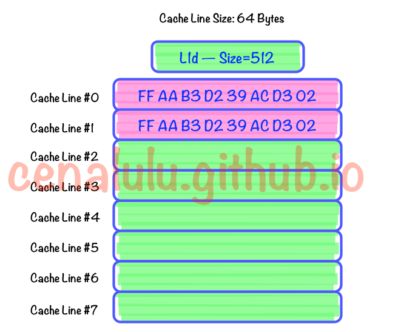

## 缓存一致性

### CPU缓存
按照数据读取顺序和与CPU结合的紧密程度，CPU缓存可以分为一级缓存，二级缓存，部分高端CPU还具有三级缓存，每一级缓存中所储存的全部数据都是下一级缓存的一部分，这三种缓存的技术难度和制造成本是相对递减的，所以其容量也是相对递增的。当CPU要读取一个数据时，**首先从一级缓存中查找，如果没有找到再从二级缓存中查找，如果还是没有就从三级缓存或内存中查找**。一般来说，每级缓存的命中率大概都在80%左右，也就是说全部数据量的80%都可以在一级缓存中找到，只剩下20%的总数据量才需要从二级缓存、三级缓存或内存中读取，由此可见一级缓存是整个CPU缓存架构中最为重要的部分

所以速度上必然是L1>L2>L3

在处理器看来，缓存是一个透明部件。因此，程序员通常无法直接干预对缓存的操作。但是，确实可以根据缓存的特点对程序代码实施特定优化，从而更好地利用缓存。

### CPU缓存与CPU寄存器
zwlj：缓存和寄存器是两个概念，缓存专门设于cpu和内存之间，用来解决传输速度不匹配的问题。而寄存器属于CPU的一部分，CPU运算时要先把内存的内容放到自己的寄存器下才能进行运算。

所以具体到CPU指令下的操作，高速缓存是一个透明的(invisible)机制.CPU将内存放入到寄存器时，会经过cpu缓存进行处理。所以具体到汇编指令的时候，中间不会有让你操作缓存的时候，操作内存的时候已经涉及并且经过了缓存。不同核心cpu之间为了保持缓存一致，才有的缓存一致性。


### Cache Line
Cache Line可以简单的理解为**CPU Cache中的最小缓存单位**。目前主流的CPU Cache的Cache Line大小都是64Bytes。假设我们有一个512字节的一级缓存，那么按照64B的缓存单位大小来算，这个一级缓存所能存放的缓存个数就是512/64 = 8个。

如下图：



zwlj：Cache line就是一个block，一个单位。


### 一致性协议


操作系统的CPU和内存并不是直接交互操作的。我们的CPU有一级缓存，CPU直接操作一级缓存，由一级缓存和内存进行交互。
当然，有的CPU有二级缓存，甚至三级缓存等。实际上，大概二十年前，一级缓存是直接和内存交互的，现在，一般是二级缓存和内存直接通讯。

每个CPU都有一级缓存，但是，我们却无法保证每个CPU的一级缓存数据都是一样的。
所以同一个程序，CPU进行切换的时候，切换前和切换后的数据可能会有不一致的情况。那么这个就是一个很大的问题了。
如何保证各个CPU缓存中的数据是一致的。就是CPU的缓存一致性问题。

一种处理一致性问题的办法是使用Bus Locking（总线锁）。当一个CPU对其缓存中的数据进行操作的时候，往总线中发送一个Lock信号。
这个时候，所有CPU收到这个信号之后就不操作自己缓存中的对应数据了，当操作结束，释放锁以后，所有的CPU就去内存中获取最新数据更新。

但是用锁的方式总是避不开性能问题。总线锁总是会导致CPU的性能下降。所以出现另外一种维护CPU缓存一致性的方式，MESI。

MESI是保持一致性的协议。它的方法是在CPU缓存中保存一个标记位，这个标记位有四种状态:

 - M: Modify，修改缓存，当前CPU的缓存已经被修改了，即与内存中数据已经不一致了
 - E: Exclusive，独占缓存，当前CPU的缓存和内存中数据保持一致，而且其他处理器并没有可使用的缓存数据
 - S: Share，共享缓存，和内存保持一致的一份拷贝，多组缓存可以同时拥有针对同一内存地址的共享缓存段
 - I: Invalid，失效缓存，这个说明CPU中的缓存已经不能使用了

CPU的读取遵循下面几点：

 - 如果缓存状态是I，那么就从内存中读取，否则就从缓存中直接读取。
 - 如果缓存处于M或E的CPU读取到其他CPU有读操作，就把自己的缓存写入到内存中，并将自己的状态设置为S。
 - 只有缓存状态是M或E的时候，CPU才可以修改缓存中的数据，修改后，缓存状态变为M。


总之就是，当一个CPU修改缓存中的字节时，**其他CPU会被通知，它们的缓存将视为无效(变为I标签)**。然后最新的数据被推回内存，其他CPU再从内存里读取新的数据。

这样，每个CPU都遵循上面的方式则CPU的效率就提高上来了。

####  缓存一致性原理的补充
实质上MESI的原理还不是这么简单的。

具体操作可以参见wiki：<a>http://www.wikiwand.com/en/MESI_protocol#/Operation</a>


根据wiki上的描述

```
Processor Requests to Cache includes the following operations:

PrRd: The processor requests to read a Cache block.
PrWr: The processor requests to write a Cache block
Bus side requests are the following:

BusRd: Snooped request that indicates there is a read request to a Cache block made by another processor
BusRdX: Snooped request that indicates there is a read request to a Cache block made by another processor which doesn't already have the block.
BusUpgr: Snooped request that indicates that there is a write request to a Cache block made by another processor but that processor already has that Cache block resident in its Cache.
Flush: Snooped request that indicates that an entire cache block is written back to the main memory by another processor.
FlushOpt: Snooped request that indicates that an entire cache block is posted on the bus in order to supply it to another processor(Cache to Cache transfers).
```

经受不同的信号的话，缓存状态就会切换。

请求分为好几种，PrWr接PrRD分别是CPU读写缓存操作。

而BusRd和BusUpgr是，cpu缓存通过总线向别的cpu的缓存读写数据。详细可以去看wiki链接下的Illustration of MESI protocol operations来理解整个流程。

这里的关键是在于缓存一致性维持原子性这样一个概念，缓存一致性是不保证类似自增这种读改写操作的原子性的。

i++会被分成三条汇编命令，move，add，write，大概这三个操作。假设有2个cpu且i=1运行两个自增命令，cpu1先把内存里的内容读到寄存器当中(经过cache，此时cache为1)，此时cpu2也读取内存中的i到寄存器并在寄存器中计算出结果(寄存器值为2，cache为1，内存为1)。假如这个时候，cpu2写数据回内存，cpu2的cache将被写为2(操作缓存如同操作代替的内存)，且cache状态被改为modified，cpu1由于嗅探到cpu的操作，会将自己的cache改为invalid。如此一来，cpu1寄存器运算完(i=2)并且再写回内存的时候，发现自己的缓存失效了，那这个 **写操作将会被忽略(zht共同得出的结论)**。内存中i的值是2(没有保证自增的原子性)，而不是3。

所以缓存一致性保证的是cpu操作比如指令级别的inc自增的原子性，程序级别的i++原子性是不做保证的。
