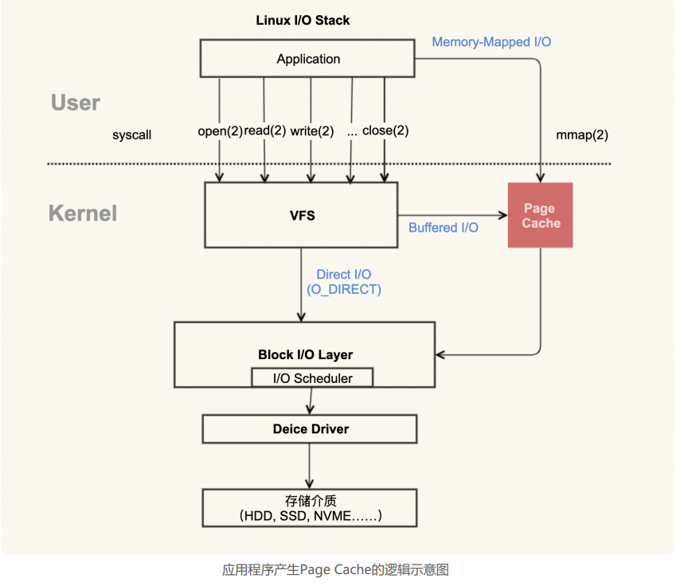
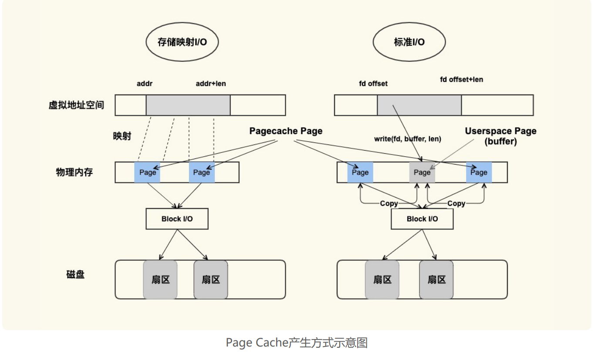
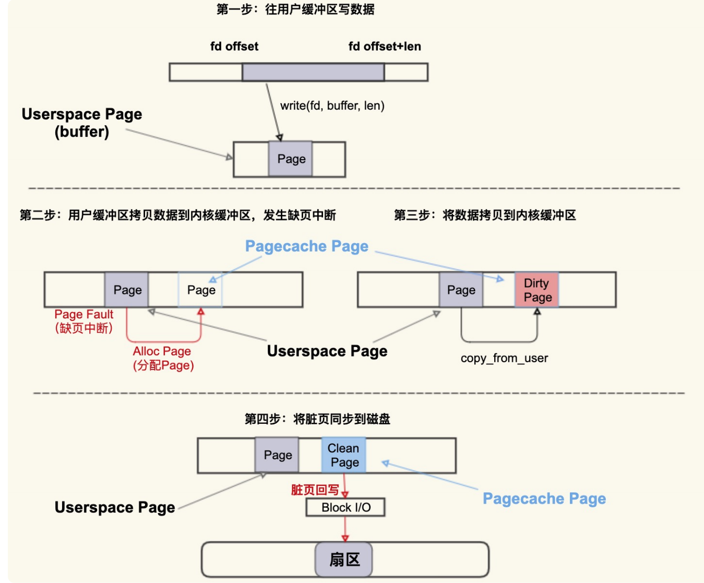
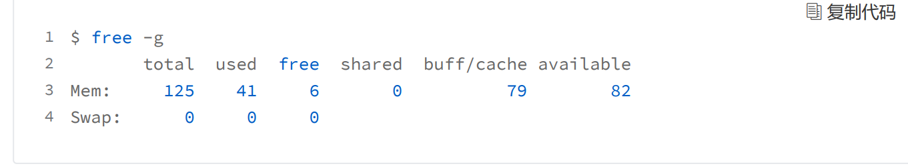
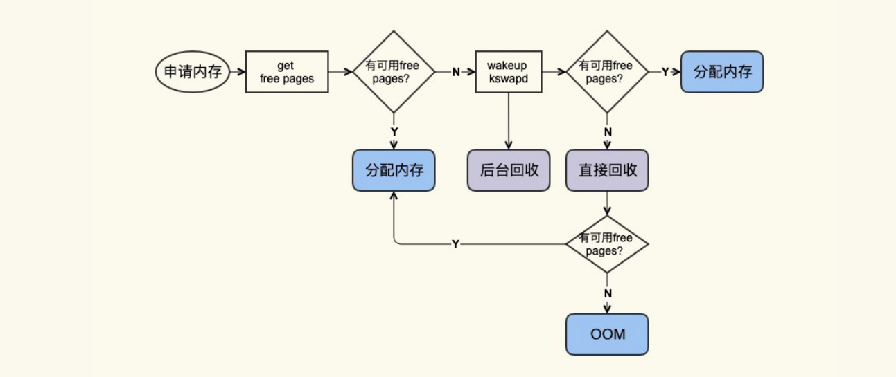
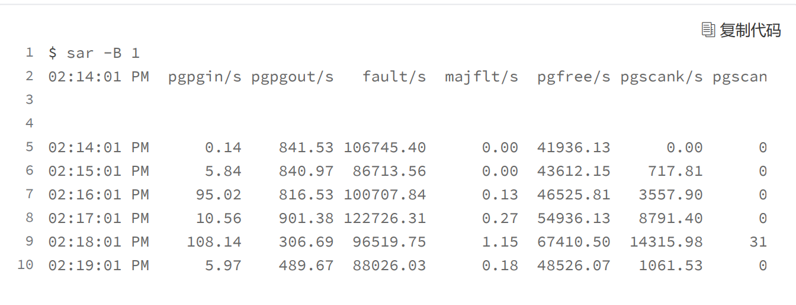

## PageCache

PageCache跟内存交换机制相关，总的来说就是操作系统内核管理的一块内存，用来加速跟硬件设备的IO



在 Linux 上直接查看 Page Cache 的方式有很多，包括 /proc/meminfo、free 、/proc/vmstat 命令等，它们的内容其实是一致的。

公式：Buffers + Cached + SwapCached = Active(file) + Inactive(file) + Shmem +SwapCached

那么等式两边的内容就是我们平时说的 Page Cache

### 标准IO和映射IO

在操作系统的IO笔记里，其实有提到双缓冲内存拷贝相关的一些知识点，其实这也跟pagecache相关。



#### 标准IO

标准 I/O 是写的 (write(2)) 用户缓冲区 (Userpace Page 对应的内存)，然后再将用户缓冲区里的数据拷贝到内核缓冲区 (Pagecache Page 对应的内存)；如果是读的 (read(2)) 话则是先从内核缓冲区拷贝到用户缓冲区，再从用户缓冲区读数据，也就是 buffer 和文件内容不存在任何映射关系。



首先往用户缓冲区 buffer(这是 Userspace Page) 写入数据，然后 buffer 中的数据拷贝到内核缓冲区（这是 Pagecache Page），如果内核缓冲区中还没有这个 Page，就会发生 Page Fault 会去分配一个 Page，拷贝结束后该 PagecachePage 是一个 Dirty Page（脏页），然后该 Dirty Page 中的内容会同步到磁盘，同步到磁盘后，该 Pagecache Page 变为 Clean Page 并且继续存在系统中。

#### 存储映射IO

对于存储映射 I/O 而言，则是直接将 Pagecache Page 给映射到用户地址空间，用户直接读写 Pagecache Page 中内容。

#### 对比

显然，存储映射 I/O 要比标准 I/O 效率高一些，毕竟少了“用户空间到内核空间互相拷贝”的过程。这也是很多应用开发者发现，为什么使用内存映射 I/O 比标准 I/O 方式性能要好一些的主要原因。


### 观察PageCache脏页

```
$cat/proc/vmstat|egrep"dirty|writeback"
nr_dirty 40
nr_writeback 2
```

nr_dirty 表示当前系统中积压了多少脏页，nr_writeback 则表示有多少脏页正在回写到磁盘中，他们两个的单位都是 Page(4KB)。

### PageCache释放

服务器运行久了后，系统中 free 的内存会越来越少，用 free 命令来查看，大部分都会是 used 内存或者 buff/cache 内存



free 命令中的 buff/cache 中的这些就是“活着”的 Page Cache

回收的方式主要是两种：直接回收和后台回收。



观察 Page Cache 直接回收和后台回收最简单方便的方式是使用 sar



pgscank/s : kswapd(后台回收线程) 每秒扫描的 page 个数。

pgscand/s: Application 在内存申请过程中每秒直接扫描的 page 个数。

pgsteal/s: 扫描的 page 中每秒被回收的个数。

%vmeff: pgsteal/(pgscank+pgscand), 回收效率，越接近 100 说明系统越安全，越接近 0 说明系统内存压力越大。