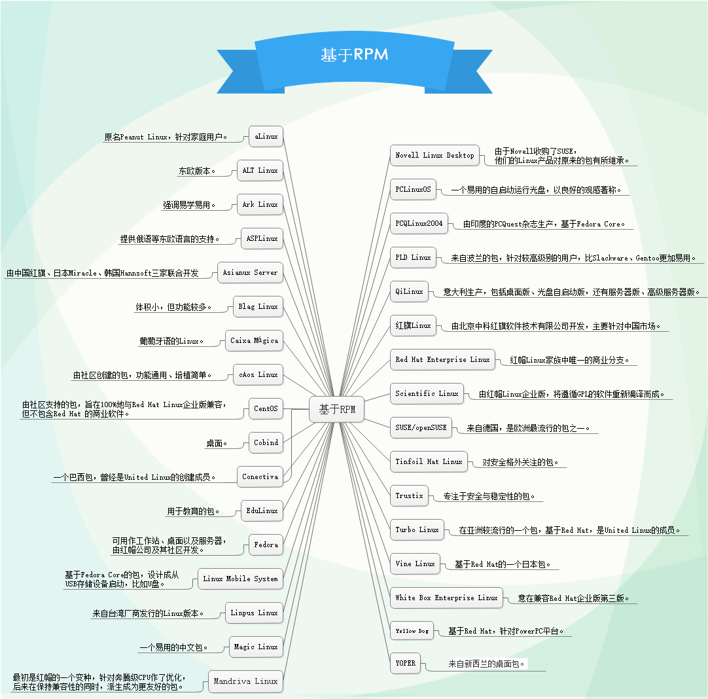
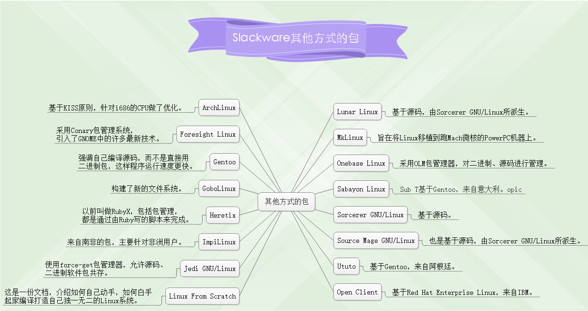
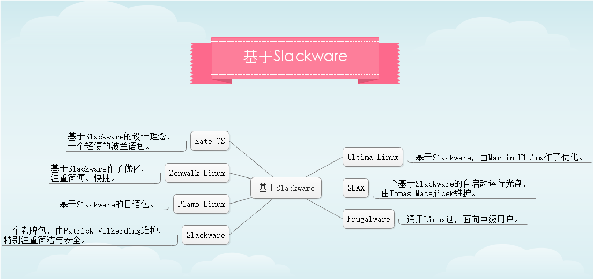
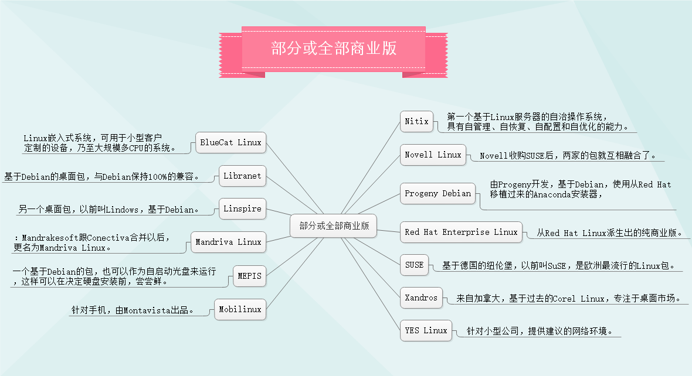

## Linux发行版总结
Linux的发行版按照版本类型的不同，可分为三大家族，分别是 **Debian、Fedora、SUSE**。

另外，根据 **维护主体** 的不同，又可分为两类，一类是 **商业公司** 维护的发行版本，一类是 **社区组织** 维护的发行版本，**前者以著名的Redhat(RHEL)为代表，后者以Debian为代表**。

### 如何选择linux发行版

