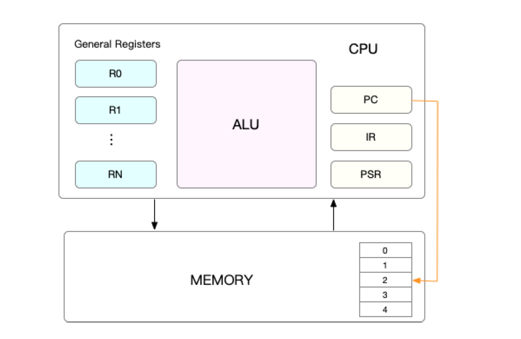
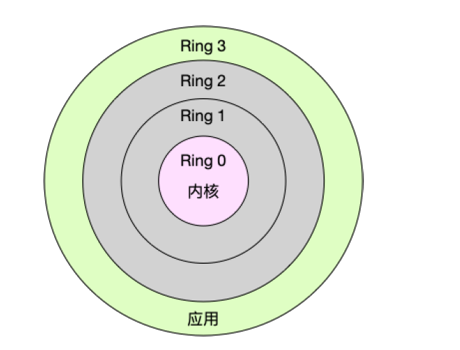
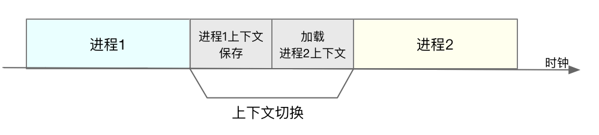
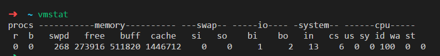
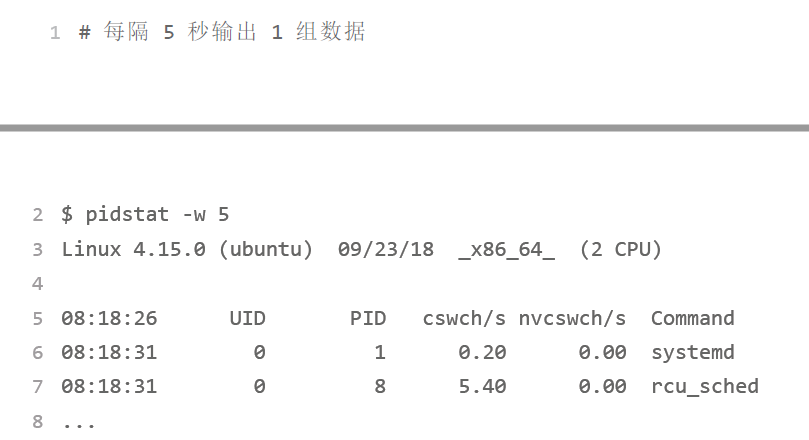
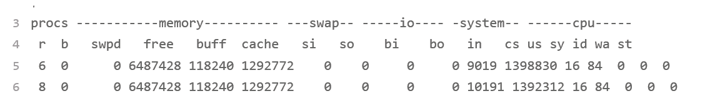
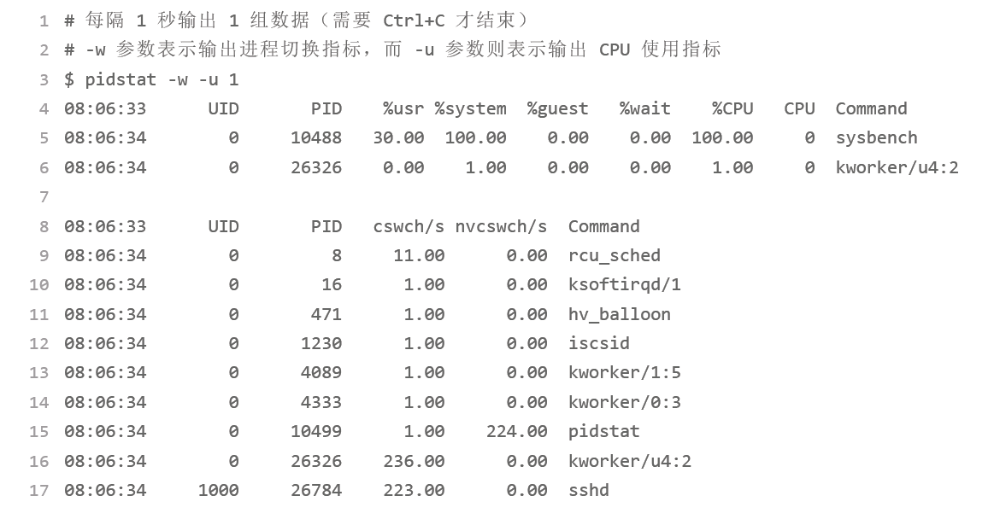
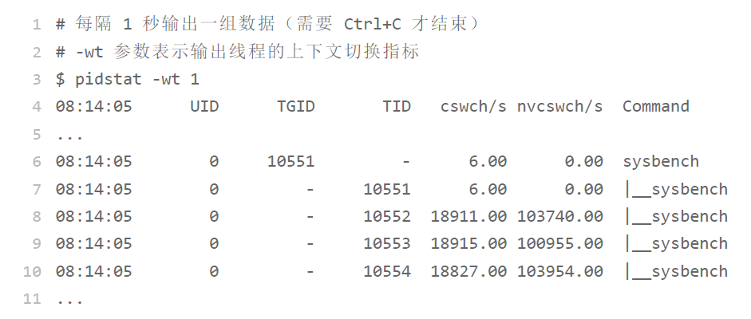
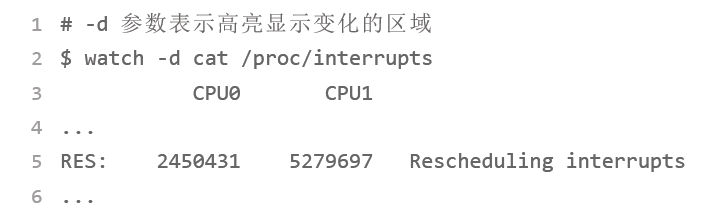

## CPU的上下文切换
Linux 是一个多任务操作系统，它支持远大于 CPU 数量的任务同时运行。当然，这些任务实际上并不是真的在同时运行，而是因为系统在很短的时间内，将 CPU 轮流分配给它们，造成多任务同时运行的错觉。

在每个任务运行前，CPU 都需要知道任务从哪里加载、又从哪里开始运行，也就是说，需要系统事先帮它设置好 **CPU 寄存器和程序计数器（Program Counter，PC）**。

CPU 寄存器，是 CPU 内置的容量小、但速度极快的内存。而程序计数器，则是用来存储CPU 正在执行的指令位置、或者即将执行的下一条指令位置。它们都是 CPU 在运行任何任务前，必须的依赖环境，因此也被叫做 **CPU 上下文**。



知道了什么是 CPU 上下文，我想你也很容易理解 CPU 上下文切换。CPU 上下文切换，就是先把前一个任务的 CPU 上下文（也就是 CPU 寄存器和程序计数器）保存起来，然后加载新任务的上下文到这些寄存器和程序计数器，最后再跳转到程序计数器所指的新位置，运行新任务。这些保存下来的上下文，会存储在系统内核中，并在任务重新调度执行时再次加载进来。这样就能保证任务原来的状态不受影响，让任务看起来还是连续运行。

**根据任务的不同，CPU 的上下文切换就可以分为几个不同的场景**:

 - 进程上下文切换
 - 线程上下文切换
 - **中断上下文切换**。

### 进程上下文切换
Linux 按照特权等级，把进程的运行空间分为内核空间和用户空间，分别对应着下图中，CPU 特权等级的 Ring 0 和 Ring 3。

内核空间（Ring 0）具有最高权限，可以直接访问所有资源；

用户空间（Ring 3）只能访问受限资源，不能直接访问内存等硬件设备，必须通过系统调用陷入到内核中，才能访问这些特权资源。



换个角度看，也就是说，进程既可以在用户空间运行，又可以在内核空间中运行。进程在用户空间运行时，被称为进程的用户态，而陷入内核空间的时候，被称为进程的内核态。

从用户态到内核态的转变，需要通过系统调用来完成。比如，当我们查看文件内容时，就需要多次系统调用来完成：首先调用 open() 打开文件，然后调用 read() 读取文件内容，并调用 write() 将内容写到标准输出，最后再调用 close() 关闭文件。那么，系统调用的过程有没有发生 CPU 上下文的切换呢？答案自然是肯定的。

CPU 寄存器里原来用户态的指令位置，需要先保存起来。接着，为了执行内核态代码，**CPU 寄存器需要更新为内核态指令的新位置(改寄存器和程序计数器)**。最后才是跳转到内核态运行内核任务。

而系统调用结束后，CPU 寄存器需要恢复原来保存的用户态，然后再切换到用户空间，继续运行进程。所以，**一次系统调用的过程，其实是发生了两次 CPU 上下文切换(重)**。

不过，需要注意的是，系统调用过程中，并不会涉及到虚拟内存等进程用户态的资源，也不会切换进程。**这跟我们通常所说的进程上下文切换是不一样的**：

**进程上下文切换，是指从一个进程切换到另一个进程运行(重！这才是概念)，而系统调用过程中一直是同一个进程在运行**。

所以，系统调用过程通常称为**特权模式切换**，而不是上下文切换。但实际上，系统调用过程中，CPU 的上下文切换还是无法避免的。

那么，进程上下文切换跟系统调用又有什么区别呢？

进程是由内核来管理和调度的，进程的切换只能发生在内核态。所以，进程的上下文不仅包括了虚拟内存、栈、全局变量等用户空间的资源，还包括了内核堆栈、寄存器等内核空间的状态。

因此，进程的上下文切换就比系统调用时多了一步：在保存当前进程的内核状态和 CPU 寄存器之前，需要先把该进程的虚拟内存、栈等保存下来；而加载了下一进程的内核态后，还需要刷新进程的虚拟内存和用户栈。保存上下文和恢复上下文的过程并不是“免费”的，**需要内核在 CPU 上运行才能完成**。



进程上下文切换的时间是很可观的，Linux 为每个 CPU 都维护了一个就绪队列，将活跃进程（即正在运行和正在等待CPU 的进程）按照优先级和等待 CPU 的时间排序，然后选择最需要 CPU 的进程，也就是优先级最高和等待 CPU 时间最长的进程来运行。

#### 进程上下文触发场景

 - 当某个进程的时间片耗尽了，就会被系统挂起，切换到其它正在等待 CPU 的进程运行。
 - 进程在系统资源不足（比如内存不足）时，要等到资源满足后才可以运行，这个时候进程也会被挂起，并由系统调度其他进程运行。
 - 当进程通过睡眠函数 sleep 这样的方法将自己主动挂起时，自然也会重新调度。
 - 当有优先级更高的进程运行时，为了保证高优先级进程的运行，当前进程会被挂起，由高优先级进程来运行。
 - 最后一个，发生硬件中断时，CPU 上的进程会被中断挂起，转而执行内核中的中断服务程序

了解这几个场景是非常有必要的，一旦出现上下文切换性能问题，他们就是幕后凶手。

### 线程上下文切换
线程与进程最大的区别在于，线程是调度的基本单位，而进程则是资源拥有的基本单位。说白了，所谓内核中的任务调度，实际上的调度对象是线程；而进程只是给线程提供了虚拟内存、全局变量等资源

当进程拥有多个线程时，这些线程会共享相同的虚拟内存和全局变量等资源。这些资源在上下文切换时是不需要修改的。另外，线程也有自己的私有数据，比如栈和寄存器等，这些在上下文切换时也是需要保存的。

这么一来，线程的上下文切换其实就可以分为两种情况：

1. 前后两个线程属于不同进程。此时，因为资源不共享，所以切换过程就跟进程上
下文切换是一样。
2. 前后两个线程属于同一个进程。此时，因为虚拟内存是共享的，所以在切换时，
虚拟内存这些资源就保持不动，只需要切换线程的私有数据、寄存器等不共享的数据。

同进程内的线程切换，要比多进程间的切换消耗更少的资源，而这，也正是多线程代替多进程的一个优势。

### 中断上下文切换
除了前面两种上下文切换，还有一个场景也会切换 CPU 上下文，那就是中断。

为了快速响应硬件的事件，中断处理会打断进程的正常调度和执行，转而调用中断处理程序，响应设备事件。而在打断其他进程时，就需要将进程当前的状态保存下来，这样在中断结束后，进程仍然可以从原来的状态恢复运行。

跟进程上下文不同，中断上下文切换并不涉及到进程的用户态。所以，即便中断过程打断了一个正处在用户态的进程，也不需要保存和恢复这个进程的虚拟内存、全局变量等用户态资源。中断上下文，其实只包括内核态中断服务程序执行所必需的状态，包括 CPU 寄存器、内核堆栈、硬件中断参数等。

对同一个 CPU 来说，中断处理比进程拥有更高的优先级，所以中断上下文切换并不会与进程上下文切换同时发生。同样道理，由于中断会打断正常进程的调度和执行，所以大部分中断处理程序都短小精悍，以便尽可能快的执行结束。

跟进程上下文切换一样，中断上下文切换也需要消耗 CPU，切换次数过多也会耗费
大量的 CPU，甚至严重降低系统的整体性能。所以，当你发现中断次数过多时，就需要注意去排查它是否会给你的系统带来严重的性能问题。

### 上下文切换分析
分析系统的上下文切换和中断情况，可以用**vmstat**这个工具。

```
# 每隔 5 秒输出 1 组数据
$ vmstat 5
```



 - cs（context switch）是每秒上下文切换的次数。
 - in（interrupt）则是每秒中断的次数。
 - r（Running or Runnable）是就绪队列的长度，也就是正在运行和等待 CPU 的进程数。
 - b（Blocked）则是处于不可中断睡眠状态的进程数。

这个只是系统的总体情况，我们可以用pidstat去看每个进程各自的情况。



这个结果中有两列内容是我们的重点关注对象。一个是 cswch ，表示每秒自愿上下文切换（voluntary context switches）的次数，另一个则是 nvcswch ，表示每秒非自愿上下文切换（non voluntary context switches）的次数。

这两个概念一定要牢牢记住，因为它们意味着不同的性能问题：

 - 所谓自愿上下文切换，是指进程无法获取所需资源，导致的上下文切换。比如说，I/O、内存等系统资源不足时，就会发生自愿上下文切换。
 - 非自愿上下文切换，则是指进程由于时间片已到等原因，被系统强制调度，进而发生的上下文切换。比如说，大量进程都在争抢 CPU 时，就容易发生非自愿上下文切换。

#### 情景模拟
可以用sysbench工具，模拟系统多线程调度的瓶颈

```
# 以 10 个线程运行 5 分钟的基准测试，模拟多线程切换的问题
$ sysbench --threads=10 --max-time=300 threads run

# 每隔 1 秒输出 1 组数据（需要 Ctrl+C 才结束）
$ vmstat 1
```



可以发现，cs 列的上下文切换次数 骤然上升到了 139 万。同时，注意观察其他几个指标

us（user）和 sy（system）列：这两列的 CPU 使用率加起来上升到了 100%，其中系统 CPU 使用率，也就是 sy 列高达 84%，说明 CPU 主要是被内核占用了。

in 列：中断次数也上升到了 1 万左右，说明中断处理也是个潜在的问题。

综合这几个指标，我们可以知道，系统的就绪队列过长，也就是正在运行和等待 CPU 的进程数过多，导致了大量的上下文切换，而上下文切换又导致了系统 CPU 的占用率升高。

用 pidstat 来看一下， CPU 和进程上下文切换的情况



从 pidstat 的输出可以发现，CPU 使用率的升高果然是 sysbench 导致的，它的 CPU使用率已经达到了 100%。但上下文切换则是来自其他进程，包括非自愿上下文切换频率最高的 pidstat ，以及自愿上下文切换频率最高的内核线程 kworker 和 sshd。

上面的数据显然还没达到十几万，是因为我们之列了进程的上下文切换数据，我们要加上-t参数才能看到线程的上下文切换指标。



除了找到上下文切换频繁的根源外，我们还要找到中断次数上升的原因。之前中断次数也上升到了 1 万，但到底是什么类型的中断上升了，现在还不清楚。我们接下来继续抽丝剥茧找源头。

我们可以从 /proc/interrupts 这个只读文件中读取。/proc 实际上是 Linux 的一个虚拟文件系统，用于内核空间与用户空间之间的通信。/proc/interrupts 就是这种通信机制的一部分，提供了一个只读的中断使用情况。



观察一段时间，你可以发现，变化速度最快的是重调度中断（RES），这个中断类型表示，唤醒空闲状态的 CPU 来调度新的任务运行。这是多处理器系统（SMP）中，调度器用来分散任务到不同 CPU 的机制，通常也被称为处理器间中断（Inter-Processor Interrupts，IPI）。

#### 如何判定
每秒上下文切换多少次才算正常呢？

这个数值其实取决于系统本身的 CPU 性能。在我看来，如果系统的上下文切换次数比较稳定，那么从数百到一万以内，都应该算是正常的。但当上下文切换次数超过一万次，或者切换次数出现数量级的增长时，就很可能已经出现了性能问题。

这时，你还需要根据上下文切换的类型，再做具体分析。比方说：

自愿上下文切换变多了，说明进程都在等待资源，有可能发生了 I/O 等其他问题；

非自愿上下文切换变多了，说明进程都在被强制调度，也就是都在争抢 CPU，说明 CPU的确成了瓶颈；

中断次数变多了，说明 CPU 被中断处理程序占用，还需要通过查看 /proc/interrupts文件来分析具体的中断类型。