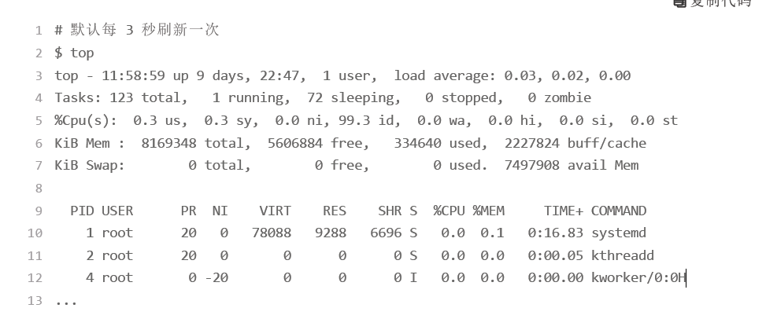

## CPU指标基础

### CPU使用率
Linux 作为一个多任务操作系统，将每个 CPU 的时间划分为很短的时
间片，再通过调度器轮流分配给各个任务使用，因此造成多任务同时运行的错觉。

为了维护 CPU 时间，Linux 通过事先定义的节拍率（内核中表示为 HZ），触发时间中断，并使用全局变量 Jiffies 记录了开机以来的节拍数。每发生一次时间中断，Jiffies 的值就加 1。

**节拍率 HZ** 是内核的可配选项，可以设置为 100、250、1000 等。不同的系统可能设置不同数值，你可以通过查询 /boot/config 内核选项来查看它的配置值。比如**节拍率设置成了 250，也就是每秒钟触发 250 次时间中断**。

同时，正因为节拍率 HZ 是内核选项，所以用户空间程序并不能直接访问。为了方便用户空间程序，内核还提供了一个用户空间节拍率 USER_HZ，它总是固定为 100，也就是1/100 秒。这样，用户空间程序并不需要关心内核中 HZ 被设置成了多少，因为它看到的总是固定值 USER_HZ。

根据man proc，我们可以知道CPU使用率有几个比较重要的指标，我们要了解一下，这些指标都指示着cpu不同场景下的CPU运行时间：

 - user（通常缩写为 us），代表用户态 CPU 时间。注意，它不包括下面的 nice 时间，但包括了 guest 时间。
 - nice（通常缩写为 ni），代表低优先级用户态 CPU 时间，也就是进程的 nice 值被调整为 1-19 之间时的 CPU 时间。这里注意，nice 可取值范围是 -20 到 19，数值越大，优先级反而越低。
 - system（通常缩写为 sys），代表内核态 CPU 时间。
 - idle（通常缩写为 id），代表空闲时间。注意，它不包括等待 I/O 的时间（iowait）。
 - iowait（通常缩写为 wa），代表等待 I/O 的 CPU 时间。
 - irq（通常缩写为 hi），代表处理硬中断的 CPU 时间。
 - softirq（通常缩写为 si），代表处理软中断的 CPU 时间。
 - steal（通常缩写为 st），代表当系统运行在虚拟机中的时候，被其他虚拟机占用的CPU 时间。
 - guest（通常缩写为 guest），代表通过虚拟化运行其他操作系统的时间，也就是运行虚拟机的 CPU 时间。
 - guest_nice（通常缩写为 gnice），代表以低优先级运行虚拟机的时间

以上指标我们其实可以通过`cat /proc/stat | grep ^cpu`来看

而我们通常所说的 CPU 使用率，就是除了空闲时间外的其他时间占总 CPU 时间的百分比，用公式来表示就是：

刚才我们说的命令 `cat /proc/stat | grep ^cpu` 就是用来看开机以来各统计项cpu使用时间的累加。所以我们可以通过这个命令知道开机以来的CPU使用率

但是一般我们都没必要这么做，我们有各种性能分析的工具，只不过上面的指标必须要稍微了解下。

#### 查看cpu使用率
查看cpu使用率，就不得不说ps和top这两个命令了。

 - top 显示了系统总体的 CPU 和内存使用情况，以及各个进程的资源使用情况。
 - ps 则只显示了每个进程的资源使用情况。

top默认没3秒刷新一次，CPU使用率也是算的这3秒的：

这个输出结果中，第三行 %Cpu 就是系统的 CPU 使用率，具体每一列的含义上一节都讲过，只是把 CPU 时间变换成了 CPU 使用率，不过需要注意，**top 默认显示的是所有 CPU 的平均值**，这个时候你只需要按下数字 1 ，就可以切换到每个 CPU的使用率了。

继续往下看，空白行之后是进程的实时信息，每个进程都有一个 %CPU 列，表示进程的CPU 使用率。它是用户态和内核态 CPU 使用率的总和，包括进程用户空间使用的 CPU、通过系统调用执行的内核空间 CPU 、以及在就绪队列等待运行的 CPU。在虚拟化环境中，它还包括了运行虚拟机占用的 CPU。

所以，到这里我们可以发现， top 并没有细分进程的用户态 CPU 和内核态 CPU。那要怎么查看每个进程的详细情况呢？你应该还记得上一节用到的 pidstat 吧，它正是一个专门分析每个进程 CPU 使用情况的工具。

下面的 pidstat 命令，就间隔 1 秒展示了进程的 5 组 CPU 使用率，包括：

 - 用户态 CPU 使用率 （%usr）；
 - 内核态 CPU 使用率（%system）；
 - 运行虚拟机 CPU 使用率（%guest）；
 - 等待 CPU 使用率（%wait）；
 - 以及总的 CPU 使用率（%CPU）。

### 总结

CPU 使用率是最直观和最常用的系统性能指标，更是我们在排查性能问题时，通常会关注的第一个指标。所以我们更要熟悉它的含义，尤其要弄清楚用户（%user）、
Nice（%nice）、系统（%system） 、等待 I/O（%iowait） 、中断（%irq）以及软中断（%softirq）这几种不同 CPU 的使用率。

比如说：

 - 用户 CPU 和 Nice CPU 高，说明用户态进程占用了较多的 CPU，所以应该着重排查进程的性能问题。
 - 系统 CPU 高，说明内核态占用了较多的 CPU，所以应该着重排查内核线程或者系统调用的性能问题。
 - I/O 等待 CPU 高，说明等待 I/O 的时间比较长，所以应该着重排查系统存储是不是出现
了 I/O 问题。
 - 软中断和硬中断高，说明软中断或硬中断的处理程序占用了较多的 CPU，所以应该着重排查内核中的中断服务程序。