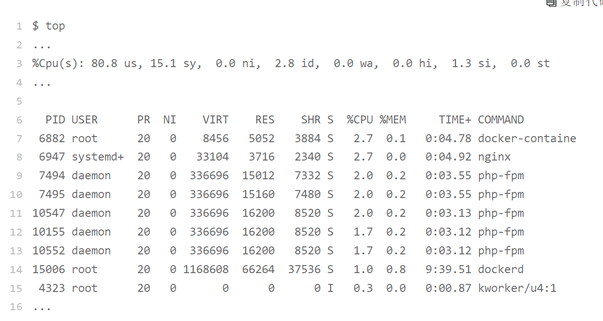
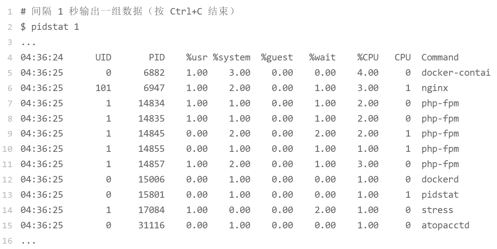
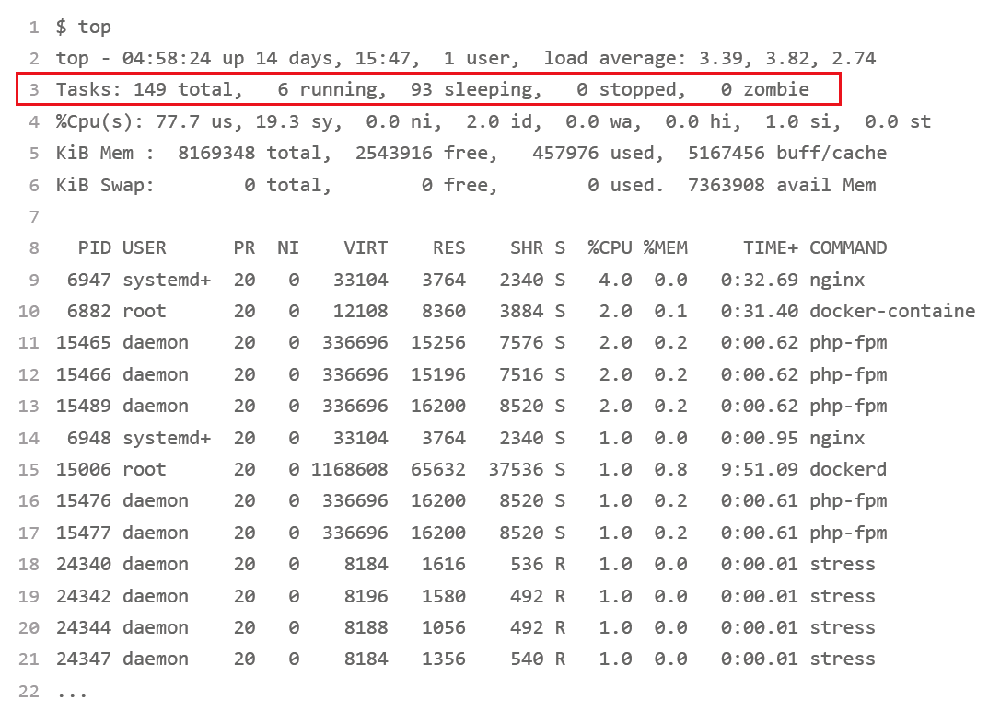
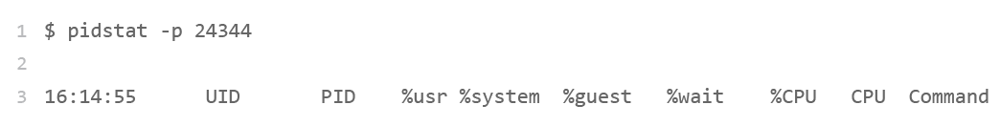
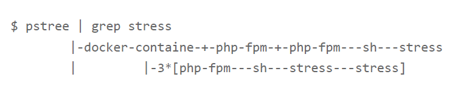
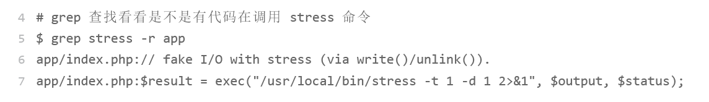
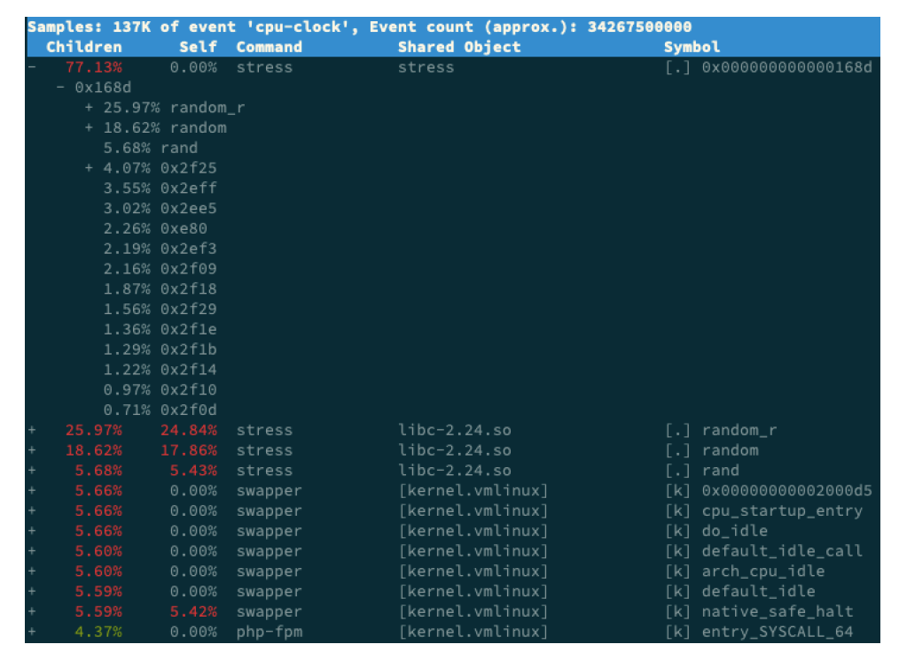
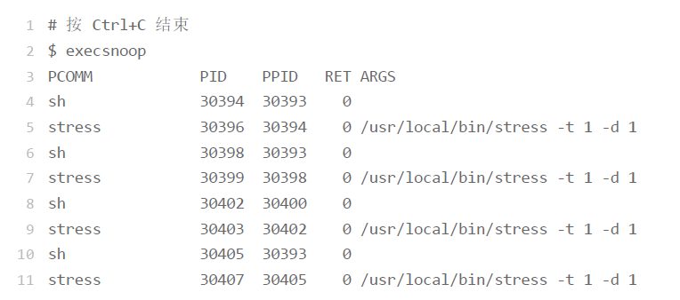

## CPU问题分析思路

遇到CPU过高的问题的时候，首先我们不要先用GDB，我们考虑一下perf。可参见perf笔记，一种用法就是perf top，能够看到CPU时钟最多的函数或者指令，可以用来找热点函数。

### 某个应用CPU过高
遇到这个问题，我们其实思路是，热点分析，top看进程的CPU占用，然后用perf分析手段，去进行热点分析。

### 系统CPU使用率过高
假如我们用top看到这样的情景：

由CPU那一列，可以看到用户空间CPU占用率很高，到了80%，而sys系统占用率到了15%也不低。idle只有2.8，这个cpu几乎跑满了。而进程方面，最高的进程也只占用到2.7%

明明最高用户进程只有2.7，怎么会让cpu跑到80的用户进程呢？有问题，但是top不太看得出来，我们用pidstat看一下

也看不出来问题，因为所有进程占用率都不高，加起来也不到80.

我们重新看看top命令，

这时终于发现问题，就绪队列里有6个进程在running，然而，关键的几个进程确是S sleep状态。在跑的是那几个stress进程，显然这个stress进程有问题。

pidstat又没有输出，重新看top和ps发现进程号又变了，说明很可能该进程在不断重启。

这些进程都是短时进程，也就是在其他应用内部通过 exec 调用的外面命
令。这些命令一般都只运行很短的时间就会结束，你很难用 top 这种间隔时间比较长的工具发现（上面的案例，我们碰巧发现了）。

这时候，我们就要知道是谁再调用stree了，**我们这时要使用工具pstree**

从这里可以看到，stress 是被 php-fpm 调用的子进程，并且进程数量不止一个（这里是3 个）。找到父进程后，我们能进入 app 的内部分析了。

这种时候我们还是要用perf观察一下app，其实也很快：

#### 工具execsnoop
execsnoop 就是一个专为短时进程设计的工具。它通过 ftrace 实时监控进程的 exec() 行为，并输出短时进程的基本信息，包括进程 PID、父进程 PID、命令行参数以及执行的结果。

比如，用 execsnoop 监控上述案例，就可以直接得到 stress 进程的父进程 PID 以及它的命令行参数，并可以发现大量的 stress 进程在不停启动：

#### 总结
上面这个案例其实是指示我们：

 - 第一，应用里直接调用了其他二进制程序，这些程序通常运行时间比较短，通过 top 等
工具也不容易发现。
 - 第二，应用本身在不停地崩溃重启，而启动过程的资源初始化，很可能会占用相当多的
CPU。