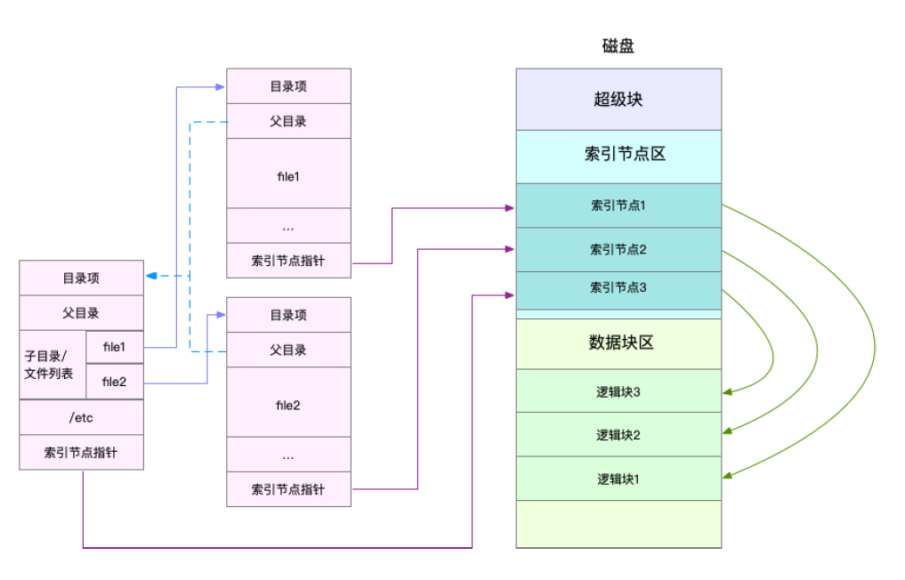
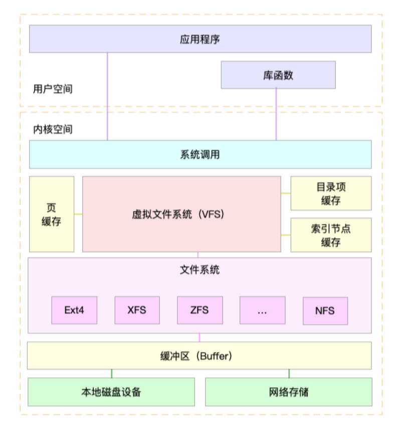

## Linux文件系统
有关目录项和索引节点，已经记录在了linux索引inode笔记当中。这里不在赘述

目录项**本身就是一个内存缓存**，而**索引节点则是存储在磁盘中的数据**。在前面的内存指标笔记Buffer 和 Cache 原理中，提到为了协调慢速磁盘与快速 CPU 的性能差异，文件内容会缓存到页缓存 Cache 中。索引节点自然也会缓存到内存中，加速文件的访问。

磁盘在执行文件系统格式化时，会被分成三个存储区域，超级块、索引节点区和数据块区(如上图)。其中，

 - 超级块，存储整个文件系统的状态。
 - 索引节点区，用来存储索引节点。
 - 数据块区，则用来存储文件数据。

### 虚拟文件系统
目录项、索引节点、逻辑块以及超级块，构成了 Linux 文件系统的四大基本要素。不过，为了支持各种不同的文件系统，Linux 内核在用户进程和文件系统的中间，又引入了一个抽象层，也就是虚拟文件系统 VFS（Virtual File System）。

VFS 定义了一组所有文件系统都支持的数据结构和标准接口。这样，用户进程和内核中的其他子系统，只需要跟 VFS 提供的统一接口进行交互就可以了，而不需要再关心底层各种文件系统的实现细节。

通过这张图，你可以看到，在 VFS 的下方，Linux 支持各种各样的文件系统，如 Ext4、XFS、NFS 等等。按照存储位置的不同，这些文件系统可以分为三类。

第一类是基于磁盘的文件系统，也就是把数据直接存储在计算机本地挂载的磁盘中。常见的 Ext4、XFS、OverlayFS 等，都是这类文件系统。

第二类是基于内存的文件系统，也就是我们常说的虚拟文件系统。这类文件系统，不需要任何磁盘分配存储空间，但会占用内存。我们经常用到的 /proc 文件系统，其实就是一种最常见的虚拟文件系统。此外，/sys 文件系统也属于这一类，主要向用户空间导出层次化的内核对象。

第三类是网络文件系统，也就是用来访问其他计算机数据的文件系统，比如 NFS、SMB、iSCSI 等。

这些文件系统，要先挂载到 VFS 目录树中的某个子目录（称为挂载点），然后才能访问其中的文件。拿第一类，也就是基于磁盘的文件系统为例，在安装系统时，要先挂载一个根目录（/），在根目录下再把其他文件系统（比如其他的磁盘分区、/proc 文件系统、/sys文件系统、NFS 等）挂载进来。

### 文件系统IO
把文件系统挂载到挂载点后，你就能通过挂载点，再去访问它管理的文件了。VFS 提供了一组标准的文件访问接口。这些接口以系统调用的方式，提供给应用程序使用。

就拿 cat 命令来说，它首先调用 open() ，打开一个文件；然后调用 read() ，读取文件的内容；最后再调用 write() ，把文件内容输出到控制台的标准输出中：

文件读写方式的各种差异，导致 I/O 的分类多种多样。最常见的有，缓冲与非缓冲 I/O、直接与非直接 I/O、阻塞与非阻塞 I/O、同步与异步 I/O 等。这里所说的“缓冲”，是指标准库内部实现的缓存。比方说，你可能见到过，很多程序遇到换行时才真正输出，而换行前的内容，其实就是被标准库暂时缓存了起来。

根据是否利用操作系统的页缓存，可以把文件 I/O 分为**直接 I/O 与非直接 I/O**。直接 I/O，是指跳过操作系统的页缓存，直接跟文件系统交互来访问文件。非直接 I/O 正好相反，文件读写时，先要经过系统的页缓存，然后再由内核或额外的系统调用，真正写入磁盘。想要实现直接 I/O，需要你在系统调用中，指定 O_DIRECT 标志。如果没有设置过，默认
的是非直接 I/O。