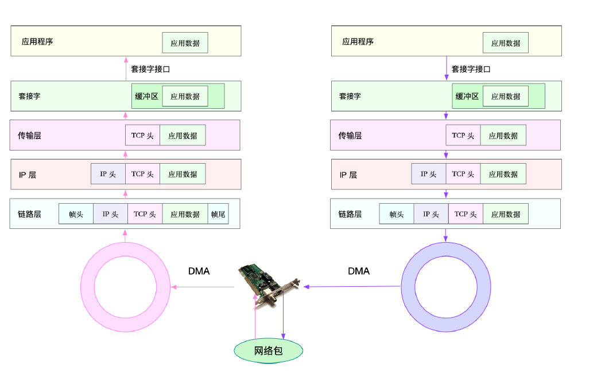

## Linux网络基础
TCP IP协议栈的知识就不再赘述了。

当一个网络帧到达网卡后，网卡会通过 DMA 方式，把这个网络包放到收包队列中；然后通过硬中断，告诉中断处理程序已经收到了网络包。接着，网卡中断处理程序会为网络帧**分配内核数据结构（sk_buff）**，并将其拷贝到sk_buff 缓冲区中；然后再通过软中断，通知内核收到了新的网络帧。接下来，内核协议栈从缓冲区中取出网络帧，并通过网络协议栈，从下到上逐层处理这个网络帧



### 网络查看命令

一般可以用netstat来查看socket

```
# -l 表示只显示监听套接字
# -n 表示显示数字地址和端口 
# -p 表示显示进程信息
$ netstat -nlp | head -n 3
```

netstat，都展示了套接字的状态、接收队列、发送队列、本地地
址、远端地址、进程 PID 和进程名称等。

其中，接收队列（Recv-Q）和发送队列（Send-Q）需要你特别关注，它们通常应该是0。当你发现它们不是 0 时，说明有网络包的堆积发生。当然还要注意，在不同套接字状态下，它们的含义不同。

当套接字处于连接状态（Established）时:

 - Recv-Q 表示套接字缓冲还没有被应用程序取走的字节数 即接收队列长度  
 - Send-Q 表示还没有被远端主机确认的字节数（即发送队列长度）。

当套接字处于监听状态（Listening）时:

 - Recv-Q 表示 syn backlog 的当前值。
 - Send-Q 表示最大的 syn backlog 值。

而 syn backlog 是 TCP 协议栈中的半连接队列长度，相应的也有一个全连接队列
（accept queue），它们都是维护 TCP 状态的重要机制。所谓半连接，就是还没有完成 TCP 三次握手的连接，连接只进行了一半，而服务器收到了客户端的 SYN 包后，就会把这个连接放到半连接队列中，然后再向客户端发送SYN+ACK 包。

### 网络性能查看
网络性能主要有这四个指标：

 - 带宽，表示链路的最大传输速率，单位通常为 b/s （比特 / 秒）。
 - 吞吐量，表示单位时间内成功传输的数据量，单位通常为 b/s（比特 / 秒）或者B/s（字节 / 秒）。吞吐量受带宽限制，而吞吐量 / 带宽，也就是该网络的使用率。
 - 延时，表示从网络请求发出后，一直到收到远端响应，所需要的时间延迟。在不同场景中，这一指标可能会有不同含义。比如，它可以表示，建立连接需要的时间（比如 TCP握手延时），或一个数据包往返所需的时间（比如 RTT）。
 - PPS，是 Packet Per Second（包 / 秒）的缩写，表示以网络包为单位的传输速率。PPS 通常用来评估网络的转发能力，比如硬件交换机，通常可以达到线性转发（即 PPS可以达到或者接近理论最大值）。而基于 Linux 服务器的转发，则容易受网络包大小的影响。

我们可以用sar命令来看吞吐和pps,给 sar 增加 -n 参数就可以查看网络的统计信息


```
# 数字 1 表示每隔 1 秒输出一组数据网络接口（DEV）
$ sar -n DEV 1
```