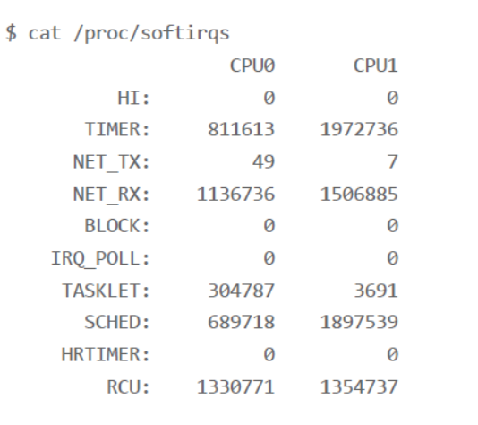
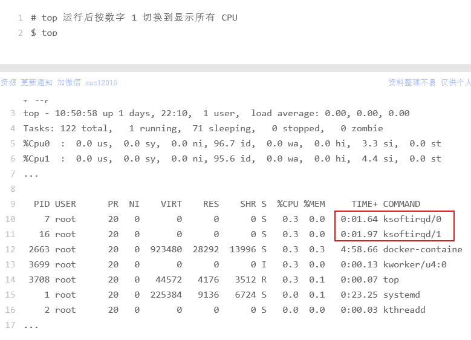
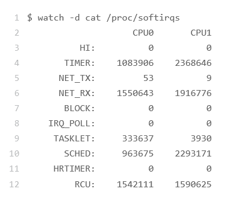

## Linux软中断
中断是系统用来响应硬件设备请求的一种机制，它会打断进程的正常调度和执行，然后调用内核中的中断处理程序来响应设备的请求。

中断其实是一种异步的事件处理机制，可以提高系统的并发处理
能力。【就像是外卖到了打电话让你拿外卖，而不用你时不时下楼看看】

由于中断处理程序会打断其他进程的运行，所以，为了减少对正常进程运行调度的影响，中断处理程序就需要尽可能快地运行。如果中断本身要做的事情不多，那么处理起来也不会有太大问题；但如果中断要处理的事情很多，中断服务程序就有可能要运行很长时间。

特别是，中断处理程序在响应中断时，还会临时关闭中断。这就会导致上一次中断处理完成之前，其他中断都不能响应，也就是说中断有可能会丢失。【**好比你点了两份外卖，一份外卖电话到时，另一份外面电话占线不能打通你手机**】

### Linux中断

事实上，为了解决中断处理程序执行过长和中断丢失的问题，**Linux 将中断处理过程分成了两个阶段，也就是上半部和下半部**。

 - 上半部用来快速处理中断，它在中断禁止模式下运行，主要处理跟硬件紧密相关的或时间敏感的工作。
 - **下半部用来延迟处理上半部未完成的工作，通常以内核线程的方式运行**。

比如说前面取外卖的例子，上半部就是你接听电话，告诉配送员你已经知道了，其他事儿见面再说，然后电话就可以挂断了；下半部才是取外卖的动作，以及见面后商量发票处理的动作。这样，第一个配送员不会占用你太多时间，当第二个配送员过来时，照样能正常打通你的电话。

再比如，网卡接受数据包的例子:网卡接收到数据包后，会通过硬件中断的方式，通知内核有新的数据到了。这时，内核就应该调用中断处理程序来响应它。对上半部来说，既然是快速处理，其实就是要把网卡的数据读到内存中，然后更新一下硬件寄存器的状态（表示数据已经读好了），最后再发送一个软中断信号，通知下半部做进一步的处理。而下半部被软中断信号唤醒后，需要从内存中找到网络数据，再按照网络协议栈，对数据
进行逐层解析和处理，直到把它送给应用程序。

所以，这两个阶段你也可以这样理解：

 - 上半部直接处理硬件请求，也就是我们常说的**硬中断**，特点是快速执行；
 - 而下半部则是由内核触发，也就是我们常说的**软中断**，特点是延迟执行。

上半部会打断 CPU 正在执行的任务，然后立即执行中断处理程序。而下半部以内核线程的方式执行，并且每个 CPU 都对应一个软中断内核线程，名字为 “ksoftirqd/CPU编号”，比如说， 0 号 CPU 对应的软中断内核线程的名字就是 ksoftirqd/0。

### 查看软中断和内核线程
我们知道proc 文件系统，它是一种内核空间和用户空间进行
通信的机制，可以用来查看内核的数据结构，或者用来动态修改内核的配置。

 - /proc/softirqs 提供了软中断的运行情况；
 - /proc/interrupts 提供了硬中断的运行情况。

运行下面的命令，查看 /proc/softirqs 文件的内容，你就可以看到各种类型软中断在不同CPU 上的累积运行次数：



软中断包括了 10 个类别，分别对应不同的工作类型。比如 NET_RX 表示网络接收中断，而NET_TX 表示网络发送中断。

我们用ps命令也可以看到内核线程：

```
ps aux | grep softirq
```

### 案例
有时候我们会遇到这样的情况，机器很快，但是CPU占用率却不高，但是发现都是内核线程在进行占用，那这就是软中断的问题了：



比如上图我们通过top命令观察到，CPU占用率很低，但是占用的进程全是内核的。我们这时就可以通过cat一下proc的softirqd来看看是怎么回事。

同时我们要检测软中断的增长速率，就用watch命令：



能看到是哪个指标变化快然后进行分析。

### 总结

Linux 中的中断处理程序分为上半部和下半部：

 - 上半部对应硬件中断，用来快速处理中断。
 - 下半部对应软中断，用来异步处理上半部未完成的工作。

Linux 中的软中断包括网络收发、定时、调度、RCU 锁等各种类型，可以通过查看/proc/softirqs 来观察软中断的运行情况。