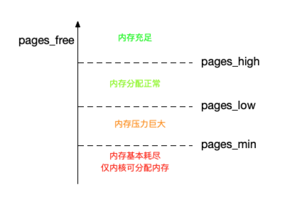

## 内存的相关指标与分析
Linux中，我们通常都用free命令来查看机器的内存。

### buffer&cache
free命令打出来的指标中就有buffer和cahce。从 free 的手册中，你可以看到 buffer 和 cache 的说明。

 - Buffers 是内核缓冲区用到的内存，对应的是 /proc/meminfo 中的 Buffers 值。
 - Cache 是内核页缓存和 Slab 用到的内存，对应的是 /proc/meminfo 中的 Cached 与 SReclaimable 之和

我们之前有提到多proc文件系统，/proc 是 Linux 内核提供的一种特殊文件系统，是 用户跟内核交互的接口。比方说，用户可以从 /proc 中查询内核的运行状态和配置选项， 查询进程的运行状态、统计数据等，当然，你也可以通过 /proc 来修改内核的配置。

比如 free 命令，就是 通过读取 /proc/meminfo ，得到内存的使用情况。通过man proc我们其实可以看到buffer和cache的相关解释。根据里面的说明：

 - Buffers 是对原始磁盘块的临时存储，也就是用来缓存磁盘的数据，通常不会特别大 （20MB 左右）。这样，**内核就可以把分散的写集中起来，统一优化磁盘的写入**，比如 可以把多次小的写合并成单次大的写等等。
 - Cached 是从磁盘读取文件的页缓存，也就是**用来缓存从文件读取的数据**。这样，下次 访问这些文件数据时，就可以**直接从内存中快速获取，而不需要再次访问缓慢的磁盘**。
 - SReclaimable 是 Slab 的一部分。Slab 包括两部分，其中的可回收部分，用 SReclaimable 记录；而不可回收部分，用 SUnreclaim 记录。

### swap
刚才我们讲到了buffer和cache，然后我们可以发现，buffer和cache都是和文件直接相关的。当我们要写一些文件数据到磁盘时，我们经过buffer做一些整合。我们为了更快的读取文件数据时，我们通过cache来快速读取。

那么什么是swap呢，swap其实就和内存管理息息相关了。我们之前就学习了分页技术，当发生缺页中断的时候，我们就需要把暂时用不到的页拿下来放进磁盘中。而这块磁盘区域，就是swap区了。

Swap 说白了就是把一块磁盘空间或者一个本地文件（以下讲解以磁盘为
例），当成内存来使用。它包括换出和换入两个过程。

#### 内存的回收
一个最容易想到的场景就是，有新的大块内存分配请求，但是剩余内存不足。这个时候系统就需要回收一部分内存（比如前面提到的缓存），进而尽可能地满足新内存请求。这个过程通常被称为**直接内存回收**。

除了直接内存回收，还有一个专门的内核线程用来定期回收内存，也就是kswapd0。为了衡量内存的使用情况，kswapd0 定义了三个内存阈值（watermark，也称为水位），分别是：

 - 页最小阈值（pages_min）
 - 页低阈值（pages_low）
 - 页高阈值（pages_high）。
 - 剩余内存，则使用 pages_free 表示。

kswapd0 **定期扫描内存的使用情况**，并根据剩余内存**落在这三个阈值的空间位置，进行内存的回收操作**。

#### 匿名页&文件页
其实上面所说的还引出了两个概念，匿名页和文件页。其实所谓的文件页，就可以理解成是有实体文件背景的内存部分。也就是上面所说的buffer和cache，背后都有对应的文件做支撑，当内存部分的数据被更新且还没被写入磁盘时，这部分文件页又会被叫做**脏页**。

而匿名页，就是我们进程缺页中断产生的那部分，需要被交换出去的页。