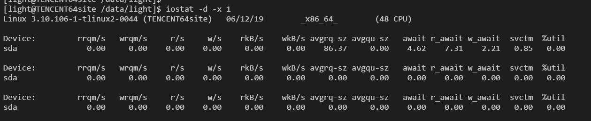
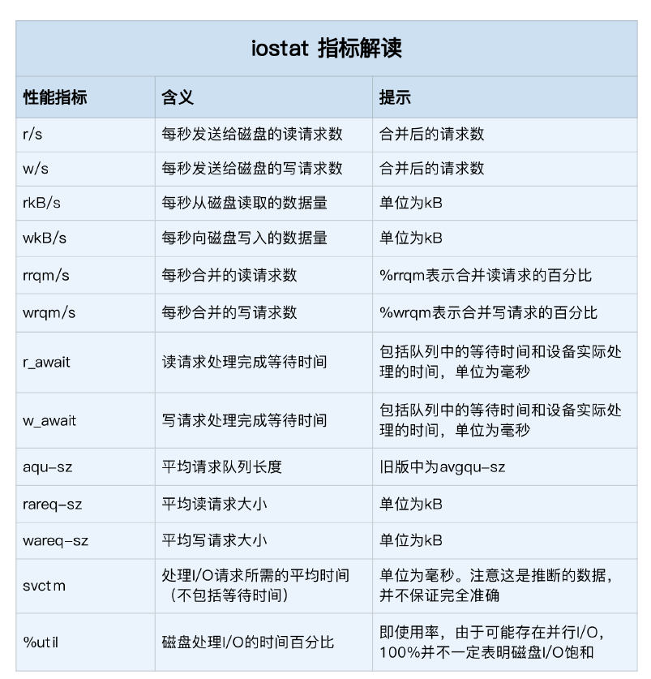
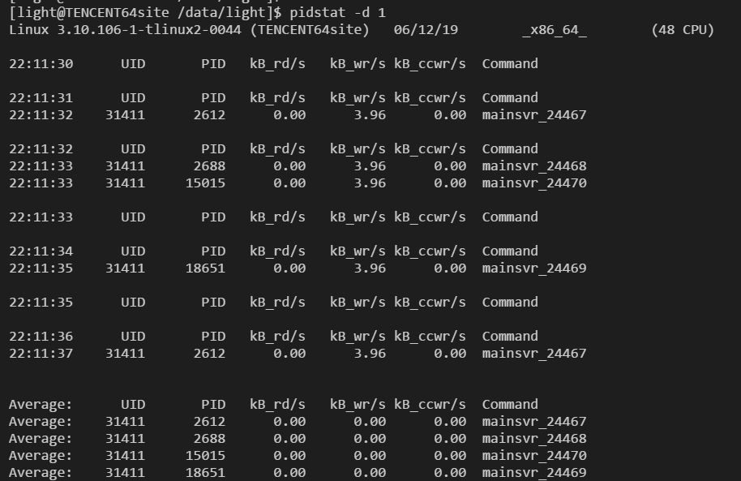
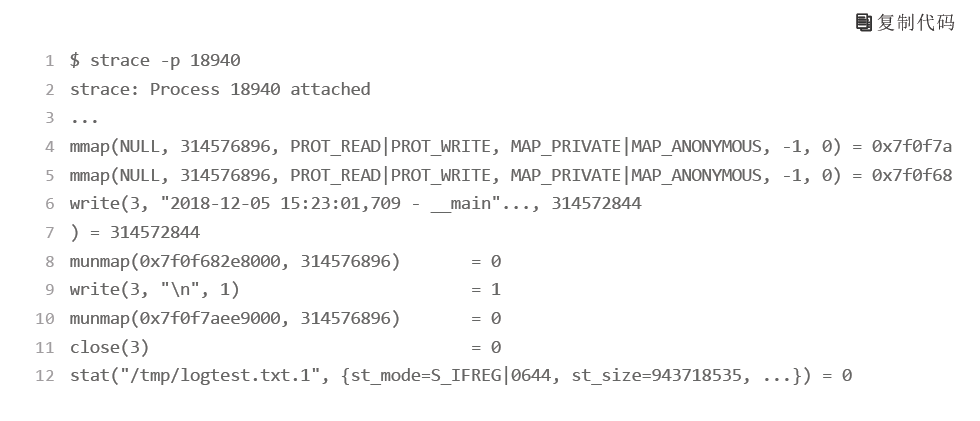
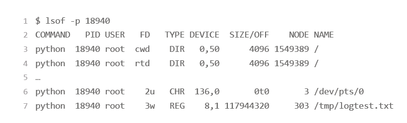

## 磁盘性能指标
说到磁盘性能的衡量标准，必须要提到五个常见指标，也就是我们经常用到的，**使用率、饱和度、IOPS、吞吐量以及响应时间等。这五个指标，是衡量磁盘性能的基本指标**。

 - 使用率，是指磁盘处理 I/O 的时间百分比。过高的使用率（比如超过 80%），通常意味着磁盘 I/O 存在性能瓶颈。
 - 饱和度，是指磁盘处理 I/O 的繁忙程度。过高的饱和度，意味着磁盘存在严重的性能瓶颈。**当饱和度为 100% 时，磁盘无法接受新的 I/O 请求**。
 - IOPS（Input/Output Per Second），是指每秒的 I/O 请求数。
 - 吞吐量，是指每秒的 I/O 请求大小。
 - 响应时间，是指 I/O 请求从发出到收到响应的间隔时间。

这里要注意的是，使用率只考虑有没有 I/O，而不考虑 I/O 的大小。换句话说，当使用率是 100% 的时候，磁盘依然有可能接受新的 I/O 请求。

在数据库、大量小文件等这类随机读写比较多的场景中，IOPS 更能反映系统的整体性能；而在多媒体等顺序读写较多的场景中，吞吐量才更能反映系统的整体性能。

**一般来说，我们在为应用程序的服务器选型时，要先对磁盘的 I/O 性能进行基准测试，以便可以准确评估，磁盘性能是否可以满足应用程序的需求**

### 磁盘IO观测
基本上，第一个要观测的，是每块磁盘的使用情况。

iostat 是最常用的磁盘 I/O 性能观测工具，它提供了每个磁盘的使用率、IOPS、吞吐量等各种常见的性能指标，当然，这些指标实际上来自 **/proc/diskstats**。

从这里你可以看到，iostat 提供了非常丰富的性能指标。第一列的 Device 表示磁盘设备的名字

这些指标中，要注意：

 - %util ，就是我们前面提到的磁盘 I/O 使用率；
 - r/s+ w/s ，就是 IOPS；
 - rkB/s+wkB/s ，就是吞吐量；
 - r_await+w_await ，就是响应时间。

在观测指标时，也别忘了结合请求的大小（ rareq-sz 和 wareq-sz）一起分析。

从 iostat 并不能直接得到磁盘饱和度。事实上，饱和度通常也没有其他简单的观测方法，不过，你可以把观测到的，平均请求队列长度或者读写请求完成的等待时间，跟基准测试的结果（比如通过 fio）进行对比，综合评估磁盘的饱和情况。

### 进程IO观测
除了每块磁盘的 I/O 情况，每个进程的 I/O 情况也是我们需要关注的重点。

iostat 只提供磁盘整体的 I/O 性能数据，缺点在于，并不能知道具体是哪些进程在进行磁盘读写。要观察进程的 I/O 情况，还可以使用 pidstat 和 iotop 这两个工具。

pidstat 是我们的老朋友了。给它加上 -d 参数，你就可以看到进程的 I/O 情况，如下所示：

从 pidstat 的输出你能看到，它可以实时查看每个进程的 I/O 情况，包括下面这些内容。

 - 用户 ID（UID）和进程 ID（PID） 。
 - 每秒读取的数据大小（kB_rd/s） ，单位是 KB。
 - 每秒发出的写请求数据大小（kB_wr/s） ，单位是 KB。
 - 每秒取消的写请求数据大小（kB_ccwr/s） ，单位是 KB。
 - 块 I/O 延迟（iodelay），包括等待同步块 I/O 和换入块 I/O 结束的时间，单位是时钟周期。

### 一些分析进程IO的方法
假如我们通过top发现一个进程，io很高(wa很高)，成为瓶颈，那该咋搞，我们可以用strace来分析一下。

假如我们发现18940这个进程很有问题，那我们可以输入strace命令，如下图：

在终端中运行 strace 命令，并通过 -p 18940 指定进程的 PID 号

从 write() 系统调用上，我们可以看到，进程向文件描述符编号为 3 的文件中，写入了300MB 的数据。看来，它应该是我们要找的文件。不过，write() 调用中只能看到文件的描述符编号，文件名和路径还是未知的。

接下来，我们在终端中运行下面的 lsof 命令，看看进程 18940 都打开了哪些文件

这说明，这个进程打开了文件 /tmp/logtest.txt，并且它的文件描述符是3 号，而 3 后面的 w ，表示以写的方式打开。

这跟刚才 strace 完我们猜测的结果一致，看来这就是问题的根源：进程 18940 以每次300MB 的速度，在“疯狂”写日志，而日志文件的路径是 /tmp/logtest.txt。

在排查应用程序问题时，我们可能需要，在线上环境临时开启应用程序的调试日志。有时候，事后一不小心就忘了调回去。没把线上的日志调高到警告级别，可能会导致 CPU 使用率、磁盘 I/O 等一系列的性能问题，严重时，甚至会影响到同一台服务器上运行的其他应用程序。