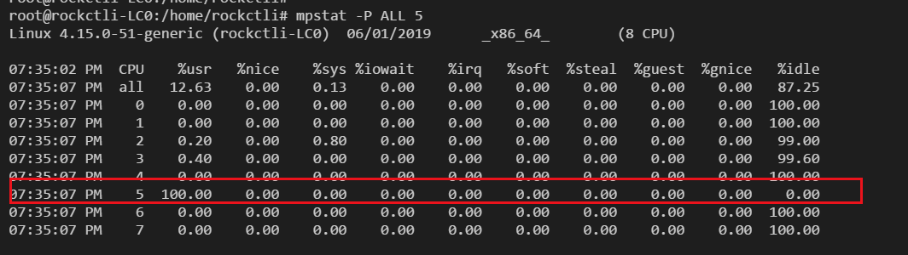
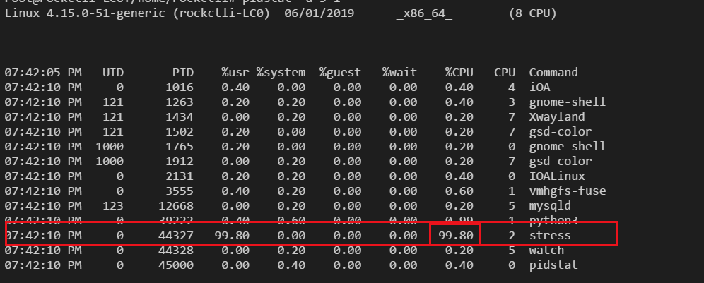

## 平均负载
平均负载专题的内容可见平均负载笔记。

通过uptime命令：

- 我们能看到1，5，15分钟三个时间段的平均负载。如果这三个值基本相同，说明系统负载很平稳
- 但如果 1 分钟的值远小于 15 分钟的值，就说明系统最近 1 分钟的负载在减少，而过去15 分钟内却有很大的负载。
- 反过来，如果 1 分钟的值远大于 15 分钟的值，就说明最近 1 分钟的负载在增加，这种增加有可能只是临时性的，也有可能还会持续增加下去，所以就需要持续观察。**一旦 1分钟的平均负载接近或超过了 CPU 的个数，就意味着系统正在发生过载的问题，这时就得分析调查是哪里导致的问题，并要想办法优化了**。

业界规矩，基本平均负载高于CPU数量的70%的时候，就要分析排查问题了。

### 平均负载和CPU使用率
平均负载是指单位时间内，处于可运行状态和不可中断状态的进程数。所以，它不仅包括了正在使用 CPU 的进程，还包括等待 CPU 和等待I/O 的进程。

而 CPU 使用率，是单位时间内 CPU 繁忙情况的统计，跟平均负载并不一定完全对应。比如：

CPU 密集型进程，使用大量 CPU 会导致平均负载升高，此时这两者是一致的；
I/O 密集型进程，等待 I/O 也会导致平均负载升高，但 CPU 使用率不一定很高；
大量等待 CPU 的进程调度也会导致平均负载升高，此时的 CPU 使用率也会比较高。

### 分析场景实操
先介绍两个工具 stress和systat，stress 是一个 Linux 系统压力测试工具，这里我们用作异常进程模拟平均负载升高的场景。而 sysstat 包含了常用的 Linux 性能工具，用来监控和分析系统的性能。我们的案例会用到这个包的两个命令 mpstat 和 pidstat。

ubuntu下可以这样安装：

```
apt install stress sysstat
```

mpstat 是一个常用的多核 CPU 性能分析工具，用来实时查看每个 CPU 的性能指标，以及所有 CPU 的平均指标。pidstat 是一个常用的进程性能分析工具，用来实时查看进程的 CPU、内存、I/O 以及上下文切换等性能指标。

#### 模拟场景和实践
我们想要模拟这个场景，可以使用stress命令：

```
stress --cpu 1 --timeout 600
```

可以用watch命令持续观测平均负载：

```
# -d 参数表示高亮显示变化的区域
$ watch -d uptime
..., load average: 1.00, 0.75, 0.39
```

用watch全屏观看uptime持续输出，那么可以看到近期时间的cpu的负载会慢慢逼近1.最后再轮到mpstat出场，看看cpu使用率的变化情况：

```
# -P ALL 表示监控所有 CPU，后面数字 5 表示间隔 5 秒后输出一组数据
$ mpstat -P ALL 5
```



如上图，我们就能很清晰看到一个CPU被stress run到100了。

到底是哪个进程导致了 CPU 使用率为 100% 呢？你可以使用 **pidstat** 来查询

```
# 间隔 5 秒后输出一组数据
$ pidstat -u 5 1
```



从这里可以明显看到，stress 进程的 CPU 使用率为 100%。

同理

如果是IO很高的场景，我们也可以通过mpstat这个命令看看各个CPU上进程运作的各指标，然后用pidstat来看是哪个进程的IO比较高，主要看%system这一列。

如果是大量进程的场景，CPU可能处理不来这么多进程，拿这些进程就会等待CPU。这些等待的进程也是会被算进活动进程里的哦，这时候用pidstat就应该看%wait这一列。


**总结，mpstat看cpu进程指标，pidstat看看是哪个进程在搞事情。平均负载高可能是CPU密集型进程导致的，也有可能是IO操作多的进程在搞事情，这时未必CPU利用率就一定高。**

