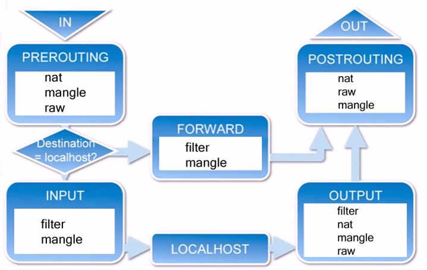
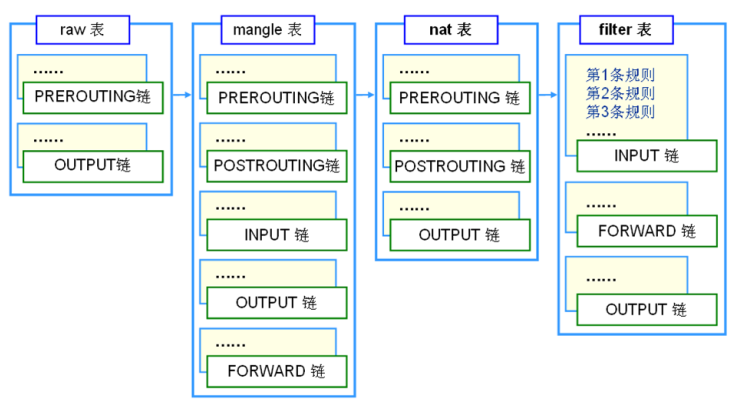

## iptables详解
Iptabels是与Linux内核集成的**包过滤防火墙系统**，几乎所有的linux发行版本都会包含Iptables的功能。如果 Linux 系统连接到因特网或 LAN、服务器或连接 LAN 和因特网的代理服务器， 则Iptables有利于在 Linux 系统上更好地控制 IP 信息包过滤和防火墙配置。

这个包过滤防火墙是免费的，它可以代替昂贵的商业防火墙解决方案，完成**封包过滤、封包重定向和网络地址转换（NAT）等功能**。

### 组件
虽然netfilter/iptables包过滤系统被称为单个实体，但它实际上由两个组件**netfilter** 和 **iptables** 组成。

netfilter 组件也称为**内核空间**（kernelspace），是内核的一部分，由一些信息包过滤表组成，这些表包含内核用来控制信息包过滤处理的规则集。

iptables 组件是一种工具，也称为**用户空间**（userspace），它使插入、修改和除去信息包过滤表中的规则变得容易。

### 原理
iptables的原理主要是对数据包的控制，看下图：



1. 一个数据包进入网卡时，它首先进入PREROUTING链，内核根据数据包**目的IP**判断是否需要转发出去。

2. 如果数据包就是进入本机的，它就会沿着图向下移动，到达INPUT链。数据包到了INPUT链后，**任何进程都会收到它**。本机上运行的程序可以发送数据包，这些数据包会经 过**OUTPUT链**，然后到达**POSTROUTING链**输出。

3. 如果数据包是要转发出去的，且内核允许转发，数据包就会如图所示向右移动，经过 **FORWARD链**，然后到达**POSTROUTING链**输出。

#### 规则（rules）
规则（rules）其实就是网络管理员预定义的条件，规则一般的定义为“如果数据包头符合这样的条件，就这样处理这个数据包”。规则存储在内核空间的信息包过滤表中，这些规则分别指定了源地址、目的地址、传输协议（如TCP、UDP、ICMP）和服务类型（如HTTP、FTP和SMTP）等。当数据包与规则匹配时，iptables就根据规则所定义的方法来处理这些数据包，如放行（accept）、拒绝（reject）和丢弃（drop）等。配置防火墙的主要工作就是添加、修改和删除这些规则。

#### 链（chains）
链（chains）是数据包传播的路径，每一条链其实就是**众多规则中的一个检查清单**，**每一条链中可以有一条或数条规则**。当一个数据包到达一个链时，iptables就会从链中第一条规则开始检查，看该数据包是否满足规则所定义的条件。如果满足，系统就会根据该条规则所定义的方法处理该数据包；否则iptables将继续检查下一条规则，如果该数据包不符合链中任一条规则，iptables就会根据该链**预先定义的默认策略来处理数据包**。

#### 表（tables）
表（tables）提供特定的功能，iptables**内置了4个表**，即raw表、filter表、nat表和mangle表，用于实现**包过滤**，**网络地址转换** 和**包重构**的功能。

raw表用来关闭nat上启用的连接追踪机制，mangle用于拆解报文做出修改。



#### 总结(zwlj重)
总而言之，包要通过这个主机，必须要根据上述流程图中一样，通过一个个链，链的组成实质上就是一条条规则，通过每条链实质上就是匹配那一条条规则。

那么什么是表呢？表也是一样的，也是一些规则的集合。但是，**表tables是通过功能的不同封装了一系列规则**，这样不同的链里就可以通过**调用同一张表来进行规则复用了**。默认的表有raw，filter，nat，mangle。


时刻牢记流程图，就能掌握iptables的使用。

### Usage

选项

```
-t<表>：指定要操纵的表；
-A：向规则链中添加条目；
-D：从规则链中删除条目；
-i：向规则链中插入条目；
-R：替换规则链中的条目；
-L：显示规则链中已有的条目；
-F：清楚规则链中已有的条目；
-Z：清空规则链中的数据包计算器和字节计数器；
-N：创建新的用户自定义规则链；
-P：定义规则链中的默认目标；
-h：显示帮助信息；
-p：指定要匹配的数据包协议类型；
-s：指定要匹配的数据包源ip地址；
-j<目标>：指定要跳转的目标；
-i<网络接口>：指定数据包进入本机的网络接口；
-o<网络接口>：指定数据包要离开本机所使用的网络接口。

```

iptables命令选项输入顺序：

iptables -t 表名 \<-A/I/D/R\> 规则链名 \[规则号\] \<-i/o 网卡名\> -p 协议名 \<-s 源IP/源子网\> --sport 源端口 \<-d 目标IP/目标子网\> --dport 目标端口 -j 动作

**表名包括**：

 - raw：高级功能，如：网址过滤。
 - mangle：数据包修改（QOS），用于实现服务质量。
 - nat：地址转换，用于网关路由器。
 - filter：包过滤，用于防火墙规则。

 **规则链名包括：**

  - INPUT链：处理输入数据包。
  - OUTPUT链：处理输出数据包。
  - FORWARD链：处理转发数据包。
  - PREROUTING链：用于目标地址转换（DNAT）。
  - POSTOUTING链：用于源地址转换（SNAT）。

**动作包括：**
  - accept：接收数据包。
  - DROP：丢弃数据包。
  - REDIRECT：重定向、映射、透明代理。
  - SNAT：源地址转换。
  - DNAT：目标地址转换。
  - MASQUERADE：IP伪装（NAT），用于ADSL。
  - LOG：日志记录。

**查看已添加的iptables规则**

```
iptables -L -n -v
```

### 一些例子

```
iptables -A OUTPUT -j ACCEPT #允许所有本机向外的访问
iptables -A INPUT -p tcp --dport 22 -j ACCEPT #允许访问22端口
iptables -A INPUT -s 127.0.0.1 -d 127.0.0.1 -j ACCEPT #允许本地回环接口(即运行本机访问本机)
iptables -I INPUT -s 123.45.6.7 -j DROP #屏蔽单个IP的命令

```
