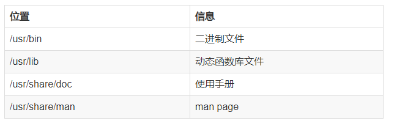

## 系统安装命令梳理
笔记梳理一下不同场景下遇到的安装命令
redhat主要是rpm和更高级的yum，debian主要是dpkg和更高级的apt。

### 源
源和软件仓库实际上是一个意思，厂商将编译后的二进制文件和软件信息存放至服务器，用户需要安装软件时，包管理器自动分析本机和容器（repository）内的信息，下载需要的包并自动安装，安装后将新安装的软件信息存放至本地数据库。如果有前置软件没有安装，rpm和dpkg会提示安装失败，也可以强制安装，yum和apt会自动安装全部需要的依赖包。更新和卸载也同理。

这些源的位置记录在/etc/apt/sources.list，我们可以手动修改这些文件，但是修改重要系统配置前先备份是一个好习惯（sudo cp /etc/apt/sources.list /etc/apt/sources.list_backup）。

### yum
 - 全称是“Yellow dog Updater,Modified”
 - 是redhat、centos、Fedora系统(都是基于linux的系统)下的安装方式
 - 能够指定服务器自动下载RPM包并安装（也可设置只下载包但不安装），可以自动处理依赖关系，安装所有依赖的软件包。


### rpm
 - 全称是“redhat package management”
 - redhat系统下的软件管理包
 - 用来安装、卸载xx.rpm软件

使用wget下载一个 rpm包, 然后用 rpm -ivh  xxx.rpm  安装这个包，系统可能会提示在安装此包之前，必须先安装另一个包，只有将那个包安装好，才能继续安装你要安装的包，这种就是包之间的依赖关系。

如果安装一个包，还要依赖好多包，那rpm就不太好用了，这种情况下，通常使用yum命令。  yum  install  xxx(包名)，能自动下载和安装依赖包。

### apt-get
是ubuntu下的一种安装方式，基于debain

软件厂商自己编译好了很多二进制文件，只要系统和环境对应，下载之后就能直接安装。

#### 安装位置


自己编译，自己手动安装软件的时候，大都喜欢将该文件的根目录放到/usr/local下，这样安装的好处是卸载方便，直接删除就基本完成了，而且不同的软件泾渭分明，不会说大家的文件混一起不好找。如果是那样的话，只能使用locate或者find之类的命令辅助查询了。

但是手动这样安装也有不好的地方，就是会导致man命令和一些二进制命令不能直接使用，这也是为什么我们安装完以后需要配置PATH的原因。

#### update
sudo apt-get update 执行这条命令后计算机做了什么？

无论用户使用哪些手段配置APT软件源，只是修改了配置文件——/etc/apt/sources.list，目的只是告知软件源镜像站点的地址。但那些所指向的镜像站点所具有的软件资源并不清楚，需要将这些资源列个清单，以便本地主机知晓可以申请哪些资源。

用户可以使用“apt-get update”命令刷新软件源，建立更新软件包列表。在Ubuntu Linux中，“apt-get update”命令会扫描每一个软件源服务器，并为该服务器所具有软件包资源建立索引文件，存放在本地的/var/lib/apt/lists/目录中。 使用apt-get执行安装、更新操作时，都将依据这些索引文件，向软件源服务器申请资源。因此，在计算机设备空闲时，经常使用“apt-get update”命令刷新软件源，是一个好的习惯。

#### install

 - 扫描本地存放的软件包更新列表（由“apt-get update”命令刷新更新列表，也就是/var/lib/apt/lists/），找到最新版本的软件包；
 - 进行软件包依赖关系检查，找到支持该软件正常运行的所有软件包；
 - 从软件源所指 的镜像站点中，下载相关软件包，并存放在/var/cache/apt/archive；
 - 第四步，解压软件包，并自动完成应用程序的安装和配置。


#### upgrade
使用“apt-get install”命令能够安装或更新指定的软件包。而在Ubuntu Linux中，只需一条命令就可以轻松地将系统中的所有软件包一次性升级到最新版本，这个命令就是“apt-get upgrade”，它可以很方便的完成在相同版本号的发行版中更新软件包。
在依赖关系检查后，命令列出了目前所有需要升级的软件包，在得到用户确认后，便开始更新软件包的下载和安装。当然，apt- get upgrade命令会在最后以合理的次序，安装本次更新的软件包。系统更新需要用户等待一段时间。

### yum 
YUM是基于rpm但更胜于rpm的软件管理工具,主要是redhat系在用。

一些本地的yum相关配置要知道：

```
yum配置文件：/etc/yum.conf (通常无需修改)

仓库配置文件目录：/etc/yum.repos.d/

yum的缓存目录：/var/cache/yum

yum的日志文件：/var/log/yum.log
```

yum安装软件：

```
yum install 软件名称
```

#### yum 仓库
也就相当于源，就是在刚才所说的

```
/etc/yum.repos.d/
```

这个路径下。

如果我们想添加一个网络中的仓库, 我们可以先把repo文件下载, 然后复制到仓库文件夹下:

```
cd /etc/yum.repos.d/
wget repository_url
```

或者可以推荐使用yum仓库管理工具`yum-config-manager`

#### yum配置的进一步说明
主配置文件在`/etc/yum.conf`这里，里面有个main section用来指示yum的主要信息。

```
# cat /etc/yum.conf
[main]
cachedir=/var/cache/yum/$basearch/$releasever
keepcache=0
debuglevel=2
logfile=/var/log/yum.log
exactarch=1
obsoletes=1
gpgcheck=1
plugins=1
installonly_limit=3
```

而 `/etc/yum.repos.d` 这个文件夹下的子repo文件，将会覆盖主配置。


来看看这些repo文件的格式：

```
[epel]
name=Extra Packages for Enterprise Linux 7 - $basearch
baseurl=http://download.fedoraproject.org/pub/epel/7/$basearch
enabled=1
gpgcheck=1
gpgkey=file:///etc/pki/rpm-gpg/RPM-GPG-KEY-EPEL-7
```

也是分成了好几个键值对，name代表仓库描述，baseurl是仓库地址，**enabled**决定这个仓库启用不启用，一定要注意了。


### 手动安装rpm
yum源有时候就是设置不好，搞不对。那我们就直接找对应发行版的rpm包手动下载安装就好了。

简单粗暴。我们就是利用rpm这个命令来安装包：

```
rpm -ivh rpm包文件  //安装

-i:表示安装

-v：表示可视化

-h：表示显示安装进度
```

**zwlj:我们要把所有互相依赖的rpm包下载到一个地方，然后一口气暴力安装(比如rpm -ivh *.rpm)。。。**