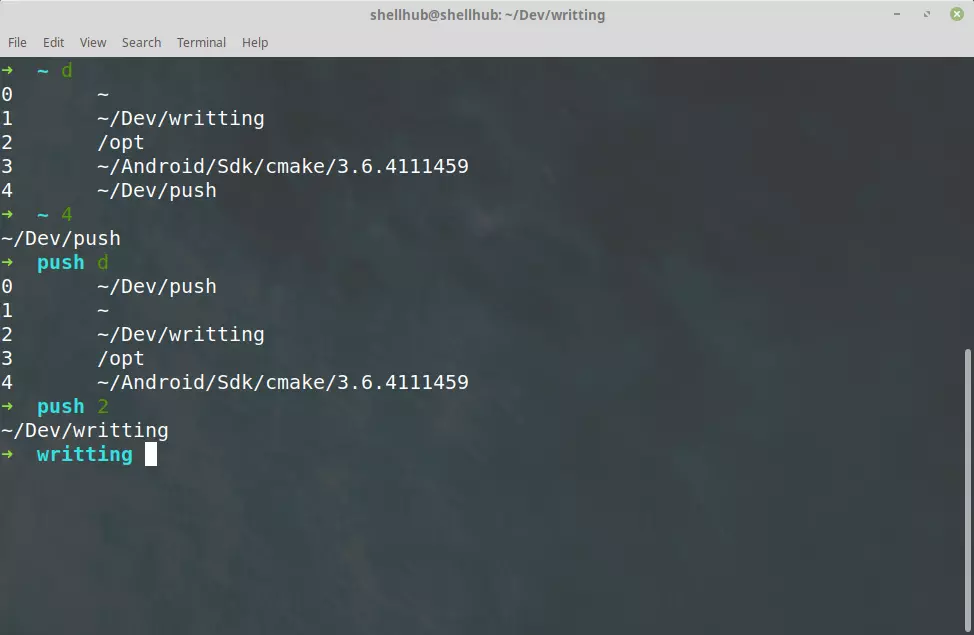

## linux第三方实用工具收录整理

### zsh(oh-my-zsh)
linux自带的bash其实不够好用,Z Shell(Zsh) 是一种Unix shell，它可以用作为交互式的登录shell，也是一种强大的shell脚本命令解释器。Zsh可以认为是一种Bourne shell的扩展，带有数量庞大的改进，包括一些bash、ksh、tcsh的功能。

简而言之，就是 shell 脚本语言的一种扩展与加强。

最大的优点就是：在用户启动的所有shell中共享命令历史。

那么oh-my-zsh就是一个定制版的zsh，官网的描述: It comes bundled with a ton of helpful functions, helpers, plugins, themes, and a few things that make you shout...


要安装on zsh，先安装zsh：

```
apt-get install zsh
```

官网上的安装步骤：

```
sh -c "$(wget https://raw.githubusercontent.com/robbyrussell/oh-my-zsh/master/tools/install.sh -O -)"
```

安装以后shell都自动被换成zsh了。

#### 安装插件

所有插件都列在Plugins，自定义插件可以安装在〜/.oh-my-zsh/custom/plugins中。要使用插件，只需将其添加到〜/.zshrc文件中的插件列表即可。明智地添加，因为太多的插件会减慢shell的启动速度。插件之间使用空格分割。

比如安装auto suggestions

```
# 安装
cd /home/shellhub/.oh-my-zsh/custom/plugins
git clone https://github.com/zsh-users/zsh-syntax-highlighting


# 添加到.zshrc配置文件中的plugins中
vim ~/.zshrc

# 例子
plugins=(
  git
  autojump
  colored-man-pages
  zsh-syntax-highlighting
  zsh-autosuggestions
)
```

**zsh-autosuggestions,zsh-syntax-highlighting比较建议安装**

#### 别名跳转
可以进行别名跳转来提高效率：

Oh-My-Zsh会自动记住您访问过的最后20个目录。您可以使用dirs -v或d来按时间顺序列出历史记录。



#### 快速解压

使用`x`命令即可。

#### 更新
`upgrade_oh_my_zsh`

### z命令
用来快速跳转。

```
mkdir ~/code
cd ~/code
git clone https://github.com/rupa/z.git
echo 'source ~/code/z/z.sh' >> ~/.zshrc
source ~/.zshrc
```

### bat
一个cat的代替命令，用来高亮输出的。

去github下载对应的dpkg，然后安装。

```
sudo dpkg -i bat_0.11.0_amd64.deb  # adapt version number and architecture
```

### fzf > ctrl+r
这个工具就比较厉害了，快速模糊搜索神器。比ctrl+r好用多了。

它是一款使用 GO 语言编写的交互式的 Unix 命令行工具。可以用来查找任何列表内容、文件、历史命令、 本机绑定的host、 进程、 Git 分支、进程等。所有的命令行工具可以生成列表输出的都可以再通过管道 pipe 到 fzf 上进行搜索和查找

简单介绍一下它的查找历史命令的功能，查看历史输入的终端命令我们一般用 ctrl+r，在这方面，fzf 可以说是秒杀 ctrl+r 了，ctrl+r 只能呼出最近一条包含输入字符串的历史命令，而且只能做精确匹配，而安装了 fzf 后，当呼出 ctrl+r 会显示所有包含输入字符串的命令(默认匹配最近一条符合搜索条件的命令)，按上下箭头即可自由选择你想要的命令，而且支持模糊搜索，这个特性针对那些常常只是隐约记得历史命令的人特别有用

安装 fzf 后，在命令行的任何地方按下 **Ctrl + T( ZSH下是CTRL-R)** ，就可以开启交互式模糊搜索界面，递归搜索当前目录下的文件。输入搜索项后，上、下键选择结果，回车上屏


fzf 的功能远不止于此，与其他命令结合让你的效率飞速提升,自动补全功能完全秒杀默认的 tab 功能，再安装一个具有预览功能的 highlight 插件，好用到爆炸，不信看以下功能展示


安装

```
git clone --depth 1 https://github.com/junegunn/fzf.git ~/.fzf
~/.fzf/install
```