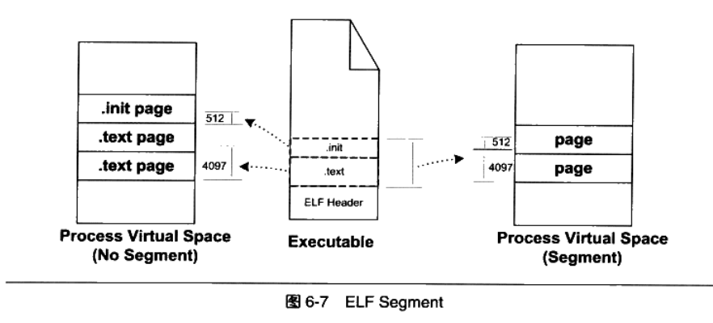
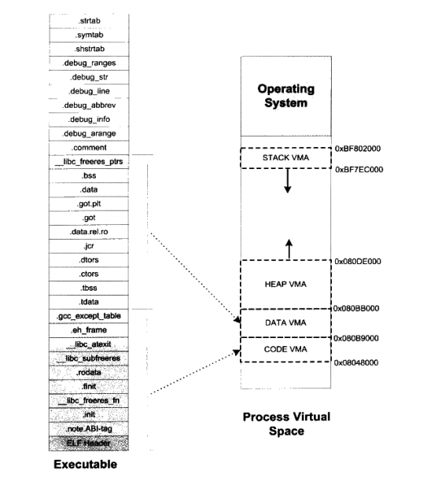

## 可执行文件的装载
可执行文件是如何装载到内存当中的呢？

通过之前目标文件的笔记，我们知道了，一个可执行文件会被划分为好几个段。而我们在进程相关的笔记里也知道了，进程也是会分段分页的。由此内存管理的分段，跟可执行文件的分段，两者之间非常有关系。

操作系统其实并不怎么关心可执行文件内部是怎么划分段的，它比较关心段的权限(可读，可写，可执行),所以它有一个很简单的策略，那就是，**对于相同权限的段，把它们合并到一起进行段的映射**

如上图，比如有两个段分别叫".text"和".init",它们包含的分别是程序的可执行代码和初始化代码,并且它们的权限相同,都是可读并且可执行的。假设.text为4097字节, .init为512字节,这两个段分别映射的话就要占用三个页面,但是,如果将它们合并成起映射的话只须占用两个页面

这时我们可以看到引入了一个segment的概念，这个就是操作系统中段的含义。把有相同权限的段合成一个segment，就能提高VMA(virtual memory area)的利用率.

**zwlj:可执行文件中的段(section)在装载的过程中被分为操作系统概念上的段segment，然后进行映射**

### 堆和栈
在操作系统中，除了可执行文件会被划分为segment映射到VMA以外，还需要用到**堆和栈**，它们也会在进程映射中作为VMA存在。

### VMA总结
根据上面的讲解，可知一个可执行文件加载成为进程之后，会划分为以下几个VMA(virtual memory area)区域：

 - 代码VMA.权限只读、可执行;有映像文件。
 - 数据VMA,权限可读写、可执行;有映像文件。
 - 堆VMA,权限可读写、可执行:无映像文件,匿名,可向上扩展。
 - 栈VMA,权限可读写、不可执行;无映像文件,匿名,可向下扩展。

如上图所示，映射到了四处VMA。

### Linux内核加载可执行文件
当我们在Linux下输入一个命令执行某个可执行文件的时候，bash进程会调用fork()系统调用创建一个新的进程，然后调用execve()系统调用执行指定的ELF文件。