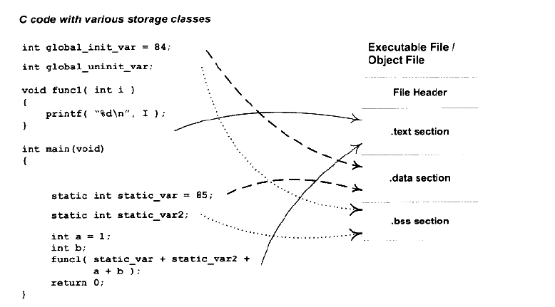
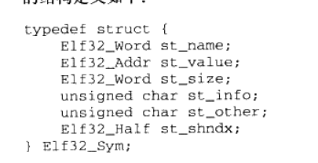
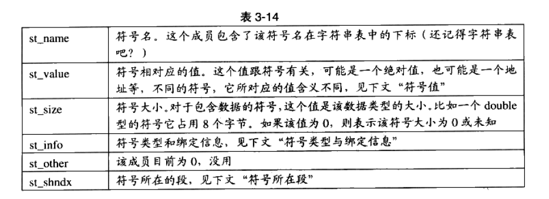
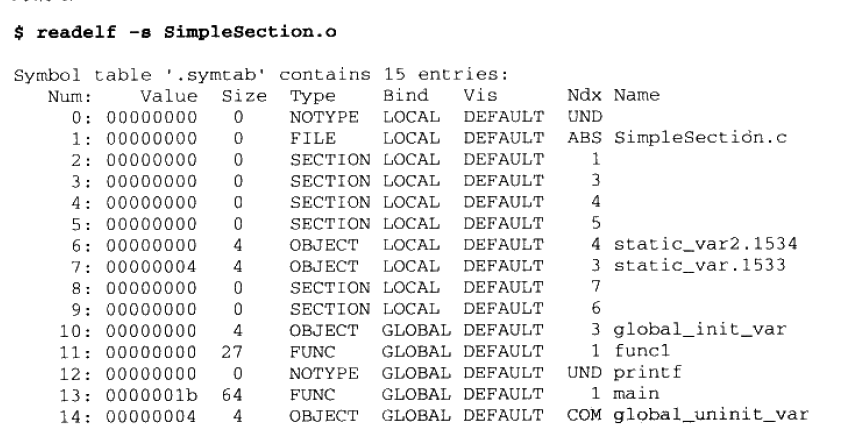
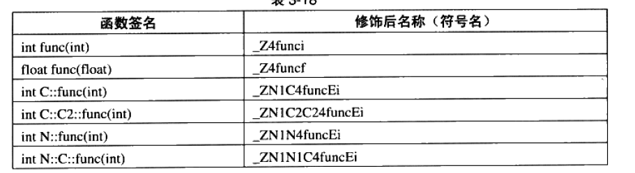

## 目标文件详解
在编译与链接的笔记里，其实已经有说到，源代码生成后的文件就是目标文件，比如.o这些。

可执行文件就是由这些.o文件组装而成。从广义上看，目标文件和可执行文件的格式几乎是一样的。在Windows上，我们称他们为**PE-COFF**文件。Linux里我们统称他们为**ELF文件**

#### ELF格式文件标准
比如Linux的ELF文件标准，就把ELF格式的文件分为四类：

 - 可重定位文件( 比如.o .obj格式的)
 - 可执行文件 (比如windows下的.exe,linux下的可执行文件)
 - 共享目标文件(动态库，比如.so .dll)
 - 核心转储文件 (Linux下的core dump)

### 目标文件格式
我们大概能猜到, 目标文件中的内容至少有编译后的机器指令代码、数据。没错,除了这些内容以外,目标文件中还包括了链接时所须要的一些信息,比如符号表、调试信息、宁符串等。

一般目标文件将这些信息按不同的属性,以“节" (Section)的形式存储,有时候也叫“段” (Segment),在一般情况下,它们都表示一个一定长度的区域

好比说，我们源代码翻译出的机器指令会被放到代码段，一般是.code或者.text，全局变量或者静态变量放到数据段.data.比如图：

除此之外，还能看见有ELF文件头。它描述了整个文件的文件属性,包括文件是否可执行、是静态链接还是动态链接及入口地址(如果是可执行文件)、目标硬件、目标操作系统等信息

文件头还包括一个段表(Section Table),段表其实是一个描述文件中各个段的数组。段表描述了文件中各个段在文件中的偏移位置及段的属性等,从段表里面可以得到每个段的所有信息。

ps：.data段和.bss段都用来存放全局变量和静态变量，**.data段存放已初始化的数据，.bss段存放未初始化的全局变量数据**。

### 符号详解
之前也在编译与链接篇里提过符号，链接过程的本质就是要把多个不同的目标文件之间相互“粘合”，简而言之就是帮助A文件找到B文件中的变量或者函数。

每一个目标文件中，都会有一个**符号表Symbol Table**，这个表里会记到所有目标文件用到的符号，这些符号都有**符号值Symbol Value**。对于最常见的变量和函数符号，符号值就是地址。

符号一共有这么几类：

1. 全局符号，可被其他目标文件引用的符号，比如main,或者某些全局函数
2. 外部符号，本目标文件没有的全局符号，比如printf
3. 段名，由编译器产生，如.text,.data.
4. 局部符号，只有编译单元内部可见，调试器可以使用这些符合来分析程序或奔溃时的core文件。这些局部符号在链接过程中没有作用。
5. 行号信息

#### ELF符号表结构
接下来看看目标文件的符号表里，也就是 **.symtab段** 里存了什么内容。这个段里存的，其实是一个结构体数组，结构体的定义如下图：

表里会有符号名，符号值，以及这个符号在哪个段，等等。

用readelf命令看符号表：

Num是数组下标,第二个是符号值，Ndx表示符号所在的段，Name是符号名称，在最后。

#### 特殊符号
当我们使用ld作为链接器来链接生产可执行文件时,它会为我们定义很多特殊的符号,这些符号并没有在你的程序中定义,但是你可以直接声明并且引用它,我们称之为特殊符号。

几个很具有代表性的特殊符号如下：

 - __executable-start, 该符号为程序起始地址,注意,不是入口地址,是程序的最开始的地址。
 - __etext或etext或etext,该符号为代码段结束地址,即代码段最末尾的地址。
 - __edata或edata,该符号为数据段结束地址,即数据段最末尾的地址。
 - __end或end,该符号为程序结束地址。以上地址都为程序被装载时的虚拟地址

**我们甚至可以在程序中，直接使用这些符号**

#### 符号修饰与函数签名
C语言中，函数被翻译成符号时，非常容易造成冲突。UNIX规定C源代码相应符号名加上下划线`_`,比如main翻译成`_main`,后续C++设计时引入命名空间解决多模块问题。

GCC可以通过设置关闭C语言编译符号是否加上上下划线。

C++通过**函数签名Function Signature**来回避函数重提,函数签名包含了一个函数的信息,包括函数名、它的参数类型、它所在的类和名称空间及其他信息。函数签名用于识别不同的函数,就像签名用于识别不同的人一样

GCC的基本C++名称修饰方法如下:所有的符号都以“-Z”开头,对于嵌套的名字(在名称空间或在类里面的),后面紧跟"N",然后是各个名称空间和类的名字,每个名字前是名字字符串长度,再以"E"结尾。比如N:C:func经过名称修饰以后就是_ZN1N1C4funcE.对于一个函数来说,它的参数列表紧跟在"E”后面,对于int类型来说,就是字母"i"。q

全局变量的修饰其实也类似，这里暂不记录。

不同编译器厂商修饰的方法可能不同，细节上可能不一样。

C++为了与C兼容，有extern C的特性，这个请参见相关笔记。

### 参考
程序员的自我修养，链接装载与库