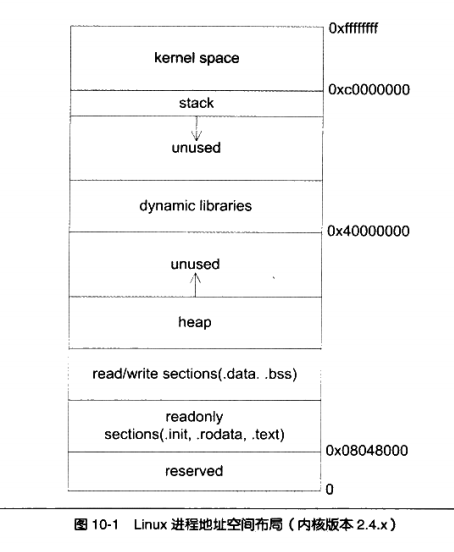
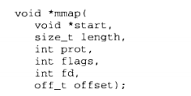

## 程序内存布局
Linux下典型的内存布局：

栈总是向下增长，堆向上。

### 栈stack

栈在程序运行中具有举足轻重的地位。最重要的,栈保存了一个函数调用所需要的维护信息,这常常被称为**堆栈帧(Stack Frame)或活动记录(Activate Record)**,堆栈帧一般包括如下几方面内容:

 - 函数的返回地址和参数。
 - 临时变量:包括函数的非静态局部变量以及编译器自动生成的其他临时变量。
 - 保存的上下文:包括在函数调用前后需要保持不变的寄存器。

### 堆heap
相对于栈而言,堆这片内存面临一个稍微复杂的行为模式:在任意时刻,程序可能发出请求,要么申请一段内存,要么释放一段已申请过的内存,而且申请的大小从几个字节到数 GB都是有可能的,我们不能假设程序会一次申请多少堆空间,因此,堆的管理显得较为复杂。下面让我们来了解-下堆的工作原理。

C语言一般用malloc来分配内存，那么malloc到底是怎么实现的呢?有一种做法是,把进程的内存管理交给操作系统内核去做,既然内核管理着进程的地址空间,那么如果它提供一个系统调用,可以让程序使用这个系统调用申请内存,不就可以了吗?当然这是一种理论上可行的做法,但实际上这样做的性能比较差,因为每次程序申请或者释放堆空间都需要进行系统调用。我们知道系统调用的性能开销是很大的,当程序对堆的操作比较频繁时,这样做的结果是会严重影响程序的性能的。比较好的做法就是程序向操作系统申请一块适当大小的堆空间,然后由程序自己管理这块空间,而具体来讲,管理着堆空间分配的往往是程序的运行库。

#### linux进程堆管理
进程的地址空间中,除了可执行文件、共享库和栈之外,剩余的 ,未分配的空间都可以被用来作为堆空间。Linux下的进程堆管理稍微有些复杂,因为它提供了两种堆空间分配的方式,即两个系统调用:**一个是brk()系统调用,另外一个是mmap()**。brk()的C语言形式声明如下:

brk()的作用实际上就是设置进程数据段的结束地址,即它可以扩大或者缩小数据段 (Linux下数据段和BSS合并在一起统称数据段),如果我们将数据段的结束地址向高地址移动,那么扩大的那部分空间就可以被我们使用,把这块空间拿来作为堆空间是最常见的做法之一. Glibc中还有一个函数叫sbrk,它的功能与brk类似,只不过参数和返回值略有不同。 sbrk以一个增量(Increment)作为参数,即需要增加(负数为减少)的空间大小,返回值是增加(或减少)后数据段结束地址,这个函数实际上是对brk系统调用的包装,它是通过brk()实现的。

mmap()的作用和Windows系统下的VirtualAlloc很相似,它的作用就是向操作系统申请一段虚拟地址空间,当然这块虚拟地址空间可以映射到某个文件(这也是这个系统调用的最初的作用,也就是共享内存),当它不将地址空间映射到某个文件时,我们又称这块空间为匿名(Anonymous)空间,匿名空间就可以拿来作为堆空间。它的声明如下:

mmap的前两个参数分别用于指定需要申请的空间的起始地址和长度,如果起始地址设置为0,那么Linux系统会自动挑选合适的起始地址.protflags这两个参数用于设置申请的空间的权限(可读、可写、可执行)以及映射类型(文件映射、匿名空间等),最后两个参数是用于文件映射时指定文件描述符和文件偏移的,我们在这里并不关心它们。

malloc函数是这样处理用户的空间请求的:**对于小于128KB的请求来说,它会在现有的堆空间里面,按照堆分配算法为它分配一块空间并返回;对于大于128KB的请求来说,它会使用mmap()函数为它分配一块匿名空间,然后在这个匿名空间中为用户分配**