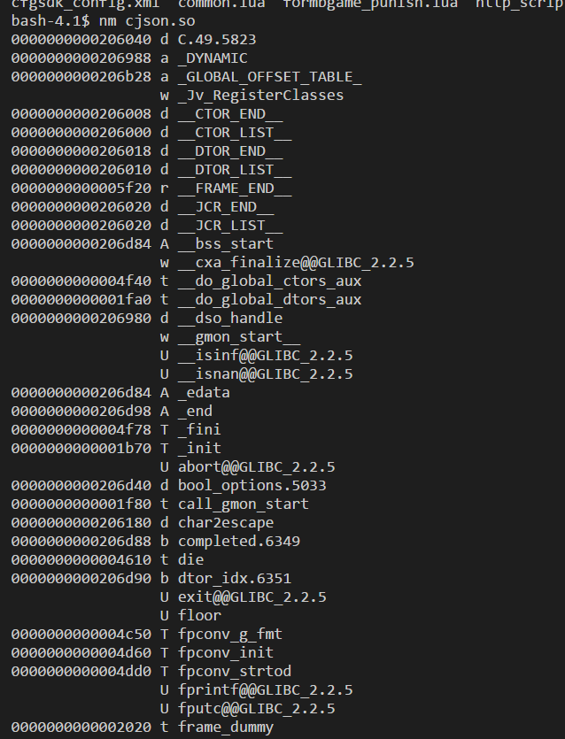
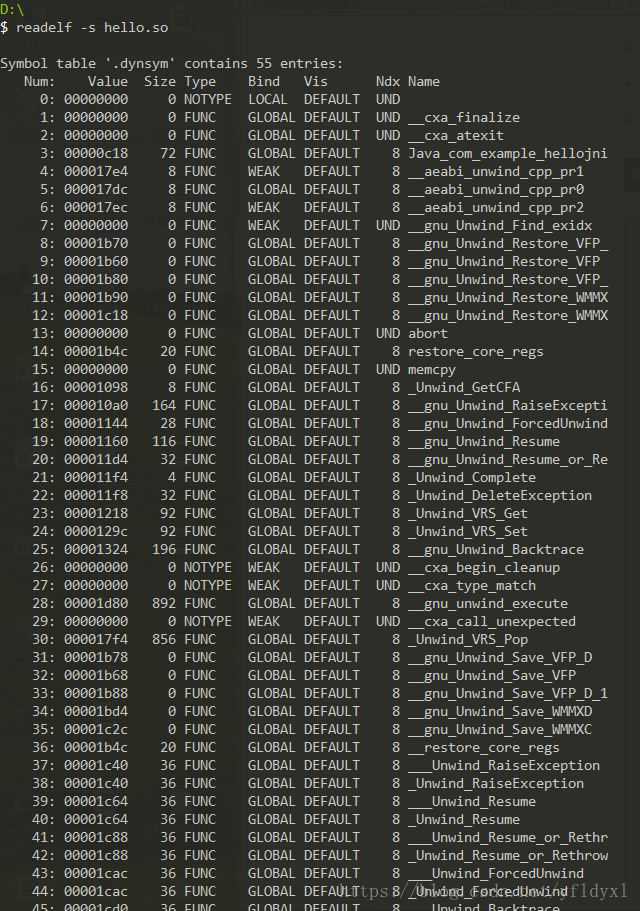

## 符号表的查看与排查
与C++打交道，我们当然少不了排查二进制中的符号问题。

在编译连接装载的书中我们已经掌握了一定的符号相关的知识。二进制文件中一般有两个符号表：

 - 一个是“正常的”（在.symtab和.strtab）
 - 一个是动态的（.dynsym和.dynstr）

我们只需要知道正常的符号表，一般只拿来调试用，包括所有符号，里面的函数符号是不会被导出的。而动态符号表则不同，是可以提供给外部使用的，也就是说可以导出去给别人感知到的。所以dynsym是symtab的子集。

经常用strip正常符号表，用来压缩二进制文件库的大小。

这里先记下两个非常有用的命令：

### nm命令
nm 命令显示关于指定 File 中符号的信息

对于 nm 命令列出的每个符号，它们的值使用十六进制来表示（缺省行为），并且在该符号前面加上了一个表示符号类型的编码字符。

nm命令比较有用的几个参数：

 - -D或–dynamic：显示动态符号。该任选项仅对于动态目标(例如特定类型的共享库)有意义。
 - -g或–extern-only：仅显示外部符号


**对于每一个符号来说，其类型如果是小写的，则表明该符号是local的；大写则表明该符号是global(external)的。**

类型字母有以下几种：

 - A 该符号的值是绝对的，在以后的链接过程中，不允许进行改变。这样的符号值，常常出现在中断向量表中，例如用符号来表示各个中断向量函数在中断向量表中的位置。

 - B 该符号的值出现在非初始化数据段(bss)中。例如，在一个文件中定义全局static int test。则该符号test的类型为b，位于bss section中。其值表示该符号在bss段中的偏移。一般而言，bss段分配于RAM中。
 - C 该符号为common。common symbol是未初始话数据段。该符号没有包含于一个普通section中。只有在链接过程中才进行分配。符号的值表示该符号需要的字节数。例如在一个c文件中，定义int test，并且该符号在别的地方会被引用，则该符号类型即为C。否则其类型为B。
 - D 该符号位于初始化数据段中。一般来说，分配到data section中。
例如：定义全局int baud_table[5] = {9600, 19200, 38400, 57600, 115200}，会分配到初始化数据段中。
 - G 该符号也位于初始化数据段中。主要用于small object提高访问small data object的一种方式。
 - I 该符号是对另一个符号的间接引用。
 - N 该符号是一个debugging符号。
 - R 该符号位于只读数据区。
例如定义全局const int test[] = {123, 123};则test就是一个只读数据区的符号。
值得注意的是，如果在一个函数中定义const char *test = “abc”, const char test_int = 3。使用nm都不会得到符号信息，但是字符串”abc”分配于只读存储器中，test在rodata section中，大小为4。
 - S 符号位于非初始化数据区，用于small object。
 - **T 该符号位于代码区text section。**
 - **U 该符号在当前文件中是未定义的，即该符号的定义在别的文件中。
例如，当前文件调用另一个文件中定义的函数，在这个被调用的函数在当前就是未定义的；但是在定义它的文件中类型是T。但是对于全局变量来说，在定义它的文件中，其符号类型为C，在使用它的文件中，其类型为U。**
 - V 该符号是一个weak object。
 - W The symbol is a weak symbol that has not been specifically tagged as a weak object symbol.
? 该符号类型没有定义


那个图来观察一下：



上图中，左侧那一栏就是符号对应的地址。右侧是函数名，中间那一列是类型，大写说明是GLOBAL的符号，小写说明是LOCAL的符号。

### readelf命令
这个工具和objdump命令提供的功能类似，但是它显示的信息更为具体，并且它不依赖BFD库。 它也是可以用来读取二进制文件符号信息的

用`readelf -s` 来查看二进制文件的两个符号表的信息




如图，readelf文件查看符号更直观，除了是否GLOBAL WEAK还看得到可见性Vis。

通过这个我们就能知道某符号是否对外部可见。


### 符号的Global和LOCAL
无论是以上两个命令，我们都可以看到符号是分为GLOBAL或者LOCAL WEAK的。其中被标位LOCAL的符号，只能在本程序内被查找感知到，无法对外提供使用，所以如果出现找不到符号的问题,用命令分析符号来梳理逻辑最好。

### 系统库的查找

linux下，我们很多一些动态库，静态库都存放在一些可以被搜索到的路径下面，我们可以用ldconfig这个命令去找我们是否有安装某些库，并且这些库存放在哪里。

比如：

```
ldconfig -p | grep libz  
```

上面的命令可以grep出zlib库的目录地点，然后我们就可以用nm或者readelf去分析它了。

如果我们链接库的时候缺失某些符号，第一个想法就是猜缺失了哪些库，然后去系统库里看看这个库有没有，有的话再看看是不是忘记在makefile或者cmake或者在命令里没有手动链这个库。