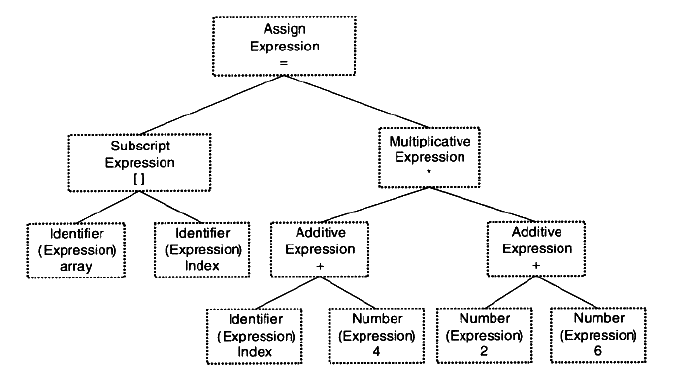
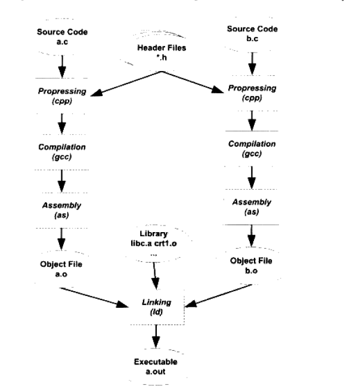

# 编译与链接
gcc编译c++程序时，整个过程可以分为四个步骤(在动静态库的笔记里也有讲)

 - 预处理
 - 编译
 - 汇编
 - 链接

这四个步骤。

### 预编译
预编译源文件会产生一些后缀为.i的中间文件。

预编译过程主要处理那些源代码文件中的以“#”开始的预编译指令。比如"#include "."#define"等,主要处理规则如下:

 - 将所有的"#define"删除,并且展开所有的宏定义。
 - 处理所有条件预编译指令,比如"fif"、"idef"、 "teli"、“telse"、"#endif.
 - 处理"#include"预编译指令,将被包含的文件插入到该预编译指令的位置。注意,这·个过程是递归进行的,也就是说被包含的文件可能还包含其他文件。删除所有的注释“11"和"/**/"。.
 - 添加行号和文件名标识,比如#2 "hello.c" 2, 以便于编译时编译器产生调试用的行号信息及用于编译时产生编译错误或警告时能够显示行号。
 - 保留#pragma编译器指令，这些编译器有用。

经过预编译后，宏定义就全部木有了。

### 编译
编译过程其实就是用一些词法分析，语法分析生成对应的**汇编代码**文件。

现代gcc已经把编译和预编译都合并成一个步骤了。

### 汇编
这一步就更直接了，直接把汇编代码翻译成具体的机器码就ok了。如此就会得到一个最后的.o文件。

### 链接
其实链接这一步才是比较复杂的。把一系列的目标文件合并到一起产生最终的可执行文件。

## 编译器工作过程
接下来简单描述源代码到最终目标代码的过程。

### 1.词法分析
首先源代码程序被输入到**扫描器Scanner**，扫描器运用一种类似**有限状态机**的算法来把源代码分割成一系列记号。

如关键字，标识符，字面量等等符号。

比如程序lex，就是一个词法扫描器。

#### 2.语法分析
**语法分析器**对词法分析得出的字面量进行语法分析，产生语法树。

语法分析也有相应的程序来完成，比如**yacc**。跟lex一样也可以根据用户给定的语法规则来对记号序列进行解析而构造成语法树。

上图为一个示例的语法树。

#### 3.语义分析
这一部分由**语义分析器Semantic Analyzer**来完成。语法分析器仅仅分析出语法树而已，接下来还要进行语义分析。比如两个指针做乘法是毫无意义的，指针也不能和浮点数做运算。

语义又分为静态语义和动态语义，前者是编译器可以确定的语义，后期只有是运行期才能确定。

静态语义通常包括声明和类型的匹配,类型的转换。比如当一个浮点型的表达式赋值给1个整型的表达式时,其中隐含了一个浮点型到整型转换的过程,语义分析过程中需要完成这个步骤。比如将一个浮点型赋值给一个指针的时候,语义分析程序会发现这个类型不匹配,编译器将会报错。动态语义一般指在运行期出现的语义相关的问题,比如将0作为除数是一个运行期语义错误.

**zwlj：简单来说就是检查语法树合不合法**

经过语义分析阶段以后,整个语法树的表达式都被标识了类型,如果有些类型需要做隐式转换,语义分析程序会在语法树中插入相应的转换节点。

#### 4.中间语言生成
现代的编译器有着很多层次的优化,往往在源代码级别会有一个优化过程。源代码级优化器会在源代码级别进行优化,比如在源代码中 (2+6)这个表达式可以被优化掉,因为它的值在编译期就可以被确定。

其实直接在语法树上作优化比较困难,所以源代码优化器往往将整个语法树转换成中间代码(Intermediate Code),它是语法树的顺序表示,其实它已经非常接近目标代码了。

**中间代码使得编译器可以被分为前端和后端。编译器前端负责产生机器无关的中间代码,编译器后端将中间代码转换成目标机器代码**。这样对于一些可以跨平台的编译器而言,它们可以针对不同的平台使用同一个前端和针对不同机器平台的数个后端。

#### 5.目标代码生成与优化

源代码级优化器产生中间代码标志着下面的过程都属于编译器后端。编译器后端主要包括代码**生成器(Code Generator)和目标代码优化器(Target Code Optimizer)**。

让我们先来看看代码生成器。代码生成器将中间代码转换成目标机器代码,这个过程十分依赖于目标机器,因为不同的机器有着不同的字长、寄存器、整数数据类型和浮点数数据类型等。

生成器生成一系列目标代码以后，会经过代码优化器来进行优化。比如选择合适的寻址方式、使用位移 ,来代替乘法运算、删除多余的指令等。

经过一系列的过程，终于产生了目标代码，但也还差一步才能产生最终的机器码，此时翻译出的目标代码中，一些变量的基址没有被确定。比如数组的起始内存地址在哪里，这些必须要编译器分配才会有。同时还可能出现变量定义在别的模块里，这种情况，所以这些就必须交给链接来执行了。

## 链接过程

### 模块拼接-静态链接
人们把每个模块独立地编译,然后按照须要将它们“组装”起来,这个组装模块的过程就是链接。

其实从原理上来讲，链接无非就是把一些指令对其他**符号地址**(也就是之前编译出的目标代码里的一些地址)的引用加以修正。

链接过程主要包括了：

 - 地址和空间分配(Address and Storage Allocation)
 - 符号决议(Symbol Resolution)
 - 重定位(Relocation)

符号决议也被叫做符号绑定，名称绑定等。

最基本的静态链接就是把源代码文件经过编译器编译成的目标文件和库一起链接成可执行文件。库可以理解为一组目标文件的包

现代的编译和链接过程也并非想象中的那么复杂,它还是一个比较容易理解的概念。

比如我们在程序模块main.c中使用另外一个模块func.c中的函数foo)。我们在main.c模块中每一处调用foo的时候都必须确切知道foo这个函数的地址,但是由于每个模块都是单独编译的,在编译器编译main.c的时候它并不知道foo函数的地址,所以它暂时把这些调用foc的指令的目标地址搁置,等待最后链接的时候由链接器去将这些指令的目标地址修正(转换)。

**zwlj：在链接这个过程中，做的最主要的事情就是符号的转换，符号用来标识一些具体的地址，不同的模块之间要进行跳转引用的时候，有这个符号就很方便。链接就是解决这个符号决议并且重定位的问题**

### 参考
程序员的自我修养，链接装载与库