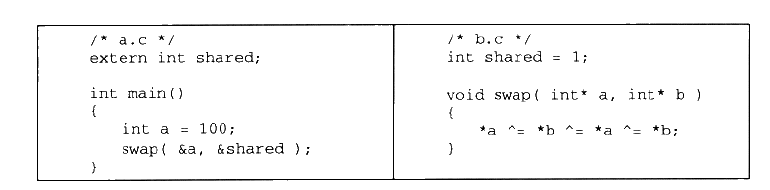
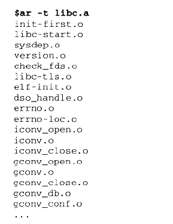

## 静态链接过程
假定我们要链接两个源文件：

我们将这两个源文件编译后链接到一块。,我们知道,**可执行文件中的代码段和数据段都是由输入的目标文件(.o文件)中合并而来的**。对于多个输入目标文件,链接器如何将它们的各个段合并到输出文件?或者说,输出文件中的空间如何分配给输入文件?

### 两步链接

现在链接器采用的链接策略叫**两步链接Two-pass Linking**,主要分为以下两步：

1. 空间地址分配
2. 符号解析与重定位

#### 空间地址分配
扫描所有的输入目标文件,并且获得它们的各个段的长度、属性和位置,并且将输入目标文件中的待号表中所有的符号定义和符号引用收集起来,统一放到一个全局符号表。这一步中,链接器将能够获得所有输入目标文件的段长度,并且将它门合并,计算出输出文件中各个段合并后的长度与位置,并建立映射关系。

**p.s: 这里注意一下bss段的合并，bss段用来存放未初始化的全局变量数据，多个目标文件合并时，其实这个bss段，在最后的可执行文件当中是不占空间的，因为没意义。但是一旦这个可执行文件被加载到内存当中(装载过程)，bss段将会映射到一块虚拟地址内存当中，此时就会占空间。**

#### 符号解析
使用上面第一步中收集到的所有信息,读取输入文件中段的数据、重定位信息,并且进行符号解析与重定位、调整代码中的地址等。事实上第二步是**链接过程的核心**,特别是重定位过程。

在我们通常的观念里,之所以要链接是因为我们目标文件中用到的符号被定义在其他目标文件,所以要将它们链接起来。比如我们直接使用ld来链接"a.o",而不将"b.o"作为输入。链接器就会发现shared和swap两个符号没有被定义,没有办法完成链接工作

 ### C++与ABI
既然每个编译器都能将源代码编译成目标文件,那么有没有不同编译器编译出来的目标文件是不能够相互链接的呢?有没有可能将MSVC编译出来的目标文件和GCC编译出来的目标文件链接到一起,形成一个可执行文件呢?

事实并不像我们想象的那么简单,如果要使两个编译器编译出来的目标文件能够相互链接,那么这两个目标文件必须满足下面这些条件:**采用同样的目标文件格式、拥有同样的符·号修饰标准、变量的内存分布方式相同、函数的调用方式相同,等等**。其中我们把符号修饰标准、变量内存布局、函数调用方式等这些跟可执行代码二进制兼容性相关的内容称为**ABI(Application Binary Interface)**.

必须ABI兼容，这样两个编译器编译出来的目标文件才能相互链接。影响ABI的因素非常多,硬件、编程语言、编译器、链接器、操作系统等都会影响ABI.

**zwlj：由于C++二进制兼容性很差，所以经常出现库不兼容的情况。**

人们一直期待着能有统一的C++二进制兼容标准(C++ ABI),诸多的团体和社区都在致力于C++ ABI标准的统一。但是目前情况还是不容乐观,基本形成以微软的VISUAL C++和GNU阵营的GCC (采用Intel Itanium C++ ABI标准)为首的两大派系,各持已见互不兼容。早先时候, *NIX系统下的ABI也十分混乱,这个情况一直延续到LSB (Linux Standard Base)和Intel的Itanium C++ ABI标准出来后才有所改善,但并未彻底解决ABI的问题,由于现实的因素,这个问题还会长期地存在,这也是为什么有这么多像我们这样的程序员能够存在的原因。

### 查看静态链接的一些信息
linux可以用一个叫ar的工具来看.a静态库文件包含了哪些目标文件:

