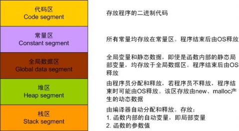

## 进程在内存中的布局
对于一个完整的程序，在内存中分布情况如下图：

### 虚拟内存和进程栈

根据虚拟内存机制，我们可以知道，一个进程会被“假定”成可以利用全部的内存空间。所以一开始就会被假定成可以利用0-4G(或者说0-物理内存大小)或者之类的一片连续空间，这片连续空间可以根据分页技术给swap出去放到磁盘上。

进程虚拟地址空间中的栈区，正指的是我们所说的进程栈。进程栈是属于用户态栈，和[进程虚拟地址空间 (Virtual Address Space)](https://durant35.github.io/2017/10/29/VM_Stacks/) 密切相关

上面就是进程栈的示意图，进程的虚拟内存就这样样被划分为Kernel space和User space。

进程栈的初始化大小是由编译器和链接器计算出来的，但是栈的实时大小并不是固定的，Linux 内核会根据入栈情况对栈区进行动态增长（其实也就是添加新的页表）。但是并不是说栈区可以无限增长，它也有最大限制 `RLIMIT_STACK` (一般为 8M)，我们可以通过 *ulimit* 来查看或更改 `RLIMIT_STACK` 的值 (**stack size**)

### 线程栈

从 Linux 内核的角度来说，其实它并没有线程的概念，Linux 把所有线程都当做进程来实现，它将线程和进程不加区分的统一到了 `task_struct` 中；线程仅仅被视为一个与其他进程共享某些资源的进程，而是否共享地址空间几乎是进程和 Linux 中所谓线程的唯一区别。线程创建的时候，加上了 `CLONE_VM` 标记，这样**线程的内存描述符将直接指向父进程的内存描述符**

- 线程栈是从进程的地址空间中 **mmap** 出来的一块内存区域，原则上是线程私有的；但是同一个进程的所有线程在生成的时候会浅拷贝线程生成者 `task_struct` 的很多字段，其中包括所有的 `vma`，因此如果愿意，其它线程也还是可以访问到的，于是一定要注意！

### 内核栈

在每一个进程的生命周期中，必然会通过到系统调用陷入内核。在执行系统调用陷入内核之后，这些内核代码所使用的栈并不是原先进程用户空间中的栈，而是一个单独内核空间的栈，这个称作进程内核栈。

所有进程运行的时候，都可能通过系统调用陷入内核态继续执行：假设第一个进程 A 陷入内核态执行的时候，需要等待读取网卡的数据，主动调用 schedule() 让出 CPU；此时调度器唤醒了另一个进程 B，碰巧进程 B 也需要系统调用进入内核态；那问题就来了，如果内核栈只有一个，那进程 B 进入内核态的时候产生的压栈操作，必然会破坏掉进程 A 已有的内核栈数据，一但进程 A 的内核栈数据被破坏，很可能导致进程 A 的内核态无法正确返回到对应的用户态了。

**zwlj：因此可以知道，每个进程不是都复用一个内核栈的，内核栈也是跟着进程走的，每次上下文切换，都要恢复进程的内核栈**