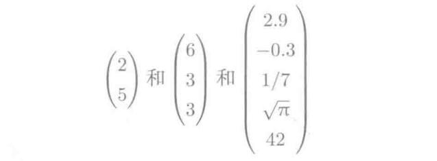
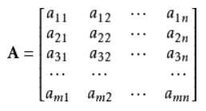
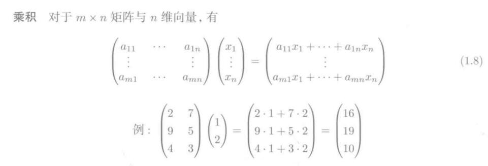
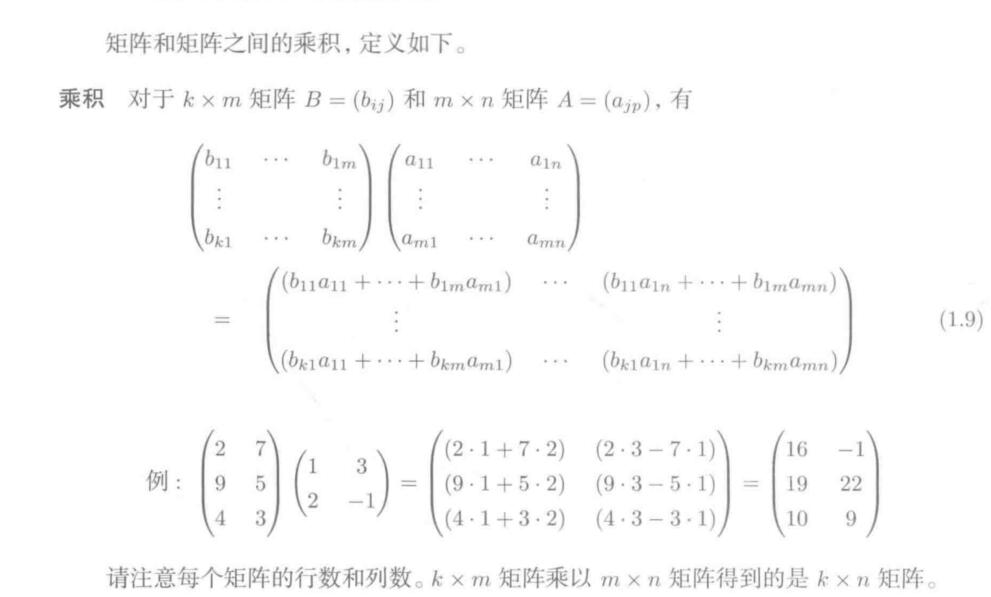
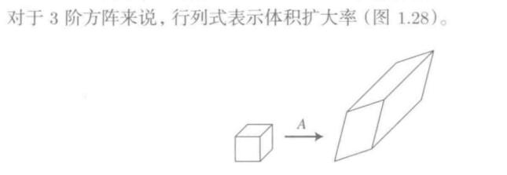

## 向量与空间

### 向量
把数排成一列就是向量：

向量默认为列向量，当然也有行向量，*T* 可用作转置符号。

### 矩阵

矩阵是二维数组，其中的每一个元素被两个索引而非一个所确定。我们通常会赋予矩阵粗体的大写变量名称，比如A。

注意几种特殊的矩阵：**零矩阵，单位矩阵，对角矩阵**。

 - 零矩阵即全0的矩阵。
 - **单位矩阵是对角线全是1的方阵(注意是方阵)**。
 - 方阵中，非对角线上元素以外全为0的矩阵为对角矩阵。

单位矩阵

对角矩阵

#### 矩阵乘法(向量)
首先看看矩阵和向量之间的乘法：

每个矩阵乘以一个列向量，都能得到一个列向量，并且列向量的维度和矩阵维度相同(行数)。

**技巧：把列向量打横放，一行一行给到矩阵参与计算(分别相乘)**

#### 矩阵乘法(矩阵)

矩阵和矩阵相乘，**完全可以看做是矩阵和若干个列向量相乘，然后得到了若干个列向量**。

吧若干个列向量分别打横，然后按与向量乘的方法计算即可。k*m的矩阵乘以m*n的矩阵后，得到k*n的矩阵，中间的m消掉。

#### 矩阵是映射
了解了矩阵乘法以后，我们知道，矩阵乘以一个列向量，得到的是一个新的列向量。Ax = y,那么我们就可以称作，向量x经过了矩阵A变化，成为了向量y。

因此我们可以知道，矩阵实质上可以当做一个变化映射。

zwlj:机器学习中的主成分分析笔记中会提到，矩阵乘以矩阵A\*B，则相当于将B矩阵中的每列列向量，映射到以A矩阵中每行行向量为基底构成的空间中。

#### 矩阵乘积是映射的合成

理解了矩阵是映射以后，我们要知道一个性质，就是x经过矩阵A变换以后再经过矩阵B变换，得到向量y。

即：B(Ax) = y

这个结果相当于y做了AB乘积矩阵的变换。也就是：

`B(Ax) = (BA)x`

这里也要注意，矩阵和向量相乘，向量要放右边，而且出于维度结合律，上面要写成(BA)x而不是(AB)x.

**由于A矩阵变换是先执行的，所以也可以理解为用B变换去变换矩阵A，得出一个新的变换矩阵，由于B作用于A，所以结果是BA而不是AB**

注：也可以把A理解成一个f(x)变换函数，所以先A后B相当于g(f(x)),这样才符合逻辑，自然就是BA而不是AB了。

#### 逆矩阵为逆映射
理解了上面例子以后，我们就可以知道逆矩阵其实就是对应着一个矩阵的逆映射。不过要注意，这里的矩阵也是指的 **方阵**！

x经过A矩阵变换得到y，y也可以经过A的逆矩阵变回x。

逆矩阵有如下性质：

##### 求解简单逆矩阵
若|A|≠0，则矩阵A可逆，且

也就是说A的逆矩阵等于A的行列式的值的倒数，乘以A星矩阵，A星矩阵为A的伴随矩阵。

二元矩阵A行列式的值就是**A的转置矩阵**对角线之积相减，二元矩阵的伴随矩阵求法为，对角线元素互换，非对角线元素加负号。

#### 矩阵行列式的本质
行列式的本质就是体积扩大率。

假象一个平面空间，一个二维向量可以想象成该空间上的点，那么这个向量上的点假如全部经过方阵A的变换后会如何呢？

点会全部缩起来或者膨胀，导致的是整个二维空间(其实就是面积)产生变化，这个变化率就是矩阵行列式的值。二维空间是面积扩大率，所以三维空间自然就是体积扩大率。

如上图1*1的二维平面空间经过矩阵A的变换，全部点都缩涨了。

同理三维立方体里的体积也是如此：

**所以矩阵的行列式的值，本质就是该矩阵变换对于整个维空间的变化率**。
