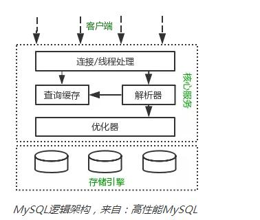

## mysql优化原理
如果能在头脑中构建一幅MySQL各组件之间如何协同工作的架构图，有助于深入理解MySQL服务器。下图展示了MySQL的逻辑架构图。



MySQL**逻辑架构整体分为三层**，最上层为客户端层，并非MySQL所独有，诸如：连接处理、授权认证、安全等功能均在这一层处理。

MySQL大多数核心服务均在中间这一层，包括查询解析、分析、优化、缓存、内置函数(比如：时间、数学、加密等函数)。所有的跨存储引擎的功能也在这一层实现：存储过程、触发器、视图等。

最下层为存储引擎，其负责MySQL中的数据存储和提取。和Linux下的文件系统类似，每种存储引擎都有其优势和劣势。中间的服务层通过API与存储引擎通信，这些API接口屏蔽了不同存储引擎间的差异。

当向MySQL发送一个请求的时候，MySQL到底做了些什么呢？


### 客户端/服务端通信协议

MySQL客户端/服务端通信协议是“半双工”的：在任一时刻，要么是服务器向客户端发送数据，要么是客户端向服务器发送数据，这两个动作不能同时发生。一旦一端开始发送消息，另一端要接收完整个消息才能响应它，所以我们无法也无须将一个消息切成小块独立发送，也没有办法进行流量控制。

客户端用一个单独的数据包将查询请求发送给服务器，所以当查询语句很长的时候，需要设置max_allowed_packet参数。但是需要注意的是，如果查询实在是太大，服务端会拒绝接收更多数据并抛出异常。

客户端用一个单独的数据包将查询请求发送给服务器，所以当查询语句很长的时候，需要设置max_allowed_packet参数。但是需要注意的是，如果查询实在是太大，服务端会拒绝接收更多数据并抛出异常。

与之相反的是，服务器响应给用户的数据通常会很多，由多个数据包组成。但是当服务器响应客户端请求时，客户端必须完整的接收整个返回结果，而不能简单的只取前面几条结果，然后让服务器停止发送。**因而在实际开发中，尽量保持查询简单且只返回必需的数据**，**减小通信间数据包的大小和数量是一个非常好的习惯，这也是查询中尽量避免使用SELECT \*以及加上LIMIT限制的原因之一**。

### 查询缓存
在解析一个查询语句前，如果查询缓存是打开的，那么MySQL会**检查这个查询语句是否命中查询缓存中的数据**。如果当前查询恰好命中查询缓存，在检查一次用户权限后直接返回缓存中的结果。这种情况下，**查询不会被解析，也不会生成执行计划，更不会执行**。

MySQL将缓存存放在一个引用表（不要理解成table，可以认为是类似于HashMap的数据结构），通过一个哈希值索引，这个哈希值通过查询本身、当前要查询的数据库、客户端协议版本号等一些可能影响结果的信息计算得来。**所以两个查询在任何字符上的不同（例如：空格、注释），都会导致缓存不会命中**。

**如果查询中包含任何用户自定义函数、存储函数、用户变量、临时表、mysql库中的系统表，其查询结果都不会被缓存**。比如函数NOW()或者CURRENT_DATE()会因为不同的查询时间，返回不同的查询结果，再比如包含CURRENT_USER或者CONNECION_ID()的查询语句会因为不同的用户而返回不同的结果，将这样的查询结果缓存起来没有任何的意义。

#### 缓存失效
既然是缓存，就会失效，那查询缓存何时失效呢？MySQL的查询缓存系统会跟踪查询中涉及的每个表，**如果这些表（数据或结构）发生变化，那么和这张表相关的所有缓存数据都将失效**。正因为如此，在**任何的写操作时**，MySQL必须将对应表的所有缓存都设置为失效。如果查询缓存非常大或者碎片很多，这个操作就可能带来很大的系统消耗，甚至导致系统僵死一会儿。而且查询缓存对系统的额外消耗也不仅仅在写操作，读操作也不例外：

1. 任何的查询语句在开始之前都必须经过检查，即使这条SQL语句永远不会命中缓存

2. 如果查询结果可以被缓存，那么执行完成后，会将结果存入缓存，也会带来额外的系统消耗

基于此，我们要知道并不是什么情况下查询缓存都会提高系统性能，**缓存和失效都会带来额外消耗**，只有当缓存带来的资源节约大于其本身消耗的资源时，才会给系统带来性能提升。但要如何评估打开缓存是否能够带来性能提升是一件非常困难的事情，也不在本文讨论的范畴内。**如果系统确实存在一些性能问题，可以尝试打开查询缓存，并在数据库设计上做一些优化**，比如：

 - 用多个小表代替一个大表，注意不要过度设计
 - 批量插入代替循环单条插入
 - 合理控制缓存空间大小，一般来说其大小设置为几十兆比较合适
 - 可以通过SQL_CACHE和SQL_NO_CACHE来控制某个查询语句是否需要进行缓存

### 语法解析和预处理
MySQL通过关键字将SQL语句进行解析，并生成一颗对应的解析树。这个过程解析器主要通过语法规则来验证和解析。比如SQL中是否使用了错误的关键字或者关键字的顺序是否正确等等。预处理则会根据MySQL规则进一步检查解析树是否合法。比如检查要查询的数据表和数据列是否存在等等。

### 查询优化
经过前面的步骤生成的语法树被认为是合法的了，并且由优化器将其转化成查询计划。多数情况下，一条查询可以有很多种执行方式，最后都返回相应的结果。优化器的作用就是找到这其中最好的执行计划。

MySQL使用基于成本的优化器，它尝试预测一个查询使用某种执行计划时的成本，并选择其中成本最小的一个。在MySQL可以通过查询当前会话的last_query_cost的值来得到其计算当前查询的成本。

``` sql
mysql> select * from t_message limit 10;
...省略结果集

mysql> show status like 'last_query_cost';
+-----------------+-------------+
| Variable_name   | Value       |
+-----------------+-------------+
| Last_query_cost | 6391.799000 |
+-----------------+-------------+
```

示例中的结果表示优化器认为大概需要做6391个数据页的随机查找才能完成上面的查询。这个结果是根据一些列的统计信息计算得来的，这些统计信息包括：每张表或者索引的页面个数、索引的基数、索引和数据行的长度、索引的分布情况等等。

有非常多的原因会导致MySQL选择错误的执行计划，比如统计信息不准确、不会考虑不受其控制的操作成本（用户自定义函数、存储过程）、MySQL认为的最优跟我们想的不一样（我们希望执行时间尽可能短，但MySQL值选择它认为成本小的，但成本小并不意味着执行时间短）等等。

MySQL的查询优化器是一个非常复杂的部件，它使用了非常多的优化策略来生成一个最优的执行计划：

 - 重新定义表的关联顺序（多张表关联查询时，并不一定按照SQL中指定的顺序进行，但有一些技巧可以指定关联顺序）
 - 优化MIN()和MAX()函数（找某列的最小值，如果该列有索引，只需要查找B+Tree索引最左端，反之则可以找到最大值，具体原理见下文）
 - 提前终止查询（比如：使用Limit时，查找到满足数量的结果集后会立即终止查询）
 - 优化排序（在老版本MySQL会使用两次传输排序，即先读取行指针和需要排序的字段在内存中对其排序，然后再根据排序结果去读取数据行，而新版本采用的是单次传输排序，也就是一次读取所有的数据行，然后根据给定的列排序。对于I/O密集型应用，效率会高很多）

### 查询执行引擎
在完成解析和优化阶段以后，MySQL会生成对应的执行计划，查询执行引擎根据执行计划给出的指令逐步执行得出结果。整个执行过程的大部分操作均是通过调用存储引擎实现的接口来完成，这些接口被称为handler API。查询过程中的每一张表由一个handler实例表示。实际上，MySQL在查询优化阶段就为每一张表创建了一个handler实例，优化器可以根据这些实例的接口来获取表的相关信息，包括表的所有列名、索引统计信息等。存储引擎接口提供了非常丰富的功能，但其底层仅有几十个接口，这些接口像搭积木一样完成了一次查询的大部分操作。

### 返回结果给客户端
查询执行的最后一个阶段就是将结果返回给客户端。即使查询不到数据，MySQL仍然会返回这个查询的相关信息，比如改查询影响到的行数以及执行时间等等。

如果查询缓存被打开且这个查询可以被缓存，MySQL也会将结果存放到缓存中。

结果集返回客户端是一个增量且逐步返回的过程。**有可能MySQL在生成第一条结果时，就开始向客户端逐步返回结果集了**。这样**服务端就无须存储太多结果而消耗过多内存**，也可以让客户端第一时间获得返回结果。需要注意的是，结果集中的每一行都会以一个满足①中所描述的通信协议的数据包发送，再通过TCP协议进行传输，在传输过程中，可能对MySQL的数据包进行缓存然后批量发送。

回头总结一下MySQL整个查询执行过程，总的来说分为6个步骤：

1. 客户端向MySQL服务器发送一条查询请求
2. 服务器首先检查查询缓存，如果命中缓存，则立刻返回存储在缓存中的结果。否则进入下一阶段
3. 服务器进行SQL解析、预处理、再由优化器生成对应的执行计划
4. MySQL根据执行计划，调用存储引擎的API来执行查询
5. 将结果返回给客户端，同时缓存查询结果

### 性能优化建议
下面会从3个不同方面给出一些优化建议。但是**不要听信你看到的关于优化的“绝对真理”，包括本文所讨论的内容**，而应该是在**实际的业务场景下**通过测试来验证你关于执行计划以及响应时间的假设。

#### Scheme设计与数据类型优化

**选择数据类型** 只要遵循小而简单的原则就好，越小的数据类型通常会更快，占用更少的磁盘、内存，处理时需要的CPU周期也更少。越简单的数据类型在计算时需要更少的CPU周期，比如，**整型就比字符操作代价低**，因而会使用整型来存储ip地址，使用DATETIME来存储时间，而不是使用字符串。

这里总结几个可能容易理解错误的技巧：

 - 通常来说把可为NULL的列改为NOT NULL不会对性能提升有多少帮助，只是如果计划在列上创建索引，就应该将该列设置为NOT NULL。


 - 对整数类型指定宽度，比如INT(11)，没有任何卵用。INT使用16为存储空间，那么它的表示范围已经确定，所以INT(1)和INT(20)对于存储和计算是相同的。

 - UNSIGNED表示不允许负值，大致可以使正数的上限提高一倍。比如TINYINT存储范围是-128 ~ 127，而UNSIGNED TINYINT存储的范围却是0 - 255。

 - 通常来讲，没有太大的必要使用DECIMAL数据类型。即使是在需要存储财务数据时，仍然可以使用BIGINT。比如需要精确到万分之一，那么可以将数据乘以一百万然后使用BIGINT存储。这样可以避免浮点数计算不准确和DECIMAL精确计算代价高的问题。

 - TIMESTAMP使用4个字节存储空间，DATETIME使用8个字节存储空间。因而，TIMESTAMP只能表示1970 - 2038年，比DATETIME表示的范围小得多，而且TIMESTAMP的值因时区不同而不同。

 - 大多数情况下没有使用枚举类型的必要，其中一个缺点是枚举的字符串列表是固定的，添加和删除字符串（枚举选项）必须使用ALTER TABLE（如果只只是在列表末尾追加元素，不需要重建表）。

 - schema的列不要太多。原因是存储引擎的API工作时需要在服务器层和存储引擎层之间通过行缓冲格式拷贝数据，然后在服务器层将缓冲内容解码成各个列，这个转换过程的代价是非常高的。如果列太多而实际使用的列又很少的话，有可能会导致CPU占用过高。

 - 大表ALTER TABLE非常耗时，MySQL执行大部分修改表结果操作的方法是用新的结构创建一个张空表，从旧表中查出所有的数据插入新表，然后再删除旧表。尤其当内存不足而表又很大，而且还有很大索引的情况下，耗时更久。当然有一些奇淫技巧可以解决这个问题，有兴趣可自行查阅。

#### 创建高性能索引
索引是提高MySQL查询性能的一个重要途径，但过多的索引可能会导致过高的磁盘使用率以及过高的内存占用，从而影响应用程序的整体性能。应当尽量避免事后才想起添加索引，因为事后可能需要监控大量的SQL才能定位到问题所在，而且添加索引的时间肯定是远大于初始添加索引所需要的时间，可见索引的添加也是非常有技术含量的。

MySQL巧妙利用了磁盘预读原理，将一个节点的大小设为等于一个页，这样每个节点只需要一次I/O就可以完全载入。为了达到这个目的，每次新建节点时，直接申请一个页的空间，这样就保证一个节点物理上也存储在一个页里，加之计算机存储分配都是按页对齐的，就实现了读取一个节点只需一次I/O。假设B+Tree的高度为h，一次检索最多需要h-1I/O（根节点常驻内存），复杂度$O(h) = O(\log_{M}N)$。实际应用场景中，M通常较大，常常超过100，因此树的高度一般都比较小，通常不超过3。

#### 高性能策略

```
CREATE TABLE People(
    last_name varchar(50) not null,
    first_name varchar(50) not null,
    dob date not null,
    gender enum(`m`,`f`) not null,
    key(last_name,first_name,dob)
);
```

对于表中每一行数据，索引中包含了last_name、first_name、dob列的值，下图展示了索引是如何组织数据存储的。


可以看到，索引首先根据第一个字段来排列顺序，当名字相同时，则根据第三个字段，即出生日期来排序，正是因为这个原因，才有了 **索引的“最左原则”**。


##### 1、MySQL不会使用索引的情况：非独立的列
“独立的列”是指索引列不能是表达式的一部分，也不能是函数的参数。比如：

```
select * from where id + 1 = 5
```

我们很容易看出其等价于 id = 4，但是MySQL无法自动解析这个表达式，使用函数是同样的道理。

##### 2、前缀索引
如果列很长，通常可以索引开始的部分字符，这样可以有效节约索引空间，从而提高索引效率。

##### 3、多列索引和索引顺序
在多数情况下，在多个列上建立独立的索引并不能提高查询性能。理由非常简单，MySQL不知道选择哪个索引的查询效率更好，**所以在老版本，比如MySQL5.0之前就会随便选择一个列的索引，而新的版本会采用合并索引的策略**。举个简单的例子，在一张电影演员表中，在actor_id和film_id两个列上都建立了独立的索引，然后有如下查询：

```
select film_id,actor_id from film_actor where actor_id = 1 or film_id = 1
```

老版本的MySQL会随机选择一个索引，但新版本做如下的优化：

```
select film_id,actor_id from film_actor where actor_id = 1
union all
select film_id,actor_id from film_actor where film_id = 1 and actor_id <> 1
```

 - 当出现多个索引做相交操作时（多个AND条件），通常来说一个包含所有相关列的索引要优于多个独立索引。

 - 当出现多个索引做联合操作时（多个OR条件），对结果集的合并、排序等操作需要耗费大量的CPU和内存资源，特别是当其中的某些索引的选择性不高，需要返回合并大量数据时，查询成本更高。所以这种情况下还不如走全表扫描。

 因此explain时如果发现有索引合并（Extra字段出现Using union），应该好好检查一下查询和表结构是不是已经是最优的，如果查询和表都没有问题，那只能说明索引建的非常糟糕，应当慎重考虑索引是否合适，有可能一个包含所有相关列的多列索引更适合。

 前面我们提到过索引如何组织数据存储的，从图中可以看到多列索引时，索引的顺序对于查询是至关重要的，很明显应该把选择性更高的字段放到索引的前面，这样通过第一个字段就可以过滤掉大多数不符合条件的数据。
