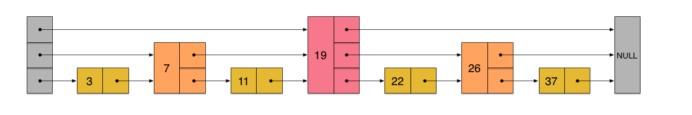

## zset原理

有序集合对象的编码可以是`ziplist`或者`skiplist`。同时满足以下条件时使用ziplist编码：

- 元素数量小于128个
- 所有member的长度都小于64字节

以上两个条件的上限值可通过zset-max-ziplist-entries和zset-max-ziplist-value来修改。

`ziplist`编码的有序集合使用紧挨在一起的压缩列表节点来保存，第一个节点保存member，第二个保存score。ziplist内的集合元素按score从小到大排序，score较小的排在表头位置。

`skiplist`编码的有序集合底层是一个命名为`zset`的结构体，而一个zset结构同时包含一个字典和一个跳跃表。跳跃表按score从小到大保存所有集合元素。而字典则保存着从member到score的映射，这样就可以用O(1)的复杂度来查找member对应的score值。虽然同时使用两种结构，但它们会通过指针来共享相同元素的member和score，因此不会浪费额外的内存。

### skiplist跳表

跳表(skip List)是一种随机化的数据结构，基于并联的链表，实现简单，插入、删除、查找的复杂度均为O(logN)。简单说来跳表也是链表的一种，只不过它在链表的基础上增加了跳跃功能，正是这个跳跃的功能，使得在查找元素时，跳表能够提供O(logN)的时间复杂度。

#### 推导

来看一个有序链表，如下图（最左侧的灰色节点表示一个空的头结点）

在这样一个链表中，如果我们要查找某个数据，那么需要从头开始逐个进行比较，直到找到包含数据的那个节点，或者找到第一个比给定数据大的节点为止（没找到）。也就是说，时间复杂度为O(n)。

假如我们每相邻两个节点增加一个指针，让指针指向下下个节点，如下图：

这样所有新增加的指针连成了一个新的链表，但它包含的节点个数只有原来的一半（上图中是7, 19, 26）。现在当我们想查找数据的时候，可以先沿着这个新链表进行查找。当碰到比待查数据大的节点时，再回到原来的链表中进行查找。比如，我们想查找23，查找的路径是沿着下图中标红的指针所指向的方向进行的：

在这个查找过程中，由于新增加的指针，我们不再需要与链表中每个节点逐个进行比较了。需要比较的节点数大概只有原来的一半。

利用同样的方式，我们可以在上层新产生的链表上，继续为每相邻的两个节点增加一个指针，从而产生第三层链表。如下图：

在这个新的三层链表结构上，如果我们还是查找23，那么**沿着最上层链表**首先要比较的是19，发现23比19大，接下来我们就知道只需要到19的后面去继续查找，从而一下子跳过了19前面的所有节点。可以想象，当链表足够长的时候，这种多层链表的查找方式能让我们跳过很多下层节点，大大加快查找的速度。

`skiplist`正是受这种多层链表的想法的启发而设计出来的。实际上，按照上面生成链表的方式，上面每一层链表的节点个数，是下面一层的节点个数的一半，这样查找过程就非常类似于一个二分查找，使得查找的时间复杂度可以降低到O(log n)。但是，这种方法在插入数据的时候有很大的问题。新插入一个节点之后，就会打乱上下相邻两层链表上节点个数严格的2:1的对应关系。如果要维持这种对应关系，就必须把新插入的节点后面的所有节点（也包括新插入的节点）重新进行调整，这会让时间复杂度重新蜕化成O(n)。删除数据也有同样的问题。

skiplist为了避免这一问题，它不要求上下相邻两层链表之间的节点个数有严格的对应关系，而是为每个节点随机出一个层数(level)。比如，一个节点随机出的层数是3，那么就把它链入到第1层到第3层这三层链表中。为了表达清楚，下图展示了如何通过一步步的插入操作从而形成一个skiplist的过程：

从上面skiplist的创建和插入过程可以看出，**每一个节点的层数（level）是随机出来的，而且新插入一个节点不会影响其它节点的层数**。因此，插入操作只需要修改插入节点前后的指针，而不需要对很多节点都进行调整。这就降低了插入操作的复杂度。**实际上，这是skiplist的一个很重要的特性，这让它在插入性能上明显优于平衡树的方案**。

skiplist，指的就是除了最下面第1层链表之外，它会产生若干层稀疏的链表，这些链表里面的指针故意跳过了一些节点（而且越高层的链表跳过的节点越多）。这就使得我们在查找数据的时候能够先在高层的链表中进行查找，然后逐层降低，最终降到第1层链表来精确地确定数据位置。在这个过程中，我们跳过了一些节点，从而也就加快了查找速度。

#### 与平衡树的比较

**在做范围查找的时候，平衡树比skiplist操作要复杂**。在平衡树上，**我们找到指定范围的小值之后，还需要以中序遍历的顺序继续寻找其它不超过大值的节点**。如果不对平衡树进行一定的改造，这里的中序遍历并不容易实现。而在skiplist上进行范围查找就非常简单，只需要在找到小值之后，对第1层链表进行若干步的遍历就可以实现。

平衡树的插入和删除操作可能引发子树的调整，逻辑复杂，**而skiplist的插入和删除只需要修改相邻节点的指针，操作简单又快速**。

从内存占用上来说，skiplist比平衡树更灵活一些。一般来说，平衡树每个节点包含2个指针（分别指向左右子树），而skiplist每个节点包含的指针数目平均为1/(1-p)，具体取决于参数p的大小。如果像Redis里的实现一样，取p=1/4，那么平均每个节点包含1.33个指针，比平衡树更有优势。

查找单个key，skiplist和平衡树的时间复杂度都为O(log n)，大体相当；而哈希表在保持较低的哈希值冲突概率的前提下，查找时间复杂度接近O(1)，性能更高一些。所以我们平常使用的各种Map或dictionary结构，大都是基于哈希表实现的。