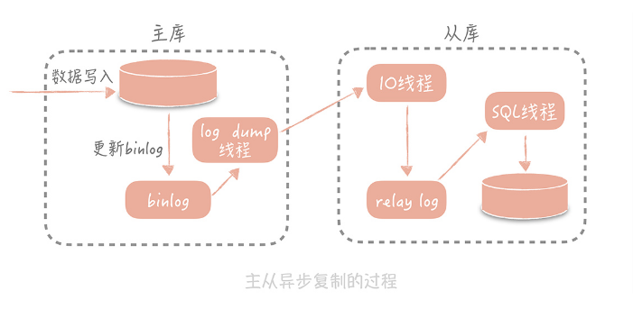
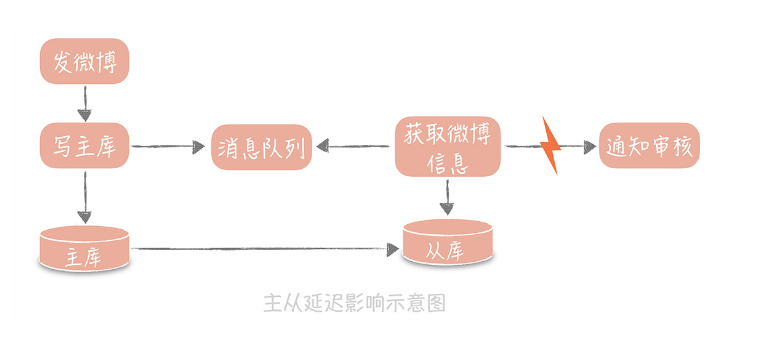

## 主从复制

其实，大部分系统的访问模型是读多写少，读写请求量的差距可能达到几个数量级。

一般来说在主从读写分离机制中，我们将一个数据库的数据拷贝为一份或者多份，并且写入到其它的数据库服务器中，原始的数据库我们称为主库，主要负责数据的写入，拷贝的目标数据库称为从库，主要负责支持数据查询。可以看到，主从读写分离有两个技术上的关键点：

1. 一个是数据的拷贝，我们称为主从复制；
2. 在主从分离的情况下，我们如何屏蔽主从分离带来的访问数据库方式的变化，让开发同学像是在使用单一数据库一样。

MySQL 的主从复制是**依赖于 binlog **的，也就是记录 MySQL 上的所有变化并以二进制形式保存在磁盘上二进制日志文件。主从复制就是将 binlog 中的数据从主库传输到从库上，一般这个过程是异步的，即主库上的操作不会等待 binlog 同步的完成。

**主从复制的过程是这样的：**首先从库在连接到主节点时会创建一个 IO 线程，用以请求主库更新的 binlog，并且把接收到的 binlog 信息写入一个叫做 relay log 的日志文件中，而主库也会创建一个 log dump 线程来发送 binlog 给从库；同时，从库还会创建一个 SQL 线程读取 relay log 中的内容，并且在从库中做回放，最终实现主从的一致性。这是一种比较常见的主从复制方式。

在这个方案中，使用独立的 log dump 线程是一种异步的方式，可以避免对主库的主体更新流程产生影响，而从库在接收到信息后并不是写入从库的存储中，是写入一个 relay log，是避免写入从库实际存储会比较耗时，最终造成从库和主库延迟变长。

你会发现，基于性能的考虑，主库的写入流程并没有等待主从同步完成就会返回结果，那么在极端的情况下，比如说主库上 binlog 还没有来得及刷新到磁盘上就出现了磁盘损坏或者机器掉电，就会导致 binlog 的丢失，最终造成主从数据的不一致。**不过，这种情况出现的概率很低，对于互联网的项目来说是可以容忍的。**

做了主从复制之后，我们就可以在写入时只写主库，在读数据时只读从库，这样即使写请求会锁表或者锁记录，也不会影响到读请求的执行。同时呢，在读流量比较大的情况下，我们可以部署多个从库共同承担读流量，这就是所说的“一主多从”部署方式

**那么你可能会说，是不是我无限制地增加从库的数量就可以抵抗大量的并发呢？**实际上并不是的。因为随着从库数量增加，从库连接上来的 IO 线程比较多，主库也需要创建同样多的 log dump 线程来处理复制的请求，对于主库资源消耗比较高，同时受限于主库的网络带宽，所以在实际使用中，**一般一个主库最多挂 3～5 个从库**。

**当然，主从复制也有一些缺陷，**除了带来了部署上的复杂度，还有就是会带来一定的主从同步的延迟，这种延迟有时候会对业务产生一定的影响，我举个例子你就明白了。

在发微博的过程中会有些同步的操作，像是更新数据库的操作，也有一些异步的操作，比如说将微博的信息同步给审核系统，所以我们在更新完主库之后，会将微博的 ID 写入消息队列，再由队列处理机依据 ID 在从库中获取微博信息再发送给审核系统。此时如果主从数据库存在延迟，会导致在从库中获取不到微博信息，整个流程会出现异常。

**zwlj：也就是主库的更新来不及给到从库**

纯粹以上面的例子来说，有三种解决方案：

**第一种方案是数据的冗余。**你可以在发送消息队列时不仅仅发送微博 ID，而是发送队列处理机需要的所有微博信息，借此避免从数据库中重新查询数据。

**第二种方案是使用缓存。**我可以在同步写数据库的同时，也把微博的数据写入到 Memcached 缓存里面，这样队列处理机在获取微博信息的时候会优先查询缓存，这样也可以保证数据的一致性。

**最后一种方案是查询主库。**我可以在队列处理机中不查询从库而改为查询主库。不过，这种方式使用起来要慎重，要明确查询的量级不会很大，是在主库的可承受范围之内，否则会对主库造成比较大的压力。