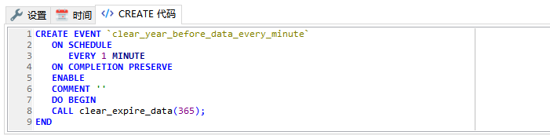

## mysql事件

事件（event）是MySQL在相应的时刻调用的过程式数据库对象。一个事件可调用一次，也可周期性的启动，它由一个特定的线程来管理的，也就是所谓的“事件调度器”。

 事件和触发器类似，都是在某些事情发生的时候启动。当数据库上启动一条语句的时候，触发器就启动了，而事件是根据**调度事件**来启动的。由于他们彼此相似，所以事件也称为临时性触发器。

MySQL的事件调度器可以精确到每秒钟执行一个任务，而操作系统的计划任务（如：Linux下的CRON或Windows下的任务计划）只能精确到每分钟执行一次。


 一条create event语句创建一个事件。每个事件由两个主要部分组成，第一部分是事件调度（event schedule），表示事件何时启动以及按什么频率启动，第二部分是事件动作（event action ），这是事件启动时执行的代码，事件的动作包含一条SQL语句，它可能是一个简单地insert或者update语句，也可以使一个存储过程或者benin...end语句块，这两种情况允许我们执行多条SQL。

### 查看事件调度器开关

MySQL事件调度器event_scheduler负责调用事件，它默认是关闭的。这个调度器不断地监视一个事件是否要调用， 要创建事件，必须打开调度器。


```sql
mysql> show variables like '%event_scheduler%';
+-----------------+-------+
| Variable_name   | Value |
+-----------------+-------+
| event_scheduler | OFF   |
+-----------------+-------+
```


### 查看调度器线程

```sql
mysql> show processlist;
+----+-----------------+-----------+------+---------+------+------------------------+------------------+
| Id | User            | Host      | db   | Command | Time | State                  | Info             |
+----+-----------------+-----------+------+---------+------+------------------------+------------------+
|  2 | root            | localhost | NULL | Query   |    0 | NULL                   | show processlist |
|  3 | event_scheduler | localhost | NULL | Daemon  |    6 | Waiting on empty queue | NULL             |
+----+-----------------+-----------+------+---------+------+------------------------+------------------+
```


### 查看现有事件

查看当前库事件

```
mysql> show events;
```

查看所有事件

```
mysql> select * from mysql.event;
```

### 创建事件

创建事件这块也可以利用到工具来生成了




复制粘贴到客户端的时候也要注意分隔符的设置

当然如果一行能写完也没问题：

```
CREATE EVENT `clear_year_before_data_every_minute` ON SCHEDULE EVERY 1 MINUTE DO  CALL clear_expire_data(365);
```

do 后面直接就接存储过程来搞了