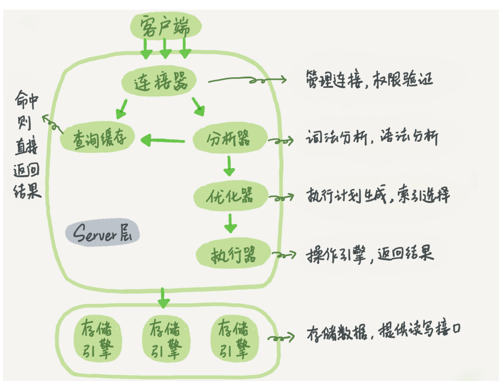

## mysql基础架构
记录一下mysql的基础架构概念。

### mysql基本架构

这个图其实在mysql优化原理笔记里已经有描述。可以参见mysql优化原理



如上图

执行 create table 建表的时候，如果不指定引擎类型，默认使用的就是InnoDB。不过，你也可以通过指定存储引擎的类型来选择别的引擎，比如在 create table语句中使用 engine=memory, 来指定使用内存引擎创建表。不同存储引擎的表数据存取方式不同，支持的功能也不同

#### 连接器
连接命令一般是这么写的：

```
mysql -h$ip -P$port -u$user -p
```

如果用户名或密码不对，你就会收到一个"Access denied for user"的错误，然后客户端程序结束执行。

如果用户名密码认证通过，连接器会到权限表里面查出你拥有的权限。之后，这个连接里面的权限判断逻辑，都将依赖于此时读到的权限。

连接完成后，如果你没有后续的动作，这个连接就处于空闲状态，你可以在 show processlist 命令中看到它

```
show processlist
```

客户端如果太长时间没动静，连接器就会自动将它断开。这个时间是由参数 **wait_timeout控制**的，默认值是 8 小时。如果在连接被断开之后，客户端再次发送请求的话，就会收到一个错误提醒： **Lost connection to MySQL server during query**。这时候如果你要继续，就需要重连，然后再执行请求了。

由于建立连接的过程比较复杂，所以mysql推荐尽量使用长连接。这也会导致内存上涨的特别快，所以可以：

1. 定期断开长连接
2. 可以在每次执行一个比较大的操作后，通过执行mysql_reset_connection 来重新初始化连接资源。这个过程不需要重连和重新做权限验证，但是会将连接恢复到刚刚创建完时的状态

#### 查询缓存
MySQL 拿到一个查询请求后，会先到查询缓存看看，之前是不是执行过这条语句。之前执行过的语句及其结果可能会以key-value 对的形式，被直接缓存在内存中。key 是查询的语句，value 是查询的结果。如果你的查询能够直接在这个缓存中找到 key，那么这个value 就会被直接返回给客户端。

查询缓存往往弊大于利

**MySQL 8.0 版本直接将查询缓存的整块功能删掉了，也就是说 8.0 开始彻底没有这个功能了。**

#### 执行器
开始执行的时候，要先判断一下你对这个表 T 有没有执行查询的权限，如果没有，就会返回没有权限的错误

如果有权限，就打开表继续执行。打开表的时候，执行器就会根据表的引擎定义，去使用这个引擎提供的接口。

对于有索引的表，第一次调用的是“取满足条件的第一行”这个接口，之后循环取“满足条件的下一行”这个接口，这些接口都是引擎中已经定义好的。

### redo log和binlog
对于更新update类型的sql语句，涉及redo log（重做日志）【InnoDB特有】和 binlog（归档日志）

在更新语句执行的时候，Mysql使用**WAL技术**，WAL 的全称是 **Write-Ahead Logging**。它的关键点就是**先写日志，再写磁盘**，也就是先写粉板，等不忙的时候再写账本。

具体来说，当有一条记录需要更新的时候，InnoDB 引擎就会先把记录写到 redo log里面，并更新内存，这个时候更新就算完成了。同时，InnoDB 引擎会在**适当的时候，将这个操作记录更新到磁盘里面**，而这个更新往往是在系统比较空闲的时候做

InnoDB 的 redo log 是固定大小的，比如可以配置为一组 4 个文件，每个文件的大小是 1GB，那么这块“粉板”总共就可以记录 4GB 的操作。从头开始写，写到末尾就又回到开头循环写，如下面这个图所示。


write pos 是当前记录的位置，一边写一边后移，写到第 3 号文件末尾后就回到 0 号文件开头。checkpoint 是当前要擦除的位置，也是往后推移并且循环的，擦除记录前要把记录更新到数据文件。

write pos 和 checkpoint 之间的是“粉板(也就是redo log)”上还空着的部分，可以用来记录新的操作。如果 write pos 追上 checkpoint，表示“粉板”满了，这时候不能再执行新的更新，得停下来先擦掉一些记录，把 checkpoint 推进一下。

有了 redo log，InnoDB 就可以保证即使数据库发生异常重启，之前提交的记录都不会丢失，这个能力称为**crash-safe**。

#### binlog
前面我们讲过，MySQL 整体架构来看，其实就有两块：一块是 Server 层，它主要做的是 MySQL 功能层面的事情；还有一块是引擎层，负责存储相关的具体事宜。上面我们聊到的粉板 **redo log 是 InnoDB 引擎特有的日志**，而 Server 层也有自己的日志，称为 binlog（归档日志）。

最开始 MySQL 里并没有 InnoDB 引擎。MySQL 自带的引擎是 MyISAM，但是 **MyISAM 没有 crash-safe 的能力**，binlog 日志只能用于归档。而 InnoDB 是另一个公司以插件形式引入 MySQL 的，既然只依靠 binlog 是没有 crash-safe 能力的，所以 InnoDB 使用另外一套日志系统——也就是 redo log 来实现 crash-safe 能力。

这两种日志有以下三点不同：

 - redo log 是 InnoDB 引擎特有的；binlog 是 MySQL 的 Server 层实现的，所有引擎都可以使用。
 - redo log 是物理日志，记录的是“在某个数据页上做了什么修改”；binlog 是逻辑日志，记录的是这个语句的原始逻辑，比如“给 ID=2 这一行的 c 字段加 1 ”。
 - redo log 是循环写的，空间固定会用完；binlog 是可以追加写入的。“追加写”是指 binlog 文件写到一定大小后会切换到下一个，并不会覆盖以前的日志。

#### update语句执行流程
假定用SQL执行update=2的条目，下面是执行流程图，深色框代表再执行器中执行：


，最后三步看上去有点“绕”，将 redo log 的写入拆成了两个步骤：prepare 和 commit，这就是"两阶段提交"。

#### 两阶段提交
分布式系统知识点笔记里其实也提到了两阶段，这里再来探讨一下。

首先从一个问题开始：**怎样让数据库恢复到半个月内任意一秒的状态？**

前面我们说过了，binlog 会记录所有的逻辑操作，并且是采用“追加写”的形式。如果你的 DBA 承诺说半个月内可以恢复，那么备份系统中一定会保存最近半个月的所有 binlog，同时系统会定期做整库备份。这里的“定期”取决于系统的重要性，可以是一天一备，也可以是一周一备。

当需要恢复到指定的某一秒时，比如某天下午两点发现中午十二点有一次误删表，需要找回数据，那你可以这么做：

 - 首先，找到最近的一次全量备份，如果你运气好，可能就是昨天晚上的一个备份，从这个备份恢复到临时库；
 - 然后，从备份的时间点开始，将备份的 binlog 依次取出来，重放到中午误删表之前的那个时刻。

这里可以用反证法来说明，为什么需要两阶段提交。

由于 redo log 和 binlog 是两个独立的逻辑，如果不用两阶段提交，要么就是先写完 redo log 再写 binlog，或者采用反过来的顺序。我们看看这两种方式会有什么问题。

仍然用前面的 update 语句来做例子。假设当前 ID=2 的行，字段 c 的值是 0，再假设执行 update 语句过程中在写完第一个日志后，第二个日志还没有写完期间发生了 crash

1. 先写 redo log 后写 binlog。假设在 redo log 写完，binlog 还没有写完的时候，MySQL 进程异常重启。由于我们前面说过的，redo log 写完之后，系统即使崩溃，仍然能够把数据恢复回来，所以恢复后这一行 c 的值是 1。
但是由于 binlog 没写完就 crash 了，这时候 binlog 里面就没有记录这个语句。因此，之后备份日志的时候，存起来的 binlog 里面就没有这条语句。然后你会发现，如果需要用这个 binlog 来恢复临时库的话，由于这个语句的 binlog 丢失，这个临时库就会少了这一次更新，恢复出来的这一行 c 的值就是 0，与原库的值不同。

2. 先写 binlog 后写 redo log。如果在 binlog 写完之后 crash，由于 redo log 还没写，崩溃恢复以后这个事务无效，所以这一行 c 的值是 0。但是 binlog 里面已经记录了“把 c 从 0 改成 1”这个日志。所以，在之后用 binlog 来恢复的时候就多了一个事务出来，恢复出来的这一行 c 的值就是 1，与原库的值不同。

#### redo log&bin log总结
redo log 用于保证 crash-safe 能力。innodb_flush_log_at_trx_commit 这个参数设置成 1 的时候，表示每次事务的 redo log 都直接持久化到磁盘。这个参数我建议你设置成 1，这样可以保证 MySQL 异常重启之后数据不丢失。

sync_binlog 这个参数设置成 1 的时候，表示每次事务的 binlog 都持久化到磁盘。这个参数也建议设置成 1，这样可以保证 MySQL 异常重启之后 binlog 不丢失。