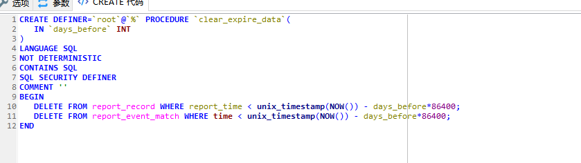

## 存储过程

我们常用的操作数据库语言SQL语句在执行的时候需要要先编译，然后执行，而存储过程（Stored Procedure）是一组为了完成特定功能的SQL语句集，经编译后存储在数据库中，用户通过指定存储过程的名字并给定参数（如果该存储过程带有参数）来调用执行它。


存储过程思想上很简单，就是数据库 SQL 语言层面的代码封装与重用。

### 创建

- 存储过程就是具有名字的一段代码，用来完成一个特定的功能。
- 创建的存储过程保存在数据库的数据字典中。

在交互式环境中，可以用声明语句结束符来开始：

```
DELIMITER $$
或
DELIMITER //
```

```
mysql> delimiter $$　　#将语句的结束符号从分号;临时改为两个$$(可以是自定义)
mysql> CREATE PROCEDURE delete_matches(IN p_playerno INTEGER)
    -> BEGIN
    -> 　　DELETE FROM MATCHES
    ->    WHERE playerno = p_playerno;
    -> END$$
Query OK, 0 rows affected (0.01 sec)
 
mysql> delimiter;　　#将语句的结束符号恢复为分号
```

**分隔符的改变很重要，因为存储过程内部很可能会有分号，导致执行失败**


用生成工具搞也是可以的




用工具的话，出参入参的设置都还比较方便


但是生成代码以后，粘贴到mysql上时，务必记得**改分隔符**

### 查看

查看现有的存储过程

```
select name from mysql.proc where db = 'your_db_name' and type= 'PROCEDURE';
```

或者

```
show procedure status;
```

查看存储过程或函数的创建代码

```
show create procedure proc_name;
show create function func_name;
```

