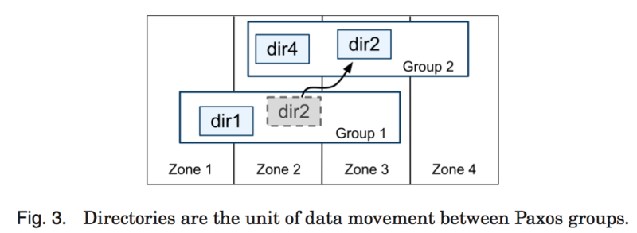
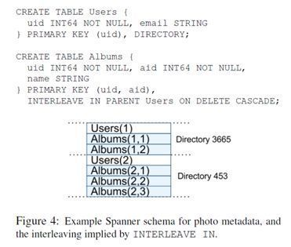
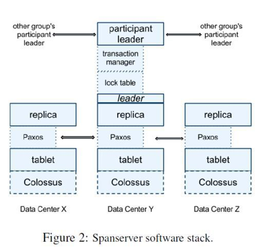

## Spanner&F1

F1是Google开发的分布式关系型数据库，主要服务于Google的广告系统。Google的广告系统以前使用MySQL，广告系统的用户经常需要使用复杂的query和join操作，这就需要设计shard规则时格外注意，尽量将相关数据shard到同一台MySQL上。扩容时对数据reshard时也需要尽量保证这一点，广告系统扩容比较艰难。在可用性方面老的广告系统做的也不够，尤其是整个数据中心挂掉的情况，部分服务将不可用或者丢数据。对于广告系统来说，短暂的宕机服务不可用将带来重大的损失。为了解决扩容/高可用的问题，Google研发了F1，一个基于Spanner的跨数据中心的分布式关系型数据库，支持ACID，支持全局索引。2012年初已上线。

### Spanner的数据模型

在一系列键值映射的上层，Spanner 实现支持一个被称为“目录”的桶抽象，也就是包含公共前缀的连续键的集合。

其实也是我们之前用到的bucket，比如/usr/dir1 这就是一个目录型key值。Paxos【不太记得paxos概念的可以复习paxos笔记，一个group就是一个冗余备份组】管理数据分片的时候，都是按这个逻辑目录结构来进行管理的。好比上图的Paxos Group1管理着dir1和dir2的数据。一个paxos group可能是横跨多个数据中心的。一个dir可以在多个paxos group之间移动，移动是因为：

- 一个paxos group的负载太大，需要切分

- 将数据移动到access更近的地方
- 将经常同时访问的directory放到一个paxos group里面

### 表结构

每个表都和关系数据库表类似，具备行、列和版本值。上图则是对应的语句和建表目录，和SQL大致非常像。

Spanner中的**表具有层次结构**，这有些类似于传统关系数据库中一对多关系。客户端应用会使用 INTERLEAVE IN 语句在数据库模式中声明这个层次结构。这个层次结构上面的表，是一个目录表。目录表中的每行都具有键 K，和子孙表中的所有以 K 开始(以字典顺序排序)的行一起，构成了一个目录。这样做是想把想关联的表放在同样的位置，利用数据的局部性提高性能，毕竟单个Paxos组内的操作比跨paxos组要来的高效。

### Spanserver

从下往上看。每个数据中心会运行一套Colossus (GFS II) 。每个机器有100-1000个tablet。Tablet概念上将相当于数据库一张表里的一些行，物理上是数据文件。打个比方，一张1000行的表，有10个tablet，第1-100行是一个tablet，第101-200是一个tablet。【每个tablet相当于又有很多paxos 状态机节点做备份】但和BigTable不同的是BigTable里面的tablet存储的是Key-Value都是string，Spanner存储的Key多了一个时间戳：

(Key: string, timestamp: int64) ->string。

每个Tablet上会有一个Paxos状态机。Paxos是一个分布式一致性协议。Table的元数据和log都存储在上面。Paxos会选出一个replica做leader，这个leader的寿命默认是10s,10s后重选【这就是所谓的**长时间的领导者租约**】。Leader就相当于复制数据的master，其他replica的数据都是从他那里复制的。读请求可以走任意的replica，但是写请求只有去leader。这些replica统称为一个paxos group。

### 外部一致性控制

Spanner 提供了读和写操作的外部一致性，以及在一个时间戳下面的跨越数据库的全球一致性的读操作。。这些特性使得 Spanner 可以支持一致的备份、一致的 MapReduce 执行和原子模式变更，所有都是在全球范围内实现，即使存在正在处理中的事务也可以。

外部一致性保证了什么，如果一个事务 T2 在事务 T1 提交以后开始执行， 那么，事务 T2 的时间戳一定比事务 T1 的时间戳大。

之所以可以支持这些特性，是因为 Spanner 可以为事务分配全球范围内有意义的提交时间戳，即使事务可能是分布式的。这些时间戳反映了事务序列化的顺序。除此以外，这些序列化的顺序满足了外部一致性的要求:如果一个事务 T1 在另一个事务 T2 开始之前就已经提交了，那么，T1 的时间戳就要比 T2 的时间戳小。Spanner 是第一个可以在全球范围内提供这种保证的系统。

实现这种特性的关键技术就是一个新的 TrueTime API 及其实现，主要是借助于现代时钟参考值(比如**GPS和原子钟**）这是谷歌的黑科技

### 部署

Google将广告系统使用的F1和Spanner集群部署在美国的5个数据中心，东海岸两个，西海岸两个，中间一个。相当于每份数据5个副本，其中东海岸一个数据中心被作为leader数据中心。在spanner的paxos实现中，5个副本中有一个leader副本，所有的对这个副本的读写事务都经过它，这个leader副本一般就存在leader数据中心中。由于paxos协议的运行只需要majority响应即可，那么一次paxos操作的延时基本取决于东海岸的leader数据中心和东海岸另外一个数据中心，和中间那个数据中心之间的延时。从这里也可以看出，对于写比较多的F1 Client来说，F1 Client和F1 Server都部署在leader数据中心性能最好。在这个配置下，F1用户的commit延时大概在50ms到150ms之间。读延时大约5～10ms。