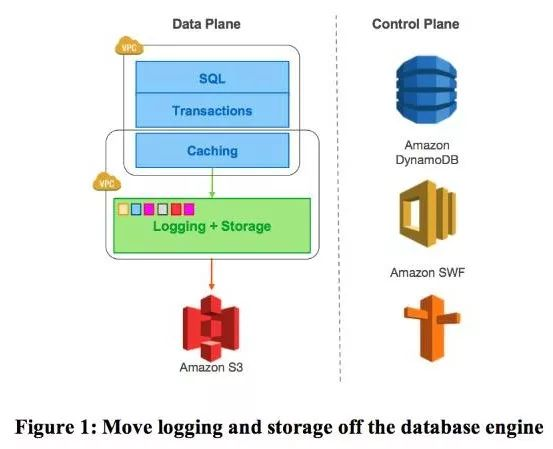
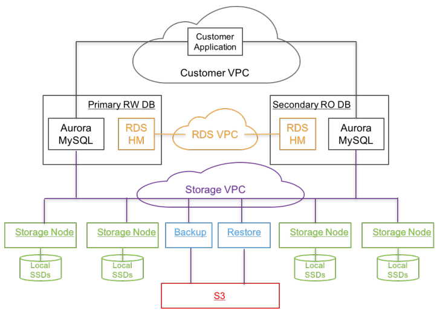
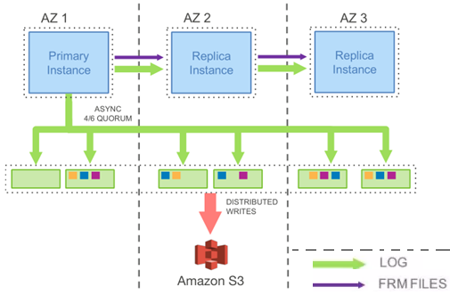
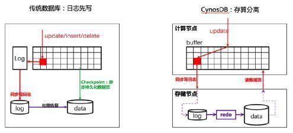
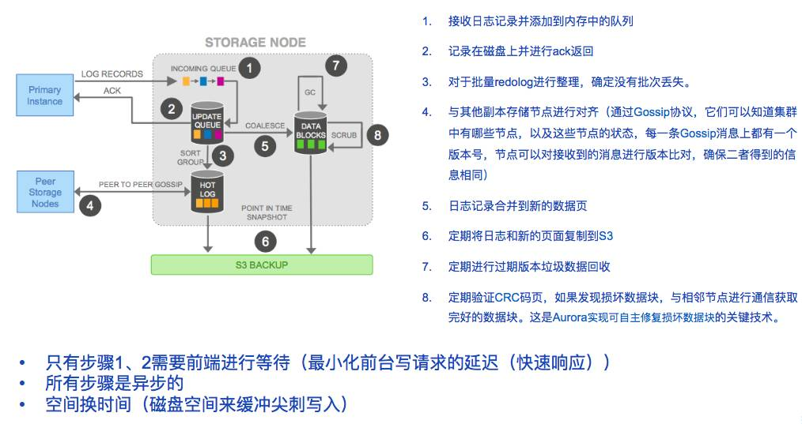

## aurora架构设计

Aurora 是依托于 AWS 云高度融合 MySQL 定位于 OLTP 的企业级关系数据库。Aurora 的设计者认为，当前海量数据处理的主要瓶颈已经从计算、存储 IO 转移到了网络 IO ，为了解决这个问题，Aurora 通过**将重做日志推到多租户的大规模存储服务当中**（Aurora 的设计哲学是 **log is database**）（2），从而不仅大幅度的减少了网络 IO，而且可以数据的多副本进行快速故障恢复，以及容错损失，建立起一套自愈存储（Aurora 将恢复子系统委托给底层可靠的存储系统，依赖这个来保障系统服务层级（ServiceLevel Agreement, SLA））。

Aurora 使用了一种新的体系结构（见下图）它将 logging 和存储从数据库引擎中剥离到分布式的云存储环境中

如上图，一个关键点就是把数据库引擎中的log下放，放到分布式存储环境中去。

这样 Aurora 的体系结构比传统方法有三个显著的优势。

1. 通过将存储构建为跨多个数据中心的独立容错和自愈的服务，使存储层中数据不受性能差异和单节点瞬态或永久故障的影响。
2. 只写重做日志记录存储，我们可以减少一个数量级的网络 IOPS 。一旦消除了这个瓶颈，就可以积极地优化许多其它争点，在 MySQL 基础代码基础上获得显著的吞吐量改进。
3. Aurora 用存储层持续异步复制操作，替代数据库引擎中最复杂、最关键、最昂贵的备份和重做恢复功能（backup and redo recovery），这是不需进行保存检查点（checkpoint）、不对数据库进程处理进行干扰的低成本的备份恢复机制。

上图是数据库的部署，数据库的部署，是**一主多从的集群架构**，图的Primary RW DB是写数据的节点，只能有一个（这点说明Aurora还是传统的数据库架构，不是真正的对等分布式架构

### 段存储

Aurora 下存储最小单位叫 Segment，每个 Segment 大小为 10GB，Protection Group（PG）是一个逻辑单位，代表的是 6 个Segment，Segment 是维护与调度的最小单元，一个Segment 故障时，同 AZ 的万兆网络可以在 10 秒内就完成修复（这也是选择 10G 的原因），存储节点 Segement 这种设计对于日常运维比较重要，例如在热点问题上（Heat Management)，我们可以在一个热磁盘或节点上标记一个片段是坏的，冲裁系统（quorum）可以通过快速迁移到另一个较冷的节点，操作系统和安全修补程序甚至存储机群升级都是该节点的一个简短的不可用事件，一次执行一次，确保各 PG 的成员不同时被修补。实现了在存储服务中使用敏捷和快速部署。

### Log is the database

#### 日志分布式存储原理

传统的数据通常采用WAL（日志先写）来实现事务和故障恢复。这样做最直观的好处是

1. 数据库down机后可以根据持久化的WAL来恢复数据页。
2. 先写日志，而不是直接写数据，可以在数据库写操作的关键路径上将随机IO（写数据页）变成顺序IO（写日志），便于提升数据库性能。

如上图，

图三（左）极度抽象地描述了传统数据库写数据的过程：每次修改数据的时候，必须保证日志先持久化之后才可以对数据页进行持久化。触发日志持久化的时机通常有：事务提交时，当日志缓存空间不够用时，当数据页缓存空间不够用时。

从理论上来说，数据库只需要持久化日志就可以了。因为只要拥有从数据库初始化时刻到当前的所有日志，数据库就能恢复出当前任何一个数据页的内容。也就是说，数据库只需要写日志，而不需要写数据页，就能保证数据的完整性和正确性。但是，实际上数据库实现者不会这么做，因为1）从头到尾遍历日志恢复出每个数据页将是非常耗时的；2）全量日志比数据本身规模要大得多，需要更多的磁盘空间去存储。

那么，如果持久化日志的存储设备不仅仅具有存储能力，还拥有计算能力，能够自行将日志重放到最新的页的话，将会怎么样？是的，如果这样的话，数据库引擎就没有必要将数据页传递给存储了，因为存储可以自行计算出新页并持久化。

存储节点除了持久化日志以外，还应具备通过apply日志生成最新数据页面的能力。如此一来，计算节点只需要写日志到存储节点即可，而不需要再将数据页传递给存储节点。

#### 设计理念

Aurora提倡“**the log is the database**”，这是其设计的核心。正如刚才所说，把log下放到分布式存储架构中去了。不需要把数据页传输给其他节点了，一切以log会核心进行更新就可以了。

除此之外，由于aurora设计时认为，网络是瓶颈，所以就只保留了redo log的网络传输。而且把redo log下沉到分布式存储系统中，方便到时候恢复。如果不做这个改动，根据上面的那个图，主实例需要往从实例传输日志数据，那除了redolog之外还有一堆什么binlog那些也要传，就相当于放大了写。

为了解决这个写入放大的问题，Aurora 提出的思路是，唯一的写入只包括通过网络写入 Redo log（不在有后台的写入、checkpoint、脏数据），直接将 Redo log 下推到存储节点，每个存储节点根据 Redo log 来构成本地（Local Segment）存储状态，多个存储可靠性通过副本数来保障。每个存储节点也可以将Segment 定时同步到 S3 上增加可靠性。

闪崩处理，在传统数据库中，闪崩后数据库需要从最近的一次 checkpoint 开始应用所有重做日志进行恢复，在 Aurora 中，持久化重做日志会多节点连续的、异步同步，任何一个读请求都有可触发重做日志对旧的页进行应用（重做日志随时应用），所以正常情况下，数据启动后基本上不用做什么恢复操作。

**相当于放弃了刷回数据，而是时时刻刻都在更新数据页**

在 Aurora 的设计思路中，存储服务的核心设计原则是最小化前台写请求的延迟（快速响应），将大多数存储处理移到后台，同时他也有机制去避免后台存储高峰导致前台延迟

CRC码是一种校验码，如果发生损坏就替换。