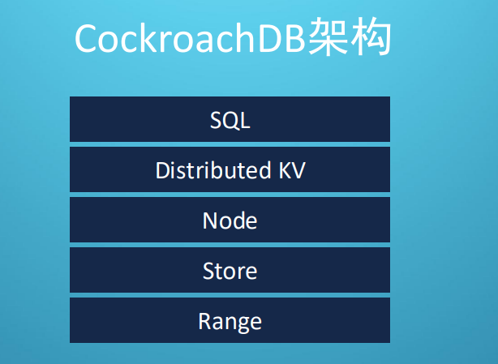
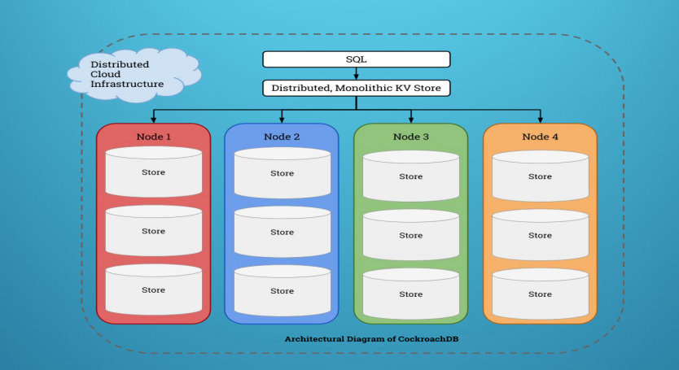
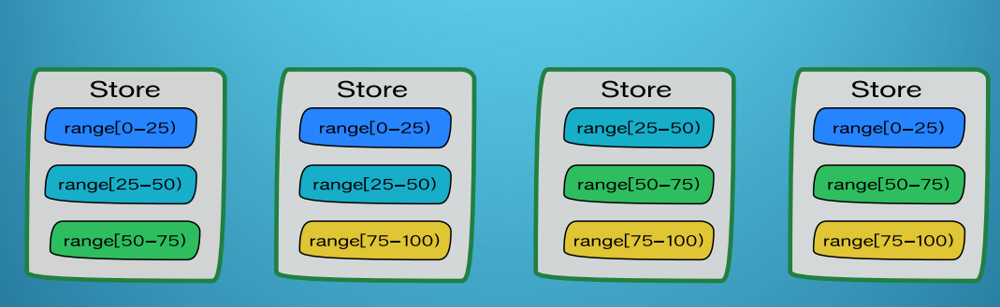
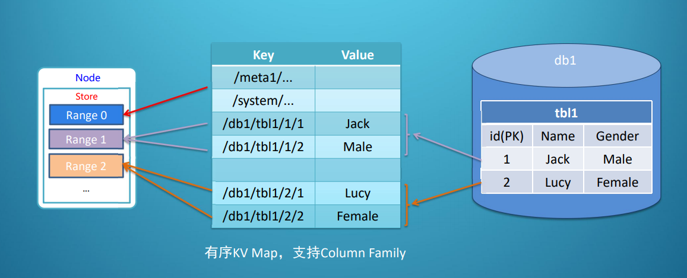
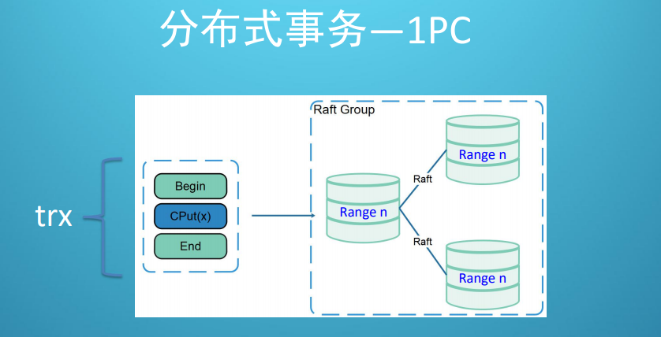

## CockroachDB数据库设计

作为Spanner的开源实现，CockroachDB具有支持标准SQL接口，线性扩展，强一致，高可用等重要特性。

cockroach DB使用PostgreSQL协议，支持标准SQL接口，兼容关系型数据库SQL生态。

上图就是CockroachDB的设计架构。

Cockroach DB采用类似Spanner的分层架构，**在分布式KV上提供了SQL引擎**，分布式KV之下引入了自身独有三个概念Node、Store、Range。

Node是Cockroach DB的进程实例，一台物理服务器启动一个Node即可，一个物理存储介质（例如一块硬盘）一般配置一个Store，一个Node中有多个Store。

如上图，SQL建立在KV存储层之上。然后Node代表的也是一个进程，Store对应着存储介质。Store里还有range分片。

一个Range是一段键值区间 [K1, K2) 的数据分片，是CockroachDB存储管理的最小单位；一个Store中有多个Range；每个Range分片默认为64MB，默认存在3个副本，分布在不同的Node上；

上图就是CockroachDB的逻辑映射关系，右边是关系型数据库模型，中间是关系型数据库做了一层转换后的kv模型。也是一种类似于目录的结构，然后这些key值也会被划分到对应的range当中。

在每个键值range中同步复制数据时使用分布式一致性的协议。选择使用 [Raft 一致性算法](https://raftconsensus.github.io/)；所有的一致性状态都存储在 RocksDB 中。每一个range都由存储在本地KV存储引擎中的数据作支持（使用 [RocksDB](http://rocksdb.org/)，[LevelDB](https://github.com/google/leveldb)的一个变体）

CockRoachDB还做了一个优化：

当事务只牵涉到一个range的时候，直接就依靠Raft协议保证原子性了。