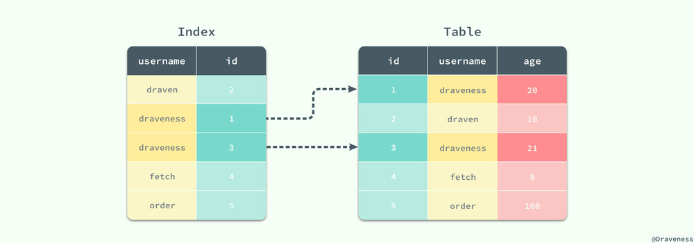
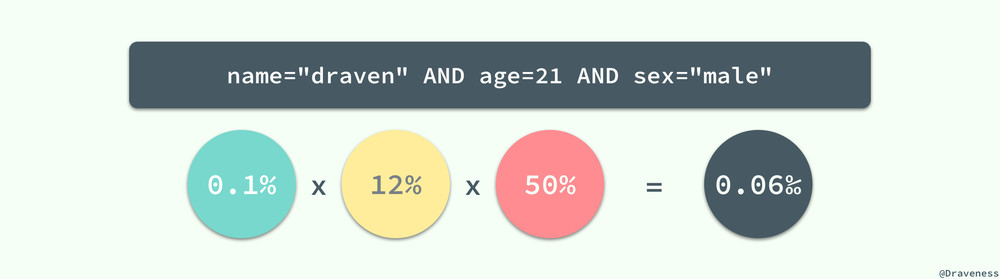

## 关系型数据库索引设计

在关系型数据库中设计索引其实并不是复杂的事情

### 磁盘IO

一个数据库必须保证其中存储的所有数据都是可以随时读写的，同时因为 MySQL 中所有的数据其实都是以文件的形式存储在磁盘上的，而从磁盘上**随机访问**对应的数据非常耗时，所以数据库程序和操作系统提供了缓冲池和内存以提高数据的访问速度


zwlj：其实就是磁盘导出寻址太慢，找到数据之后都会统一先集中到一个缓冲池里加快速度。


**除此之外，我们还需要知道数据库对数据的读取并不是以行为单位进行的，无论是读取一行还是多行，都会将该行或者多行所在的页全部加载进来，然后再读取对应的数据记录；也就是说，读取所耗费的时间与行数无关，只与页数有关。**


在 MySQL 中，页的大小一般为 16KB，不过也可能是 8KB、32KB 或者其他值，这跟 MySQL 的存储引擎对数据的存储方式有很大的关系，文中不会展开介绍，不过**索引或行记录是否在缓存池中极大的影响了访问索引或者数据的成本**。

### 随机读取

数据库等待一个页从磁盘读取到缓存池的所需要的成本巨大的，无论我们是想要读取一个页面上的多条数据还是一条数据，都需要消耗**约** 10ms 左右的时间


10ms 的时间在计算领域其实是一个非常巨大的成本，假设我们使用脚本向装了 SSD 的磁盘上顺序写入字节，那么在 10ms 内可以写入大概 3MB 左右的内容，但是数据库程序在 10ms 之内只能将一页的数据加载到数据库缓冲池中，从这里可以看出随机读取的代价是巨大的。


### 内存读取

如果在数据库的**缓存池**中没有找到对应的数据页，那么会去内存中寻找对应的页面：


当对应的页面存在于内存时，数据库程序就会使用内存中的页，这能够将数据的读取时间降低一个数量级，将 10ms 降低到 1ms；MySQL 在执行读操作时，会先从数据库的缓冲区中读取，如果不存在与缓冲区中就会尝试从内存中加载页面，如果前面的两个步骤都失败了，最后就只能执行随机 IO 从磁盘中获取对应的数据页。

### 顺序读取

从磁盘读取数据并不是都要付出很大的代价，当数据库管理程序一次性从磁盘中**顺序**读取大量的数据时，读取的速度会异常的快，大概在 40MB/s 左右。


如果一个页面的大小为 4KB，那么 1s 的时间就可以读取 10000 个页，读取一个页面所花费的平均时间就是 0.1ms，相比随机读取的 10ms 已经降低了两个数量级，甚至比内存中读取数据还要快。


数据页面的顺序读取有两个非常重要的优势：

1. 同时读取多个界面意味着总时间的消耗会大幅度减少，磁盘的吞吐量可以达到 40MB/s；
2. 数据库管理程序会对一些即将使用的界面进行预读，以减少查询请求的等待和响应时间；


### 过滤因子

在了解mysql的innodb引擎之后我们可以知道。索引查找的时候，我们都是要现根据索引的B+树找到对应行节点的id，再去主B+树再查一次。这里其实是有两次的查树行为



**宽索引(包含了查询中所有列的索引)**能够避免二次的随机 IO，而窄索引就需要在对索引进行顺序读取之后再根据主键 id 从主键索引中查找对应的数据

**如果使用的是窄索引那么对表的随机访问就不可避免，在这时如何让索引片变『薄』就是我们需要做的了**。

一个 SQL 查询扫描的索引片大小其实是由过滤因子决定的，也就是满足查询条件的记录行数所占的比例：


对于 users 表来说，sex=”male” 就不是一个好的过滤因子，它会选择整张表中一半的数据，所以**在一般情况下**我们最好不要使用 sex 列作为整个索引的第一列；而 name=”draven” 的使用就可以得到一个比较好的过滤因子了，它的使用能过滤整个数据表中 99.9% 的数据；当然我们也可以将这三个过滤进行组合，创建一个新的索引 (name, age, sex) 并同时使用这三列作为过滤条件



组合条件的过滤因子就可以达到十万分之 6 了，如果整张表中有 10w 行数据，也只需要在扫描薄索引片后进行 6 次随机读取，这种直接使用乘积来计算组合条件的过滤因子其实有一个比较重要的问题：列与列之间不应该有太强的相关性，如果不同的列之间有相关性，那么得到的结果就会比直接乘积得出的结果大一些，比如：所在的城市和邮政编码就有非常强的相关性，两者的过滤因子直接相乘其实与实际的过滤因子会有很大的偏差，不过这在多数情况下都不是太大的问题。

当我们评估一个索引是否合适时，需要考虑极端情况下查询语句的性能，比如 0% 或者 50% 等；最差的输入往往意味着最差的性能，在平均情况下表现良好的 SQL 语句在极端的输入下可能就完全无法正常工作，这也是在设计索引时需要注意的问题。

### 匹配列与过滤列

假设在 users 表中有 name、age 和 (name, sex, age) 三个辅助索引；当 WHERE 条件中存在类似 age = 21 或者 name = “draven” 这种**等值谓词**时，它们都会成为匹配列（Matching Column）用于选择索引树中的数据行，但是当我们使用以下查询时：

```sql
SELECT * FROM users
WHERE name = "draven" AND sex = "male" AND age > 20;
```

虽然我们有 (name, sex, age) 索引包含了上述查询条件中的全部列，但是在这里只有 name 和 sex 两列才是匹配列，MySQL 在执行上述查询时，会选择 name 和 sex 作为匹配列，扫描所有满足条件的数据行，然后将 age 当做过滤列（Filtering Column）：


过滤列虽然不能够减少索引片的大小，但是能够减少从表中随机读取数据的次数（第二次去读B树找数据），所以在索引中也扮演着非常重要的角色。


### 索引设计


#### 三星索引

三星索引是对于一个查询语句可能的最好索引，如果一个查询语句的索引是三星索引，那么它只需要进行**一次磁盘的随机读及一个窄索引片的顺序扫描**就可以得到全部的结果集；因此其查询的响应时间比普通的索引会少几个数量级；根据书中对三星索引的定义，我们可以理解为主键索引对于 `WHERE id = 1` 就是一个特殊的三星索引，我们只需要对主键索引树进行一次索引访问并且顺序读取一条数据记录查询就结束了。


为了满足三星索引中的三颗星，我们分别需要做以下几件事情：

1. 第一颗星需要取出所有等值谓词中的列，作为索引开头的最开始的列（任意顺序）；
2. 第二颗星需要将 ORDER BY 列加入索引中；
3. 第三颗星需要将查询语句剩余的列全部加入到索引中；

上面三步的意义如下：


1. 第一颗星不只是将等值谓词的列加入索引，它的作用是减少索引片的大小以减少需要扫描的数据行；
2. 第二颗星用于避免排序，减少磁盘 IO 和内存的使用；
3. 第三颗星用于避免每一个索引对应的数据行都需要进行一次随机 IO 从聚集索引中读取剩余的数据；


zwlj：**再解释下第二颗星，其实就是，如果根据索引取出来的数据已经是排序好了的，就不需要再在内存里排序一次来order by了。但是这个往往不能很好兼得**

看下面例子：

```sql
SELECT id, name, age FROM users
WHERE age BETWEEN 18 AND 21
  AND city = "Beijing"
ORDER BY name;
```

根据上面这个查询来设计索引，就不能同时兼得三颗星。

我们总可以通过增加索引中的列以获得第三颗星，但是如果我们想要获得第一颗星就需要最小化索引片的大小，这时索引的前缀必须为 (city, age)，这样一来，就算我们会根据city age获取到一批name无序的数据，然后再在内存里做一次排序来进行name的orderby。哪怕你索引设计成city age name，也是无用的，因为b树的结构就保证了你根据city age来查的时候，最后获取批次的数据中name是无序的。


但是你如果设计成(city name)就可以避免排序，但是这样就难免要去扫age了。

当一个 SQL 查询中**同时拥有范围谓词和 ORDER BY 时**，无论如何我们都是没有办法获得一个三星索引的，我们能够做的就是在这两者之间做出选择，是牺牲第一颗星还是第二颗星。

### 总结

总而言之，在设计单表的索引时，首先把查询中所有的**等值谓词全部取出**以任意顺序放在索引最前面，在这时，如果索引中同时存在范围索引和 ORDER BY 就需要权衡利弊了，希望最小化扫描的索引片厚度时，应该将**过滤因子最小的范围索引列**加入索引，如果希望避免排序就选择 **ORDER BY 中的全部列**，在这之后就只需要将查询中**剩余的全部列**加入索引了，通过这种固定的方法和逻辑就可以最快地获得一个查询语句的二星或者三星索引了。