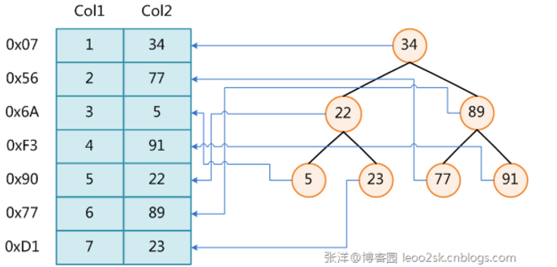
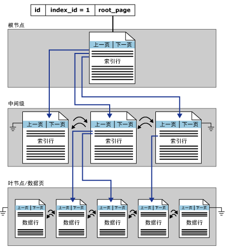
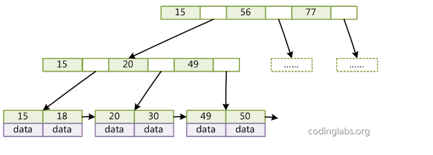

## 索引原理和B树索引
说白了，索引问题就是一个查找问题。数据库索引，是数据库管理系统中一个排序的数据结构，以协助快速查询、更新数据库表中数据。**索引的实现通常使用B树及其变种B+树。**

在数据之外，数据库系统还维护着**满足特定查找算法的数据结构**，这些数据结构以某种方式引用（指向）数据，这样就可以在这些数据结构上实现高级查找算法。这种数据结构，就是索引。

为表设置索引要付出代价的：一是增加了数据库的存储空间，二是在插入和修改数据时要花费较多的时间(因为索引也要随之变动)。

上图展示了一种可能的索引方式。左边是数据表，一共有两列七条记录，最左边的是数据记录的物理地址（注意逻辑上相邻的记录在磁盘上也并不是一定物理相邻的）。为了加快Col2的查找，可以维护一个右边所示的二叉查找树，每个节点分别包含索引键值和一个指向对应数据记录物理地址的指针，这样就可以运用二叉查找在O()的复杂度内获取到相应数据。

**zwlj:所以说所谓的建索引，就是对记录中的某一项构造成一个B+树，这样就可以用二分查找去大大提升检索效率。**

### 索引的优缺点
1. 通过创建唯一性索引，可以保证数据库表中每一行数据的唯一性。
2. 可以大大加快数据的检索速度，这也是创建索引的最主要的原因。
3. 可以加速表和表之间的连接，特别是在实现数据的参考完整性方面特别有意义。
4. 在使用分组和排序子句进行数据检索时，同样可以显著减少查询中分组和排序的时间。
第五，通过使用索引，可以在查询的过程中，使用优化隐藏器，提高系统的性能。

增加索引也有许多不利的方面

1. 创建索引和**维护索引要耗费时间**，这种时间随着数据量的增加而增加。
2. **索引需要占物理空间**，除了数据表占数据空间之外，每一个索引还要占一定的物理空间，如果要建立聚簇索引，那么需要的空间就会更大。
3. 当对表中的数据进行增加、删除和修改的时候，索引也要动态的维护，这样就降低了数据的维护速度。

### 建索引原则
一般来说，应该在这些列上创建索引：

 - 在**经常需要搜索的列**上，可以加快搜索的速度；
在作为主键的列上，强制该列的唯一性和组织表中数据的排列结构；

 - 在**经常用在连接的列**上，这些列主要是一些外键，可以**加快连接的速度**；

 - 在经常需要**根据范围进行搜索的列上创建索引**，因为索引已经排序，其指定的范围是连续的；

 - 在经常**需要排序的列上创建索引**，因为索引已经排序，这样查询可以利用索引的排序，加快排序查询时间；

 - 在经常**使用在WHERE子句中的列上面创建索引**，加快条件的判断速度。

### 索引的分类
根据数据库的功能，可以在数据库设计器中创建三种索引：唯一索引、主键索引和聚集索引。

#### 唯一索引
唯一索引是**不允许其中任何两行具有相同索引值的索引**。
当现有数据中存在重复的键值时，大多数数据库不允许将新创建的唯一索引与表一起保存。数据库还可能防止添加将在表中创建重复键值的新数据。例如，如果在employee表中职员的姓(lname)上创建了唯一索引，则任何两个员工都不能同姓。

#### 主键索引

数据库表经常有一列或列组合，其值唯一标识表中的每一行。该列称为表的主键。
在数据库关系图中为表定义主键将自动创建主键索引，**主键索引是唯一索引的特定类型**。该索引要求主键中的每个值都唯一。当在查询中使用主键索引时，它还允许对数据的快速访问。

#### 聚集索引

在聚集索引中，**表中行的物理顺序与键值的逻辑（索引）顺序相同。一个表只能包含一个聚集索引**。

zwlj:应该可以理解为用物理顺序来建索引。

如果某索引不是聚集索引，则表中行的物理顺序与键值的逻辑顺序不匹配。与非聚集索引相比，聚集索引通常提供更快的数据访问速度。

聚集索引对于任意给定的表而言是唯一的，一个表只能有一个聚集索引。不一定非要有聚集索引。聚集索引特殊的方面是：聚集索引的叶级是实际的数据-也就是说，数据重新排序，按照和聚集索引排序条件声明的相同物理顺序存储。这意味着，一旦到达索引的叶级，就到达了数据。而非聚集索引，到达了叶级只是找到了数据的引用。

### B树
一般来说，索引本身也很大，不可能全部存储在内存中，**因此索引往往以索引文件的形式存储的磁盘上**。这样的话，索引查找过程中就要产生磁盘I/O消耗，相对于内存存取，I/O存取的消耗要高几个数量级，所以评价一个数据结构作为索引的优劣最重要的指标就是在查找过程中磁盘I/O操作次数的渐进复杂度。换句话说，索引的结构组织要尽量减少查找过程中磁盘I/O的存取次数。

B树详细结构可参加算法中的笔记。

带有顺序访问指针的B+Tree：一般在数据库系统或文件系统中使用的B+Tree结构都在经典B+Tree的基础上进行了优化，增加了顺序访问指针。

如图所示，在B+Tree的每个叶子节点增加一个指向相邻叶子节点的指针，就形成了**带有顺序访问指针的B+Tree**。做这个优化的目的是为了**提高区间访问的性能**，例如图4中如果要**查询key为从18到49的所有数据记录**，当找到18后，只需顺着节点和指针顺序遍历就可以一次性访问到所有数据节点，极大提到了区间查询效率。

#### 局部性原理与磁盘预读

由于存储介质的特性，磁盘本身存取就比主存慢很多，再加上机械运动耗费，磁盘的存取速度往往是主存的几百分分之一，因此为了提高效率，要尽量减少磁盘I/O。为了达到这个目的，磁盘往往不是严格按需读取，而是每次都会预读，即使只需要一个字节，磁盘也会从这个位置开始，顺序向后读取一定长度的数据放入内存。这样做的理论依据是计算机科学中著名的局部性原理：当一个数据被用到时，其附近的数据也通常会马上被使用。程序运行期间所需要的数据通常比较集中。

由于磁盘顺序读取的效率很高（不需要寻道时间，只需很少的旋转时间），因此对于具有局部性的程序来说，预读可以提高I/O效率。预读的长度一般为页（page）的整倍数。页是计算机管理存储器的逻辑块，硬件及操作系统往往将主存和磁盘存储区分割为连续的大小相等的块，每个存储块称为一页（在许多操作系统中，页得大小通常为4k），主存和磁盘以页为单位交换数据。当程序要读取的数据不在主存中时，会触发一个缺页异常，此时系统会向磁盘发出读盘信号，磁盘会找到数据的起始位置并向后连续读取一页或几页载入内存中，然后异常返回，程序继续运行。

#### B+树性能分析

从上面介绍我们知道，B树的搜索复杂度为O(h)=O()，所以树的出度d越大，深度h就越小，I/O的次数就越少。B+Tree恰恰可以增加出度d的宽度，因为每个节点大小为一个页大小，所以出度的上限取决于节点内key和data的大小：
dmax=floor(pagesize/(keysize+datasize+pointsize))//floor表示向下取整
由于B+Tree内节点去掉了data域，因此可以拥有更大的出度，从而拥有更好的性能。

B-树和B+树查找过程基本一致。如上图所示，如果要查找数据项29，那么首先会把磁盘块1由磁盘加载到内存，此时发生一次IO，在内存中用二分查找确定29在17和35之间，锁定磁盘块1的P2指针，内存时间因为非常短（相比磁盘的IO）可以忽略不计，通过磁盘块1的P2指针的磁盘地址把磁盘块3由磁盘加载到内存，发生第二次IO，29在26和30之间，锁定磁盘块3的P2指针，通过指针加载磁盘块8到内存，发生第三次IO，同时内存中做二分查找找到29，结束查询，总计三次IO。真实的情况是，3层的b+树可以表示上百万的数据，如果上百万的数据查找只需要三次IO，性能提高将是巨大的，如果没有索引，每个数据项都要发生一次IO，那么总共需要百万次的IO，显然成本非常非常高。
