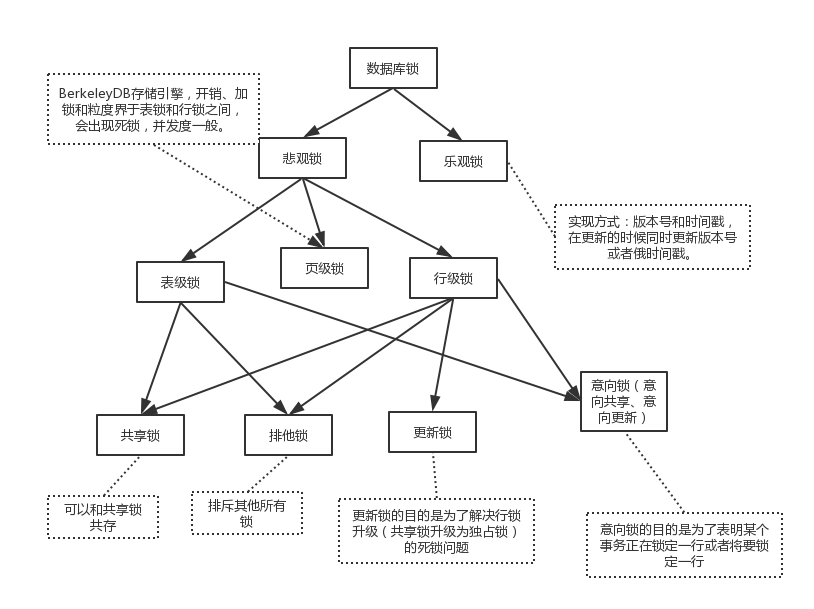

## 数据库锁机制

数据库锁一般可以分为两类，一个是悲观锁，一个是乐观锁。

乐观锁一般是指用户自己实现的一种锁机制，假设认为数据一般情况下不会造成冲突，所以在**数据进行提交更新的时候，才会正式对数据的冲突与否进行检测**，如果发现冲突了，则让返回用户错误的信息，让用户决定如何去做。乐观锁的实现方式一般包括使用版本号和时间戳。

**悲观锁一般就是我们通常说的数据库锁机制**，以下讨论都是基于悲观锁。
悲观锁主要**表锁、行锁、页锁**。在**MyISAM中只用到表锁**，不会有死锁的问题，锁的开销也很小，但是相应的并发能力很差。**innodb实现了行级锁和表锁**，锁的粒度变小了，并发能力变强，但是相应的锁的开销变大，很有可能出现死锁。同时inodb需要协调这两种锁，算法也变得复杂。

**InnoDB行锁是通过给索引上的索引项加锁来实现的**，**只有通过索引条件检索数据，InnoDB才使用行级锁，否则，InnoDB将使用表锁**。

表锁和行锁都分为**共享锁和排他锁**（独占锁），而更新锁是为了解决行锁升级（共享锁升级为独占锁）的死锁问题。
innodb中表锁和行锁一起用，**所以为了提高效率才会有意向锁（意向共享锁和意向排他锁）**。

### 意向锁
先来说说意向锁。假定有个场景：

事务A锁住了表中的一行，让这一行只能读，不能写。之后，事务B申请整个表的写锁。如果事务B申请成功，那么理论上它就能修改表中的任意一行，这与A持有的行锁是冲突的。数据库需要避免这种冲突，就是说要让B的申请被阻塞，直到A释放了行锁。

数据库要怎么判断这个冲突呢？

 - step1：判断表是否已被其他事务用表锁锁表
 - step2：判断表中的每一行是否已被行锁锁住。

注意step2，这样的判断方法效率实在不高，因为需要遍历整个表。于是就有了意向锁。在意向锁存在的情况下，**事务A必须先申请表的意向共享锁，成功后再申请一行的行锁**。

在意向锁存在的情况下，上面的判断可以改成

 - step1：不变
 - step2：发现表上有意向共享锁，说明表中有些行被共享行锁锁住了，因此，事务B申请表的写锁会被阻塞。

注意：申请意向锁的动作是数据库完成的，就是说，事务A申请一行的行锁的时候，数据库会自动先开始申请表的意向锁，不需要我们程序员使用代码来申请。

### 行锁的细分

#### 共享锁
加锁与解锁：当一个事务**执行select语句时，数据库系统会为这个事务分配一把共享锁**，来锁定被查询的数据。在默认情况下，数据被读取后，数据库系统立即解除共享锁。例如，当一个事务执行查询“SELECT * FROM accounts”语句时，数据库系统首先锁定第一行，读取之后，解除对第一行的锁定，然后锁定第二行。这样，在一个事务读操作过程中，允许其他事务同时更新accounts表中未锁定的行。

#### 排它锁
加锁与解锁：**当一个事务执行insert、update或delete语句时，数据库系统会自动对SQL语句操纵的数据资源使用独占锁。如果该数据资源已经有其他锁（任何锁）存在时，就无法对其再放置独占锁了**。

兼容性：独占锁不能和其他锁兼容，如果数据资源上已经加了独占锁，就不能再放置其他的锁了。同样，如果数据资源上已经放置了其他锁，那么也就不能再放置独占锁了。

并发性能：最差。**只允许一个事务访问锁定的数据**，如果其他事务也需要访问该数据，就必须等待。

#### 更新锁
更新锁在的初始化阶段用来锁定可能要被修改的资源，这可以避免使用共享锁造成的死锁现象。

例如，对于以下的update语句：

UPDATE accounts SET balance=900 WHERE id=1

更新操作需要分两步：读取accounts表中id为1的记录 –> 执行更新操作。

如果在第一步使用共享锁，再第二步把锁升级为独占锁，就可能出现死锁现象。例如：两个事务都获取了同一数据资源的共享锁，然后都要把锁升级为独占锁，但需要等待另一个事务解除共享锁才能升级为独占锁，这就造成了死锁。

更新锁有如下特征：

 - 加锁与解锁：当一个事务执行update语句时，数据库系统会先为事务分配一把更新锁。当读取数据完毕，执行更新操作时，会把更新锁升级为独占锁。

 - 兼容性：**更新锁与共享锁是兼容的**，也就是说，一个资源可以同时放置更新锁和共享锁，**但是最多放置一把更新锁**。这样，当多个事务更新相同的数据时，只有一个事务能获得更新锁，然后再把更新锁升级为独占锁，**其他事务必须等到前一个事务结束后，才能获取得更新锁**，这就避免了死锁。

 - 并发性能：**允许多个事务同时读锁定的资源，但不允许其他事务修改它**。
