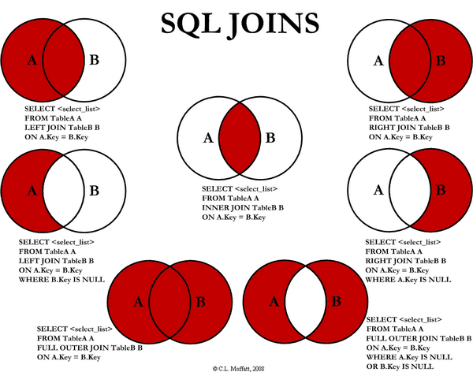

## Join
JOIN 按照功能大致分为如下三类：

 - INNER JOIN（内连接,或等值连接）：获取两个表中字段匹配关系的记录。
 - LEFT JOIN（左连接）：获取左表所有记录，即使右表没有对应匹配的记录。
 - RIGHT JOIN（右连接）： 与 LEFT JOIN 相反，用于获取右表所有记录，即使左表没有对应匹配的记录。

如果想要取得所有的元素项，则可以使用FULL JOIN

**关键字OUTER是可选择的**，取决于具体语言，在实现上它们都是遵循标准的，因此FULL JOIN和FULL OUTER JOIN是一样的。


```
Set "A"    Set "B"

 AA         BB
--------   --------
 Item 1     Item 3
 Item 2     Item 4
 Item 3     Item 5
 Item 4     Item 6
```

```
SELECT * FROM A LEFT OUTER JOIN B ON AA = BB

AA         BB
--------   --------
 Item 1
 Item 2
 Item 3     Item 3
 Item 4     Item 4
```

#### Inner Join
INNER JOIN跟JOIN是一样的，一般INNER关键字可以省略。INNER JOIN将只会返回相匹配的元素项，即不会返回结果为NULL的数据项。

```
SELECT * FROM A INNER JOIN B ON AA = BB

 AA         BB
--------   --------
 Item 3     Item 3
 Item 4     Item 4
```

#### Cross Join
最后还有一个CROSS JOIN，笛卡儿积，将会返回A中每个元素分别匹配B中所有元素的结果，即N*M组合。

```
SELECT * FROM A CROSS JOIN B

 AA         BB
--------   --------
 Item 1     Item 3      ^
 Item 1     Item 4      +--- A中第一个元素, 匹配B中所有元素
 Item 1     Item 5      |
 Item 1     Item 6      v
 Item 2     Item 3      ^
 Item 2     Item 4      +--- A中第二个元素, 匹配B中所有元素
 Item 2     Item 5      |
 Item 2     Item 6      v
 Item 3     Item 3      ... and so on
 Item 3     Item 4
 Item 3     Item 5
 Item 3     Item 6
 Item 4     Item 3
 Item 4     Item 4
 Item 4     Item 5
 Item 4     Item 6
```

### 总结

