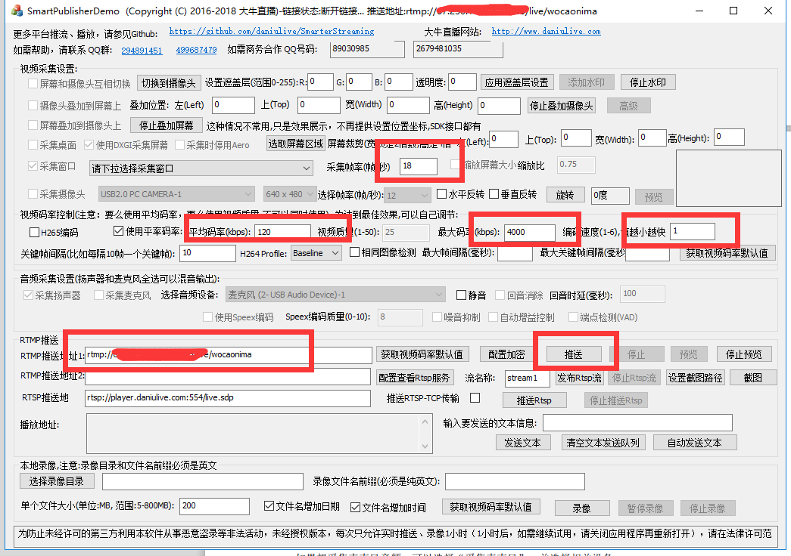

## 直播搭建笔记
由于一些个人需要，要搭建自己的直播服务，用于私人的直播推流和拉流。这里做一些相关的笔记。

### RTMP协议
直播利用的是RTMP协议，RTMP是Real Time Messaging Protocol（实时消息传输协议）的首字母缩写。该协议基于TCP，是一个协议族，包括RTMP基本协议及RTMPT/RTMPS/RTMPE等多种变种。RTMP是一种设计用来进行实时数据通信的网络协议，主要用来在Flash/AIR平台和支持RTMP协议的流媒体/交互服务器之间进行音视频和数据通信。

总之直播，主流是用这个协议去搞。操作就两个：
 
 - 推流
 - 拉流

推流就是把我们的视频实时传输到服务器，只要给出一个rmtp地址就可以推了。拉流也是，直接输入一个地址就可以拉流了。

### livego
一个go写的开源项目，简单高效的直播服务器，可以直接拿来用。直接clone以后go get然后go build就编译好可执行文件在本地了。

直接在本地执行这个可执行文件就能看到一个服务器启动了

配置文件是livego.cfg，直接使用默认的也行了，默认的appname是live

然后我们就推流，打开obs的设置，输入以下地址：`rtmp://localhost:1935/live/` localhost改成自己ip。

然后我们可以用potplayer打开链接，同样是：`rtmp://localhost:1935/live/[秘钥]`，就能开启直播。

livego 项目地址：`https://github.com/gwuhaolin/livego`

### 大牛直播
大牛直播更强，延时直接可以到1s左右。

大牛直播需要用到nginx的rmtp服务器，这个我直接用了github上的docker镜像。每次执行的时候要输入：

```
docker run -d -p 1935:1935 --name nginx-rtmp tiangolo/nginx-rtmp
```

看log可以这么看：

```
docker logs nginx-rtmp
```

启动以后打开windows的大牛直播demo，进行推流



图里几个参数慎重调试，然后RTMP路径记得不要带后缀`/`，直接在后面接路径。然后点推流，然后复制播放地址。

打开大牛直播smart player进行直播便可。牛逼的软件。