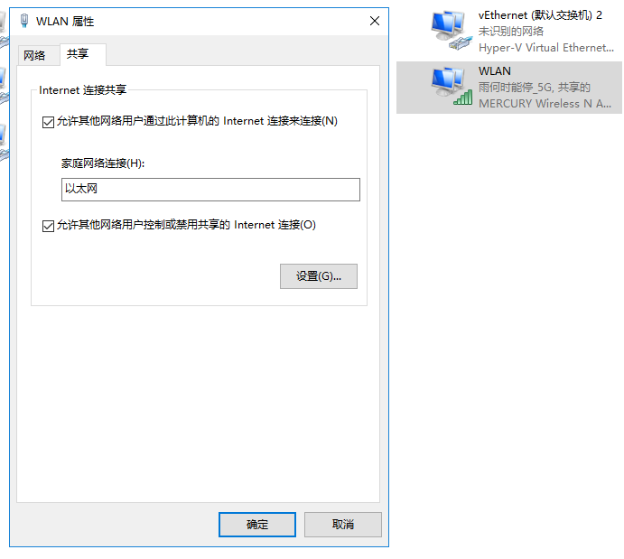
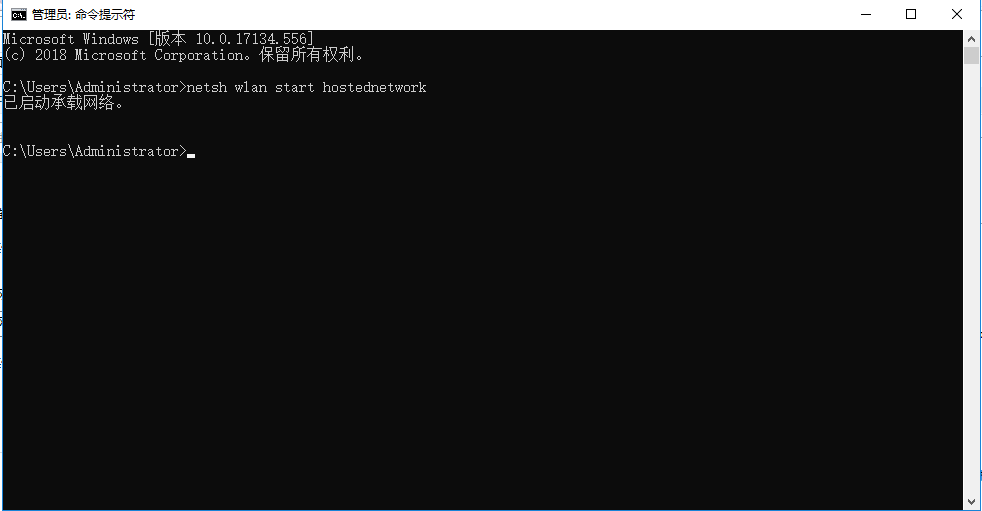
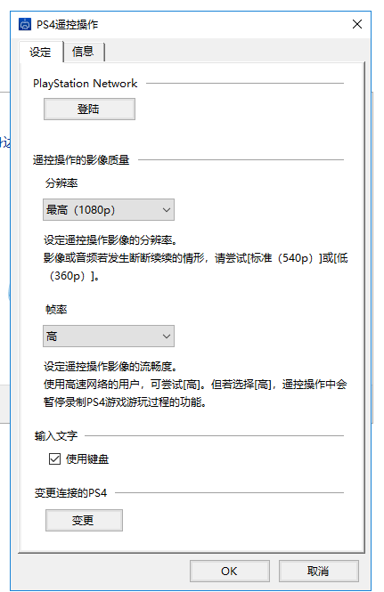

## PS4进行串流直播

下载ps4遥控软件remoteplayer

[download](https://remoteplay.dl.playstation.net/remoteplay/lang/cs/index.html)

然后接下来按这几个步骤操作就很快了：

### 1.ps4和电脑的连接
网线连接上ps4和电脑。电脑网络连接那里会多出一个未识别的以太网的标识。

电脑的控制面板，网络选项卡，找到无线网络的配置。

允许分享网络，然后选择那个新出现的以太网网络。

然后打开命令行窗口，输入`netsh wlan start hostednetwork`

启动承载网络。

然后回到ps4的网络设定那里，把网络改为通过wlan连接，全部简易自动就行。最后测试之后发现网络已经连接上了，可以通过pc上网噜！

### 2. 串流
接下来

在ps4设定的遥控设定那里，选择登录装置。然后会有个code，

赶紧切到电脑端用remoteplay

先调下设置

全部设置为最高，然后手动连接ps4，输入刚才的code就ok啦！

### 3. obs推流
这个好办了，直接下载obs软件，然后把ps4遥控全屏，然后捕捉屏幕就可以了，效果还算是不错的。