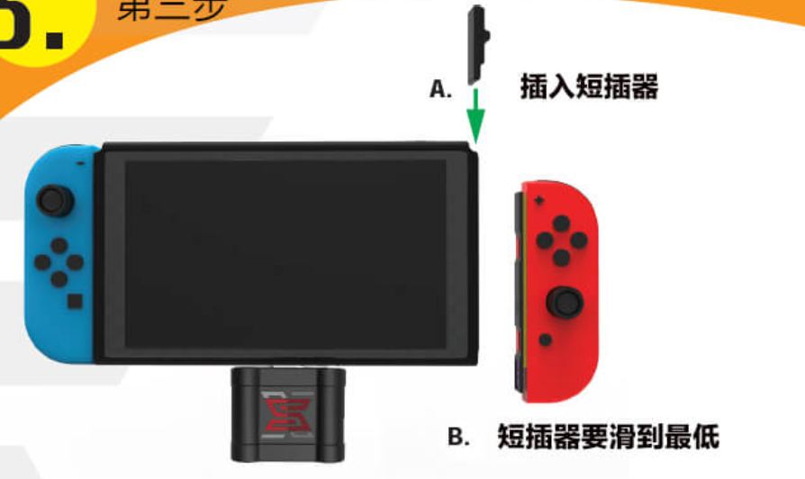
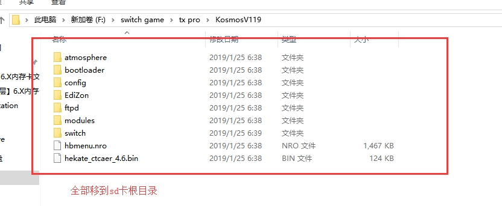

## switch破解
Nintendo Switch ，是任天堂出品的电子游戏机，拥有可拆卸控制器和可分离式主机。任天堂Switch主机的内置存储空间为32GB，可使用microSD进行扩充

### 破解原理
**存在一个可进入的工程模式（Recovery Mode），简称RCM**， Nintendo Switch的右joycon连接口中隐藏着一个特殊金属引脚（pin10）。如果在开机时，按住音量键+，并且将这个引脚接地（pin1,7,9），Nintendo Switch就能进入工程模式（RCM），从而设法运行自制代码。

**zwlj：总结，通过一种称为短接的方式，我们进入工程模式，然后注入破解代码。**

### 破解流程
上面总结了，switch的漏洞需要我们人工短接switch，进入RCM，然后注入代码。

目前主流的破解有两种方案：

 - tx系列，付费破解方案，要钱
 - 大气层破解，免费，开源社区支持。

tx系列可以玩NSP和XCI两种格式的游戏，大气层只能玩NSP。XCI格式的游戏是由卡带直接转来，NSP则是把游戏变成了一种软件形式，安装之后即可玩。

#### 准备工作
假定我们刚拿到switch机器，还有一张新买的tf卡。此时，我们需要做的是让tf卡可以被switch读取成功。

而switch只能读取fat32格式的的tf卡，买来的卡默认文件格式都是exfat。switch遇到exfat的卡，就会需要你联网升级系统来安装驱动。

所以，假如我们方便联网升级到最新系统，可以这么做。但是如果最新系统还没被破解，我们就不能联网了。我们得先把tf卡接到电脑，用软件`DiskGenius`来格式化tf卡成fat32。

**zwlj：格式化目的，让switch可以成功读取到新内存卡，这样我们把文件放入才有意义。**

#### 破解规范流程
无论是大气层破解还是tx pro破解，其实主要都是上述原理里的步骤。

也就是短接之后注入代码，所以我们第一步，就是短接：

我们一般会在淘宝上能买到短接器，把右手柄拆下，短接器滑下去就可以接上了，如下图：

如上图，接入短接器。然后按住音量键+然后按一下开机键。

这个时候，**什么都不会发生，switch会依旧显示黑屏状态**，这个就对了，这就是所谓的**RCM模式**。在这个模式下我们就能用以下两种方式进行注入了：

1. 用专门的注入U盘，比如tx pro，或者大气层u盘，插入switch的充电口
2. 连接电脑进行注入

注意，在进行注入的时候，不单单是注入，还要准备好我们**自制系统的固件**。

简而言之就是两步：

 - 将自制系统固件以及一些有用的自制软件放到tf卡根目录
 - RCM模式下，注入破解，进入自制系统。

注意是要把一系列文件提前拉到目录底下哦，比如我们以大气层的kosmos为例：

U盘注入的话，直接插入就是注入了。电脑注入还要有对应的软件叫做TegraRcmGUI，操作也很方便，打开，然后switch进入RCM模式以后，用typec线连接电脑。TegraRcm就会自动检测到switch，然后就可以注入文件。

注意的是，TegraRcm一开始需要安装驱动，在界面上就能找到驱动并且安装，不麻烦。同时，注入的时候不同的自制系统也会要注入不同的bin文件，这点需要区分。

#### 安装游戏相关
这里记录下怎么安装nsp格式的游戏。首先，大气层破解系统会有一些自带可以启动的自制软件，是nro格式的，一般放在switch目录下。

我们需要一个自制软件叫tinfoil，这个软件可以帮助我们安装nsp。但是要注意，一定要放在nsp根目录的tinfoil文件夹的nsp文件夹下，nsp文件就要暴露出来，不能再创建子文件夹了。

但光是tinfoil还不够，这个软件真不好用。我们还要用到一个软件叫devmenu，这个也是个用来安装nsp的软件，但是这个软件本身就是nsp格式的，所以我们要用tinfoil安装这个devmenu，然后就好了。

用devmenu就可以任意安装nsp软件了。

20190728 update：用新版的软件goldleaf能更好的安装，甚至说不定可以安装XCI

#### 大气层系统相关
安装了新版大气层系统之后，一RCM引导就自动进入系统了。

不过不知道是要按住哪里才是进入引导，不过进大气层以后，点左上角头像也可以找到入口手动进入引导。

