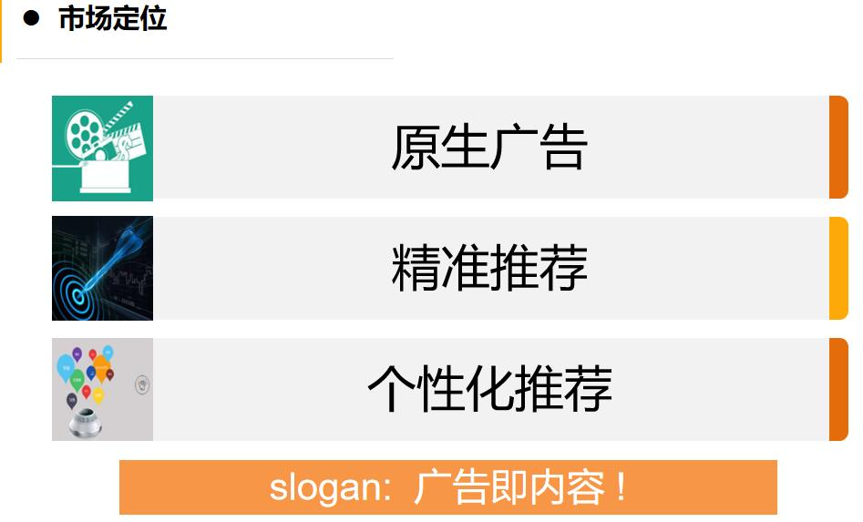
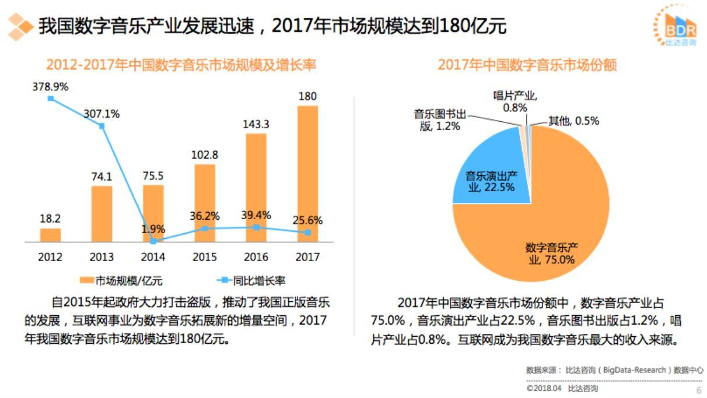
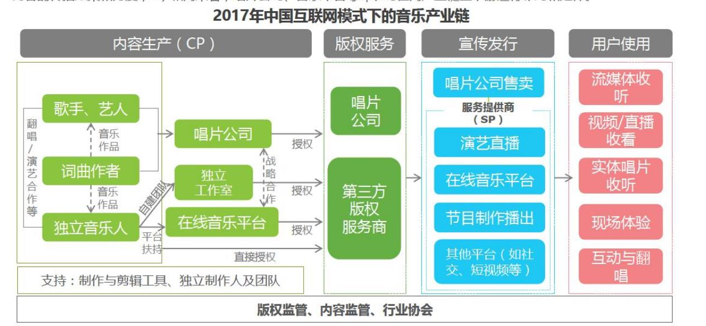
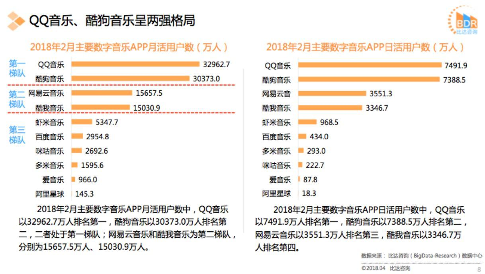
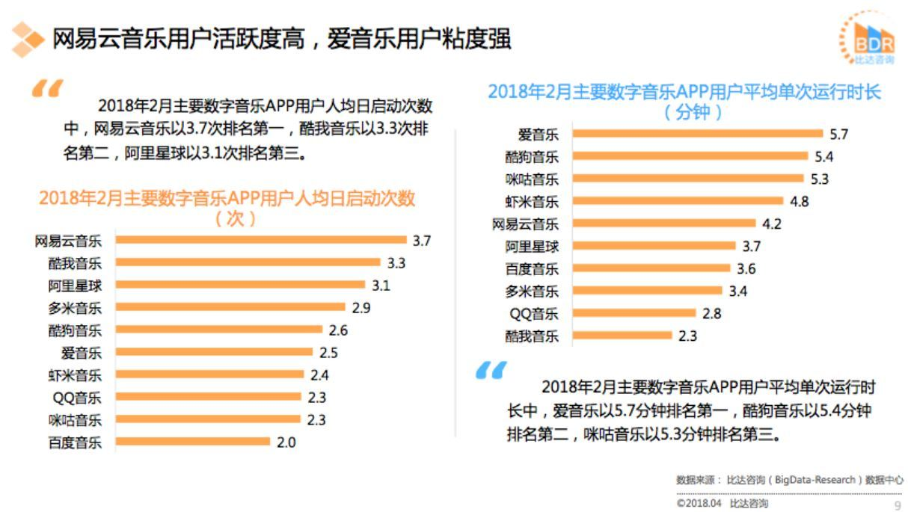
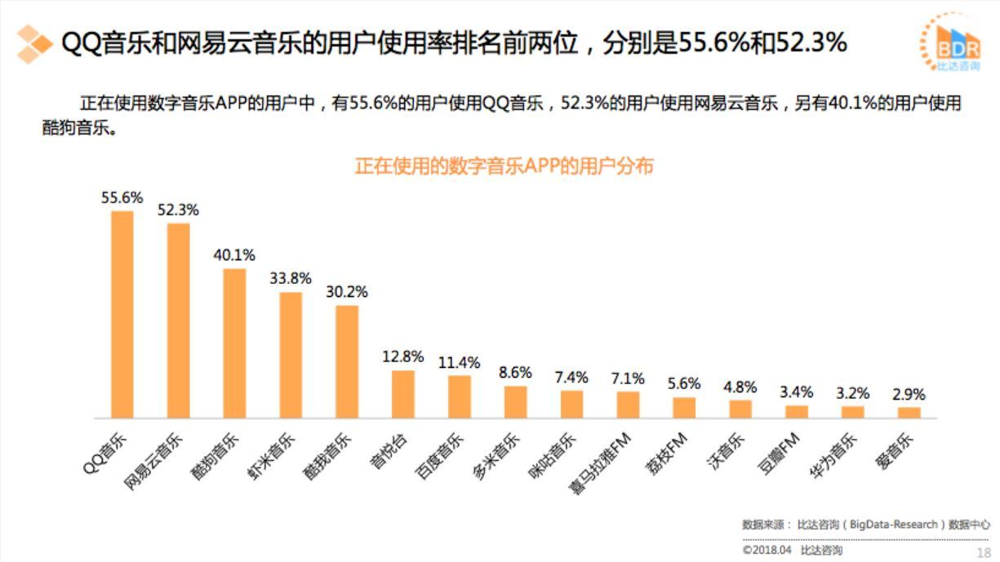

## 如何做行业分析

如果想要对**某一个产品**进行一个简单的行业分析的话，可以从以下几个步骤和方面入手，形成一个简单的方法论：

### 放在前头，至关重要的资料来源

[艾瑞网](http://report.iresearch.cn)

[比达咨询]()

[七麦数据]()

真的有用，很多报告

### 0.熟悉产品，了解产品在市场的定位
尝试通过几点来概括出产品在市场中的定位，

比如 对今日头条app的市场地位进行概括：

### 1.宏观分析，整体认知

可以先尝试阅读行业历史的分析报告(关注规模 盈利 态势)

然后推敲分析报告的逻辑是否正确，如果有失误，失误的逻辑在哪里。比如，阅读07年的行业分析报告，里面有10年后的发展预测，再对比17年的行业分析报告做验证。看看哪些与预期不符，再分析原因。

总而言之这个步骤的目的就是，了解行业格局。

zwlj方法论：

可以重点搜索以下几个方面的图表

1. 市场规模的年份柱形图和折线图，看规模大小和增长变化
2. 某一年份，该产品占一个总的大类市场的份额。(市场占有率)
3. 盈利情况表

比如下面两个图：

左边就描写了市场规模(具体数值)，增长率。右边就写了这一大块的市场份额。

### 2.分析产业链，看产品在链中的地位
任何一个行业其实只是整个产业链中的一个环节，通过对整个产业链条进行分析，其实可以帮助我们更好的了解行业。

zwlj：也就是把该产品的大类在整个行业产业链中的位置定位，具现化成图，然后分析出一些问题。

比如还是以音乐软件为例，下图是产业链图：

可以关注的问题有：
 - 行业在产业链条中的位置是什么？上下游都有哪些？
 - 行业在产业链条中的价值是什么？
 - 行业在产业链条中是否不可或缺的？
 - 行业是否具备在产业链条中的定价权？
 - 行业中的集中度如何？

### 3. 关注龙头产品
关注业内TOP3或TOP10的企业。通过龙头来熟悉这个行业。往往一个行业的转折或者巨变都会伴随着龙头座椅的变化，而变化中的逻辑往往就是行业未来五年乃至十年的发展关键。

比如下图的音乐软件分析：

zwlj: 通过这些具体的数据，就可以对市场的大致情况做一些分析推测和结论。