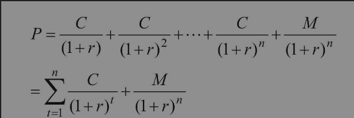
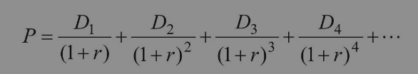
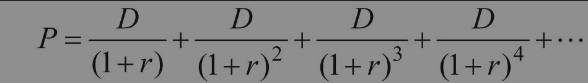
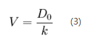
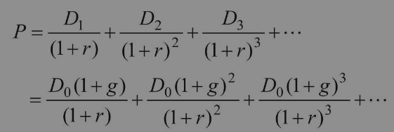
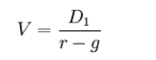
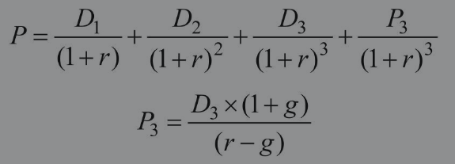

## 证券主要定价原理

先来搞懂什么是债券，**债券是政府、企业、银行等债务人为筹集资金,按照法定程序发行并向债权人承诺于指定日期还本付息的有价证券**。

债券（Bonds / debenture）是一种金融契约，是政府、金融机构、工商企业等直接向社会借债筹借资金时，向投资者发行，同时承诺按一定利率支付利息并按约定条件偿还本金的债权债务凭证。债券的本质是债的证明书，具有法律效力。

zwlj：简单来说，就是政府企业向我们借钱，最后连同利息还给我们的债务凭证。

### 贴现率

大家都知道今天的100元一般比未来的100元更值钱，这就是货币的时间价值。因为未来货币可能会通货膨胀贬值，此外，我们放弃了今天获得100元用于消费，而选择用于投资，就是希望未来获得投资收益率。

如果我们预期的投资收益率是每年10％，那么今天的100元在一年后的价值是110元。将一年后的110元，除以（1+贴现率），这里贴现率取10％，还原成今天的价值就得到100元，这一过程就是未来现金流贴现。如果是两年后获得110元，那么等同于今天的多少钱呢？等同于110÷（1+10％）^2=90.9元。三年、四年以及之后的钱的现值依此类推。

所以可得公式 `n年后的价值 / (1+贴现率)^n =现在的价值 `

如果我们的钱存放银行，基本属于无风险投资，根据收益与风险匹配原则，银行一年期定期存款利率较低，大约3％，可以被认为是无风险的贴现率。如果我们的钱用于投资债券，根据债券的历史收益率水平，贴现率为6％左右。如果我们投资股票，根据股票长期的历史收益率水平，一般回报在10％左右，所以股权的贴现率应该为10％左右。公司为获得利润所承担的风险偏高，贴现率可以上调；风险偏低，则可下调。

### 债券的定价公式

对于普通的按期付息的债券来说，其预期现金流收入有两个来源：到期日前定期支付的债券利息和到期日偿还的债券本金。

由此我们就可以得到债券的定价公式了

其中：C为每一期的债券利息，M为到期偿还的债券本金，r为贴现率，n为债券的期限。

**zwlj：这个公式可以帮助我们计算一个账面价值为M的债券当前对我们来说值多少钱**

### 股票的定价公式

债券的价值相对容易计算，毕竟期限、未来现金流收入都是确定的，但是股票就困难了，一是我们不知道公司究竟能够持续经营多少年，虽然我们经常假设永续经营，二是公司未来每一期的现金流是不确定的，只能通过预测和假设。所以，理论上股票价值的决定公式为

其中：D为各期公司现金流，r为贴现率。

### 零增长模型

为了能够计算股票的价值，人们把公司未来每一期的现金流假定为不变，是个常数，于是演化成零增长模型，该模型在现实中可以运用到微利润，行业能够长期保持稳定，处于成熟阶段的公司的价值计算，多见于公共事业类型股票。零增长模型如下：

上述公式化简以后：

k就是r，也就是贴现率，*D*0在未来无限时期支付的每股股利；

如果某一公司未来每年的净利润均为1元（这里假定公司未来现金流等同于净利润，后面章节将介绍它们实际并不完全等同，这里仅为了方便举例使用），贴现率或者称为股权的投资收益率要求为10％，则该公司的价值为1/10％=10元。

**zwlj: 因此，在零增长模型下，计算股票的价格，其实却是就是计算公司的盈利状况，通过假定未来企业每年的净利润为一个值，除以贴现率来进行估算。股票的价格，就体现了公司的盈利能力**

### 常数增长模型

零增长模型的运用过于狭窄，毕竟随着经济的发展，公司的未来现金流或者盈利一般都会不断增长，如果日后的盈利都按照一个固定的常数比例增长，则衍生出了常数增长模型。

其中，D0为当前现金流，D1为在D0基础上以固定比例（1+g）增长的未来第一期现金流，D2、D3依次在前一期基础上以（1+g）速度增长，依此类推。

化简之后就是

**上述公式的d1就是之前那幅图的d0，也就是当前现金流**。

g不能大过r，事实上g的取值也不会太大，至少不会超过宏观经济增长的速度，否则增长到最后，全世界就完全被这一个公司所占领。假设公司未来一期的净利润为1元，此后每年利润均按2％的速度增长，贴现率取10％，则公司价值为1/（10％-2％）=12.5元。常数增长模型也告诉我们，**增长公司的价值比不增长公司价值要高**。

### 二阶增长模型

为了更加贴近现实，我们可以再假设得复杂些，公司的增长大多分为高增长阶段和低增长阶段：第一个阶段，公司较小，可供开阔的市场大，因而增长速度快；第二个阶段，由于市场规模有限，可供增长的资源也有限，公司增长速度放缓，随着行业或者经济的长期增长速度而增长，第二阶段仍可以由常数增长模型表示。那么一个高速增长期为3年的二阶段增长模型可以表示为

### 总结

简化的现金流贴现模型均表明股票的内在价值并不能够计算得和债券的内在价值一样精准，它含有各种假设条件，只能说**股票的内在价值会在一个宽泛的区间内股票的内**，而所录入的各种假设条件就看投资者对公司基本面的理解是否到位，是否尽可能地接近公司真实的发展情况，因而，股票估值某种程度被认为是科学和艺术的结合。

不能精准计算股票的内在价值并不意味着价值投资无用武之地。当一个公司的股票根据所掌握信息，内在价值被我们估计为6～10元，如果它的价格是3元，则可以认为很大概率上这只股票是被低估的，而如果它的价格是20元，则可以认为很大概率上这只股票被高估。内在价值是指导我们进行股票买卖的锚，如果投资者不知道股票的内在价值，非常容易陷入胡乱买卖的境地。