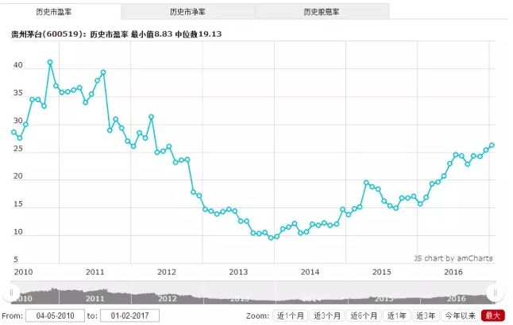

## 市盈率

市盈率（以下简称PE）是最常用来评估股价水平是否合理的指标之一，由股价除以年度[每股盈余](https://zh.wikipedia.org/wiki/每股盈餘) (Earnings Per Share，EPS)得出。**通常作为股票是便宜抑或昂贵的指标** ([通货膨胀](https://zh.wikipedia.org/wiki/通货膨胀)会使每股收益虚增，从而扭曲市盈率的比较价值)。市盈率把[企业](https://zh.wikipedia.org/wiki/企業)的股价与其制造[财富](https://zh.wikipedia.org/wiki/財富)的能力联系起来。

每股盈余的计算方法，一般是以该企业在过去一年的[净利润](https://zh.wikipedia.org/wiki/純利)，除总发行已售出股份净值。市盈率越低，代表投资者能够以相对较低[价格](https://zh.wikipedia.org/wiki/价格)购入股票。假设某股票的市价为 24 元，而过去一年的每股盈余为 3 元，则市盈率为 24/3=8。**该股票被视为有 8 倍的市盈率**。即假设该企业以后每年净利润和去年相同的基础上，如果不考虑通货膨胀因素，**回本期为 8 年**，折合平均年回报率为 12.5%，投资者每付出 8 元可分享 1 元的企业盈利。但上市公司通常只会把部分盈利用来派发[股息](https://zh.wikipedia.org/wiki/股息)，其余用来作进一步发展，所以市盈率的[倒数](https://zh.wikipedia.org/wiki/倒數)并不直接等同于股息率。

投资者计算市盈率，主要用来比较不同股票的价值。理论上，股票的市盈率愈低，表示该股票的投资[风险](https://zh.wikipedia.org/wiki/风险)越小，愈值得投资。比较不同行业、不同国家、不同时段的市盈率是不大可靠的，比较同类股票的市盈率较有实用价值。

**什么是便宜的股票**

现在大家应该清楚了，股票的便宜和贵，并不是股价，而是PE。比如，现在贵州茅台，股价345，买一手就要3万多，但PE是26，并不高，所以茅台是个便宜股票，还是不错的

**亏损公司的PE**

不赚钱还亏钱的公司，一般行情软件就不除成负数了，而是画个横线。那么亏钱的公司，能不能把钱投给他，大家按正常的逻辑可以判断一下

有人说，中国A 股，要高PE 股票才能赚钱，有时的确是

因为一个公司PE 过低，说明市场对这家公司预期不好，大家都觉得买这个股票不赚钱，都不去买，这个股票的成长空间就有限，买了后收益就不好

而且，低PE 的股票往往是大盘股，弹性很差，大量资金买入都拉不起多少百分比的升幅（比如金融股），适合避风险，不适合追求高收益

### 利用PE分析

一定要记得用历史走势去分析

茅台历史的PE走势：最高是40多，最低是9点几，现在是26左右。处在中位，还是风险不大，如果公司是好公司，在下一次牛市股价还有上升空间

### 市盈率含义

如果某股票有较高市盈率，则有可能因以下原因：

- 市场预测未来的盈利增长速度快。
- 该企业一向录得可观盈利，但在前一个年度出现过一次性的特殊支出，降低了盈利。
- 出现泡沫，该股被以超过其内在价值的价格在交易。
- 该企业有特殊的优势，保证能在低风险情况下持久录得盈利。
- 市场上可选择的股票有限，在[供求定律](https://zh.wikipedia.org/wiki/供求定律)下，股价将上升。这令跨时间的市盈率比较变得意义不大。

如果某股票有较低市盈率，则有可能因以下原因：

- 市场预测该企业和去年相比较，盈利将减少，企业价值将下降。
- 该企业在去年出现过一次性的特殊收入，暂时提高了去年的盈利。
- 该股的价格被市场低估。
- 股票的供给超过了市场上资金的投资需求。

※值得一提，如果某股票的市盈率为零，即代表股票去年是在于亏损状态。